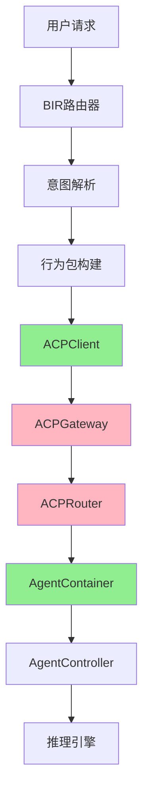
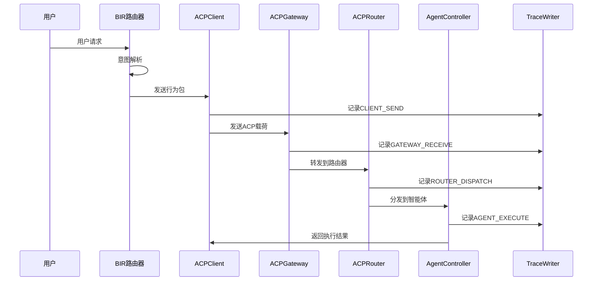

# ACP协议集成设计方案

## 概述

ACP（Agent Communication Protocol）是Nagent架构中智能体间通信的核心协议，基于企业级架构实践中的"双栈结构设计"，实现了Client-Server模式的行为链通信机制。

## 设计目标

### 核心目标
1. **行为链可控制性** - 通过trace_id实现完整的执行链路追踪
2. **状态注入完整性** - 通过context_id保障智能体推理上下文可用  
3. **调度归属可控性** - 通过from/to/tenant字段实现行为路径归属和权限审计
4. **协议可扩展性** - 支持多租户、多模型、多通道的统一行为语义

## 当前实现状态

### ✅ 已实现模块
- ACPClient客户端（部分）
- BIR路由器集成
- Trace追踪系统
- 协议数据结构

### ❌ 待实现模块  
- ACPServer服务器端
- ACPGateway网关层
- ACPRouter路由层
- 控制桥接器
- 双向通信机制

## 架构设计



## 协议结构设计

### ACP消息三段式结构

```python
@dataclass
class ACPPayload:
    # Meta段 - 元数据信息
    meta: Dict[str, Any]      # 路由和控制信息
    
    # Context段 - 上下文信息  
    context: Dict[str, Any]   # 状态和会话信息
    
    # Command段 - 命令信息
    command: Dict[str, Any]   # 执行指令和参数
    
    # 协议字段
    trace_id: str            # 全链行为标识
    context_id: str          # 状态空间绑定点
    timestamp: int           # 时间戳
    source_id: str           # 调用源标识
    permissions: List[str]   # 权限列表
```

## 核心组件设计

### 1. ACPServer服务器端

```python
class ACPServer:
    """ACP服务器 - 行为承接器"""
    
    def __init__(self, host: str, port: int):
        self.host = host
        self.port = port
        self.gateway = ACPGateway()
        self.router = ACPRouter()
        self.running = False
    
    async def start(self):
        """启动服务器"""
        # WebSocket服务器启动
        
    async def handle_message(self, websocket, message):
        """处理接收消息"""
        # 1. 解析ACP载荷
        # 2. Gateway处理
        # 3. Router分发
```

### 2. ACPGateway网关层

```python
class ACPGateway:
    """ACP网关 - 统一入口"""
    
    async def process(self, payload: ACPPayload):
        """处理载荷"""
        # 1. 权限验证
        # 2. 速率限制  
        # 3. Trace记录
        # 4. 转发路由
```

### 3. ACPRouter路由层

```python
class ACPRouter:
    """ACP路由器 - 任务分发"""
    
    async def route(self, payload: ACPPayload):
        """路由载荷"""
        # 1. 解析目标智能体
        # 2. 负载均衡选择
        # 3. 分发到容器
```

## 调用流程设计

### 完整调用链路



## Trace链路追踪

### 事件类型定义

```python
class ACPTraceEvents:
    CLIENT_SEND = "acp_client_send"
    GATEWAY_RECEIVE = "acp_gateway_receive"  
    ROUTER_DISPATCH = "acp_router_dispatch"
    AGENT_EXECUTE = "acp_agent_execute"
    CALLBACK_COMPLETE = "acp_callback_complete"
```

### 链路重建能力

通过trace_id可以重建完整的行为执行路径：
- 谁发起了什么请求
- 经过了哪些模块处理
- 每个环节的执行时间
- 成功/失败的原因分析

## 多租户支持

### 租户隔离策略

```python
class TenantIsolationStrategy:
    @staticmethod
    def validate_cross_tenant_call(from_tenant: str, to_tenant: str) -> bool:
        """验证跨租户调用权限"""
        return from_tenant == to_tenant or to_tenant == "public"
    
    @staticmethod  
    def get_tenant_agent_id(agent_id: str, tenant_id: str) -> str:
        """获取租户特定智能体ID"""
        return f"{tenant_id}_{agent_id}"
```

## 安全控制

### 权限验证

- 基于token的身份认证
- 基于权限列表的操作授权
- 跨租户调用控制

### 速率限制

- 按客户端ID限制请求频率
- 支持不同用户等级的限制策略
- 防止系统过载保护

## 性能优化

### 连接管理

- WebSocket连接池
- 连接复用和负载均衡
- 自动断线重连

### 批处理机制

- 消息批量处理
- 减少网络开销
- 提高吞吐量

## 实施计划

### 第一阶段：核心协议实现（2周）
1. 完善ACPPayload结构
2. 实现ACPServer基础框架  
3. 实现WebSocket通信
4. 集成TraceWriter

### 第二阶段：路由网关实现（2周）
1. 实现ACPGateway
2. 实现ACPRouter
3. 添加权限验证
4. 实现负载均衡

### 第三阶段：高级特性（2周）
1. 多租户隔离
2. 性能优化
3. 安全控制  
4. 监控告警

### 第四阶段：测试优化（1周）
1. 单元测试
2. 集成测试
3. 性能测试
4. 部署验证

## 配置示例

```yaml
acp:
  server:
    host: "0.0.0.0"
    port: 8080
    max_connections: 1000
    
  gateway:
    rate_limit:
      enabled: true
      default: 100  # 每分钟100次
      
  router:
    load_balancing: "round_robin"
    
  tracing:
    enabled: true
    sampling_rate: 1.0
```

## 总结

本方案将为Nagent架构提供完整的ACP协议支持，实现：

1. **统一的通信协议** - 标准化智能体间通信
2. **完整的链路追踪** - 全过程可观测和调试
3. **企业级安全控制** - 权限管理和租户隔离
4. **高性能通信机制** - 连接池和批处理优化

通过分阶段实施，将逐步构建出完整的企业级智能体通信基础设施。 