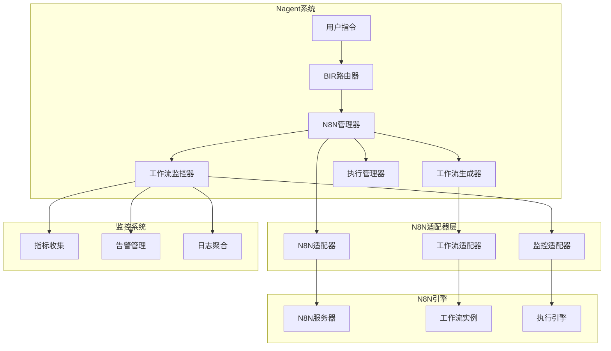
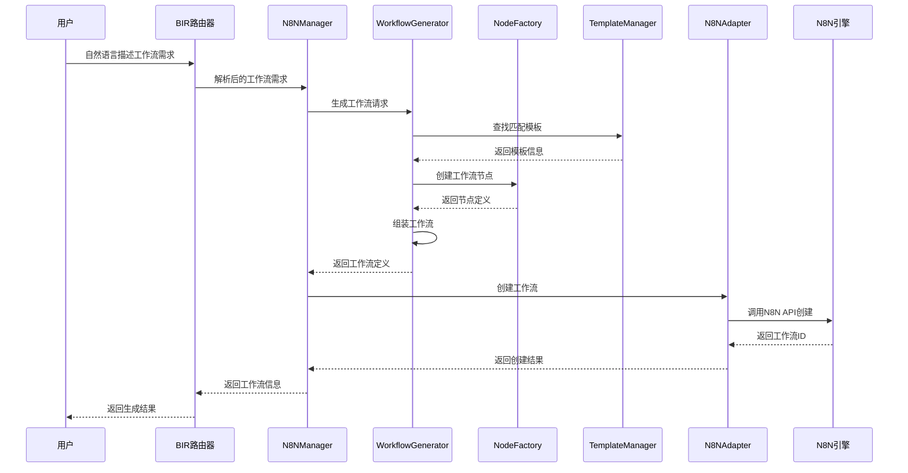
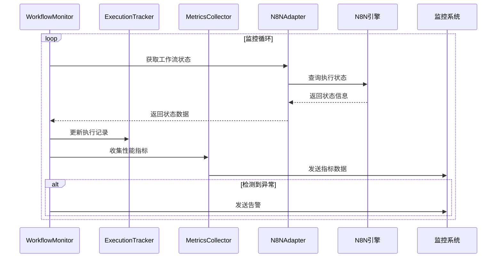

# N8N工作流引擎集成设计方案

## 1. 概述

### 1.1 项目背景
N8N是一个开源的工作流自动化工具，具有强大的可视化编辑器和丰富的集成能力。为了增强Nagent系统的工作流编排能力，我们需要设计一个完整的N8N集成方案，实现工作流监控、自动生成和智能编排功能。

### 1.2 设计目标
- **工作流监控**：实时监控N8N工作流的执行状态、性能指标和错误信息
- **自动生成**：基于任务描述和需求自动生成N8N工作流
- **智能编排**：将Nagent的智能体能力与N8N的工作流引擎结合
- **企业级特性**：提供高可用、可扩展、可监控的集成方案

### 1.3 核心价值
- 降低工作流创建门槛，支持自然语言描述生成工作流
- 提供统一的工作流监控和管理界面
- 实现智能体与传统工作流的无缝集成
- 支持复杂业务流程的自动化编排

## 2. 架构设计

### 2.1 整体架构



### 2.2 模块架构

#### 2.2.1 核心模块分层

```
N8N集成系统
├── 管理层 (Manager Layer)
│   ├── N8NManager - 统一管理入口
│   ├── WorkflowManager - 工作流生命周期管理
│   └── ExecutionManager - 执行过程管理
├── 适配器层 (Adapter Layer)
│   ├── N8NAdapter - N8N API适配器
│   ├── WorkflowAdapter - 工作流CRUD适配器
│   └── MonitoringAdapter - 监控数据适配器
├── 生成器层 (Generator Layer)
│   ├── WorkflowGenerator - 工作流自动生成
│   ├── NodeFactory - 节点工厂
│   └── TemplateManager - 模板管理
├── 监控层 (Monitoring Layer)
│   ├── WorkflowMonitor - 工作流监控
│   ├── ExecutionTracker - 执行追踪
│   └── MetricsCollector - 指标收集
├── 集成层 (Integration Layer)
│   ├── NagentIntegration - Nagent系统集成
│   ├── ToolIntegration - 工具集成
│   └── AgentIntegration - 智能体集成
└── 类型层 (Types Layer)
    ├── WorkflowTypes - 工作流类型定义
    ├── ExecutionTypes - 执行类型定义
    └── MonitoringTypes - 监控类型定义
```

### 2.3 数据流设计

#### 2.3.1 工作流生成流程



#### 2.3.2 工作流监控流程



## 3. 核心功能设计

### 3.1 工作流自动生成

#### 3.1.1 生成策略

**基于模板的生成**
- 预定义常用工作流模板
- 支持参数化配置
- 模板组合和扩展

**基于意图识别的生成**
- 分析用户描述的业务意图
- 识别输入、处理、输出节点需求
- 自动选择合适的N8N节点

**基于学习的生成**
- 分析历史工作流模式
- 学习用户偏好和习惯
- 优化生成策略

#### 3.1.2 节点选择算法

```python
class NodeSelectionAlgorithm:
    """节点选择算法"""
    
    def __init__(self):
        self.node_registry = {}  # 节点注册表
        self.compatibility_matrix = {}  # 兼容性矩阵
        self.performance_weights = {}  # 性能权重
    
    async def select_nodes(self, requirements):
        """根据需求选择最佳节点组合"""
        # 1. 功能匹配
        candidate_nodes = self._filter_by_functionality(requirements)
        
        # 2. 兼容性检查
        compatible_nodes = self._check_compatibility(candidate_nodes)
        
        # 3. 性能评估
        scored_nodes = self._score_performance(compatible_nodes)
        
        # 4. 最优选择
        return self._select_optimal(scored_nodes)
```

#### 3.1.3 工作流模板系统

**模板分类**
- **数据处理模板**：ETL、数据清洗、格式转换
- **通知模板**：邮件、短信、webhook通知
- **集成模板**：API调用、数据库操作、文件处理
- **监控模板**：健康检查、性能监控、错误处理

**模板结构**
```json
{
    "template_id": "data_processing_basic",
    "name": "基础数据处理模板",
    "description": "从API获取数据，处理后保存到数据库",
    "category": "data_processing",
    "parameters": [
        {
            "name": "api_endpoint",
            "type": "string",
            "required": true,
            "description": "API端点URL"
        }
    ],
    "nodes": [
        {
            "type": "n8n-nodes-base.httpRequest",
            "parameters": {
                "url": "{{api_endpoint}}",
                "method": "GET"
            }
        }
    ],
    "connections": {},
    "metadata": {
        "complexity": "low",
        "estimated_duration": 30,
        "success_rate": 0.95
    }
}
```

### 3.2 工作流监控系统

#### 3.2.1 监控指标

**执行指标**
- 执行次数、成功率、失败率
- 平均执行时间、最大执行时间
- 队列长度、并发数量

**性能指标**
- CPU使用率、内存使用率
- 网络延迟、I/O延迟
- 吞吐量、响应时间

**业务指标**
- 数据处理量、错误类型分布
- 用户满意度、SLA达成率
- 成本效益分析

#### 3.2.2 实时监控架构

```python
class WorkflowMonitor:
    """工作流监控器"""
    
    def __init__(self, config: MonitoringConfig):
        self.config = config
        self.trackers = {}
        self.collectors = {}
        self.alert_manager = AlertManager()
    
    async def start_monitoring(self, workflow_id: str):
        """开始监控指定工作流"""
        tracker = ExecutionTracker(workflow_id)
        collector = MetricsCollector(workflow_id)
        
        # 启动监控任务
        asyncio.create_task(self._monitor_loop(tracker, collector))
        
        self.trackers[workflow_id] = tracker
        self.collectors[workflow_id] = collector
    
    async def _monitor_loop(self, tracker, collector):
        """监控循环"""
        while True:
            try:
                # 获取最新执行状态
                status = await tracker.get_current_status()
                
                # 收集性能指标
                metrics = await collector.collect_metrics()
                
                # 检查告警条件
                await self._check_alerts(status, metrics)
                
                # 等待下一次检查
                await asyncio.sleep(self.config.check_interval)
                
            except Exception as e:
                logger.error(f"监控循环异常: {e}")
                await asyncio.sleep(5)
```

#### 3.2.3 告警系统

**告警级别**
- **Critical**: 工作流完全失败，影响核心业务
- **Warning**: 性能下降或部分失败，需要关注
- **Info**: 状态变化通知，仅供参考

**告警规则**
```yaml
alert_rules:
  - name: "工作流执行失败"
    level: "critical"
    condition: "failure_rate > 0.1"
    description: "工作流失败率超过10%"
    actions:
      - type: "webhook"
        url: "http://alertmanager/api/v1/alerts"
      - type: "email"
        recipients: ["admin@company.com"]
  
  - name: "执行时间过长"
    level: "warning" 
    condition: "avg_duration > 300"
    description: "平均执行时间超过5分钟"
    actions:
      - type: "notification"
        channel: "slack"
```

### 3.3 智能体集成

#### 3.3.1 智能体工作流编排

**编排模式**
- **顺序编排**：智能体按顺序执行任务
- **并行编排**：多个智能体同时处理不同任务
- **条件编排**：根据条件动态选择执行路径
- **循环编排**：重复执行直到满足条件

**智能体节点设计**
```python
class AgentNode:
    """智能体节点"""
    
    def __init__(self, agent_id: str, node_config: dict):
        self.agent_id = agent_id
        self.config = node_config
        self.input_schema = node_config.get('input_schema', {})
        self.output_schema = node_config.get('output_schema', {})
    
    async def execute(self, input_data: dict) -> dict:
        """执行智能体任务"""
        # 1. 验证输入数据
        validated_input = self._validate_input(input_data)
        
        # 2. 调用智能体
        agent = await self._get_agent(self.agent_id)
        result = await agent.process(validated_input)
        
        # 3. 验证输出数据
        validated_output = self._validate_output(result)
        
        return validated_output
    
    def _validate_input(self, data: dict) -> dict:
        """验证输入数据格式"""
        # JSON Schema验证
        return data
    
    def _validate_output(self, data: dict) -> dict:
        """验证输出数据格式"""
        # JSON Schema验证
        return data
```

#### 3.3.2 上下文传递机制

**上下文结构**
```python
@dataclass
class WorkflowContext:
    """工作流上下文"""
    workflow_id: str
    execution_id: str
    current_node: str
    variables: Dict[str, Any]
    metadata: Dict[str, Any]
    history: List[Dict[str, Any]]
    
    def get_variable(self, name: str, default=None):
        """获取变量值"""
        return self.variables.get(name, default)
    
    def set_variable(self, name: str, value: Any):
        """设置变量值"""
        self.variables[name] = value
    
    def add_history(self, node_id: str, result: dict):
        """添加执行历史"""
        self.history.append({
            'node_id': node_id,
            'timestamp': datetime.now().isoformat(),
            'result': result
        })
```

## 4. 技术实现

### 4.1 核心组件实现

#### 4.1.1 N8N管理器

```python
class N8NManager:
    """N8N统一管理器"""
    
    def __init__(self, config: N8NConfig):
        self.config = config
        self.adapter = N8NAdapter(config)
        self.generator = WorkflowGenerator(config)
        self.monitor = WorkflowMonitor(config)
        self.integrations = {
            'nagent': NagentIntegration(),
            'tools': ToolIntegration(),
            'agents': AgentIntegration()
        }
    
    async def start(self):
        """启动N8N管理器"""
        # 连接N8N服务器
        await self.adapter.connect()
        
        # 启动监控服务
        await self.monitor.start()
        
        # 初始化集成模块
        for integration in self.integrations.values():
            await integration.initialize()
    
    async def generate_workflow(self, description: str, requirements: dict) -> N8NWorkflow:
        """生成工作流"""
        return await self.generator.generate_from_description(description, requirements)
    
    async def execute_workflow(self, workflow_id: str, input_data: dict) -> N8NExecution:
        """执行工作流"""
        execution = await self.adapter.execute_workflow(workflow_id, input_data)
        await self.monitor.track_execution(execution)
        return execution
    
    async def monitor_execution(self, execution_id: str) -> ExecutionStatus:
        """监控执行状态"""
        return await self.monitor.get_execution_status(execution_id)
```

#### 4.1.2 工作流生成器

```python
class WorkflowGenerator:
    """工作流生成器"""
    
    def __init__(self, config: GeneratorConfig):
        self.config = config
        self.node_factory = NodeFactory()
        self.template_manager = TemplateManager()
        self.llm_client = LLMClient()
    
    async def generate_from_description(self, description: str, requirements: dict) -> N8NWorkflow:
        """基于描述生成工作流"""
        # 1. 分析描述，提取意图
        intent = await self._analyze_intent(description)
        
        # 2. 查找匹配模板
        templates = await self.template_manager.find_matching_templates(intent)
        
        # 3. 生成节点
        nodes = await self._generate_nodes(intent, requirements, templates)
        
        # 4. 建立连接
        connections = await self._generate_connections(nodes, intent)
        
        # 5. 构建工作流
        workflow = N8NWorkflow(
            id=str(uuid.uuid4()),
            name=intent.get('name', '自动生成工作流'),
            nodes=nodes,
            connections=connections,
            settings=self._generate_settings(requirements)
        )
        
        return workflow
    
    async def _analyze_intent(self, description: str) -> dict:
        """分析用户意图"""
        prompt = f"""
        分析以下工作流描述，提取关键信息：
        描述：{description}
        
        请提取：
        1. 输入源类型和参数
        2. 处理步骤和逻辑
        3. 输出目标和格式
        4. 触发条件和频率
        5. 错误处理要求
        
        返回JSON格式结果。
        """
        
        response = await self.llm_client.generate(prompt)
        return json.loads(response)
    
    async def _generate_nodes(self, intent: dict, requirements: dict, templates: list) -> list:
        """生成工作流节点"""
        nodes = []
        
        # 生成输入节点
        input_node = await self.node_factory.create_input_node(intent['input'])
        nodes.append(input_node)
        
        # 生成处理节点
        for step in intent['processing']:
            process_node = await self.node_factory.create_process_node(step)
            nodes.append(process_node)
        
        # 生成输出节点
        output_node = await self.node_factory.create_output_node(intent['output'])
        nodes.append(output_node)
        
        return nodes
```

### 4.2 监控系统实现

#### 4.2.1 执行追踪器

```python
class ExecutionTracker:
    """执行追踪器"""
    
    def __init__(self, workflow_id: str):
        self.workflow_id = workflow_id
        self.executions = {}
        self.metrics = defaultdict(list)
    
    async def track_execution(self, execution: N8NExecution):
        """追踪执行过程"""
        self.executions[execution.id] = {
            'start_time': datetime.now(),
            'status': ExecutionStatus.RUNNING,
            'nodes': {},
            'metrics': {}
        }
        
        # 监控执行过程
        asyncio.create_task(self._monitor_execution(execution.id))
    
    async def _monitor_execution(self, execution_id: str):
        """监控单次执行"""
        while True:
            try:
                # 获取执行状态
                status = await self._get_execution_status(execution_id)
                
                # 更新追踪记录
                self._update_tracking_record(execution_id, status)
                
                # 检查是否完成
                if status.is_finished():
                    break
                
                await asyncio.sleep(1)
                
            except Exception as e:
                logger.error(f"执行监控异常: {e}")
                break
    
    def _update_tracking_record(self, execution_id: str, status: dict):
        """更新追踪记录"""
        record = self.executions[execution_id]
        record['status'] = status.get('status')
        record['current_node'] = status.get('current_node')
        record['progress'] = status.get('progress', 0)
        
        # 更新节点执行记录
        for node_id, node_status in status.get('nodes', {}).items():
            record['nodes'][node_id] = {
                'status': node_status.get('status'),
                'start_time': node_status.get('start_time'),
                'end_time': node_status.get('end_time'),
                'duration': node_status.get('duration'),
                'error': node_status.get('error')
            }
```

#### 4.2.2 指标收集器

```python
class MetricsCollector:
    """指标收集器"""
    
    def __init__(self, workflow_id: str):
        self.workflow_id = workflow_id
        self.metrics_cache = {}
        self.collectors = {
            'performance': PerformanceCollector(),
            'business': BusinessCollector(),
            'error': ErrorCollector()
        }
    
    async def collect_metrics(self) -> PerformanceMetrics:
        """收集性能指标"""
        metrics = PerformanceMetrics()
        
        # 收集各类指标
        for name, collector in self.collectors.items():
            try:
                metric_data = await collector.collect(self.workflow_id)
                setattr(metrics, name, metric_data)
            except Exception as e:
                logger.error(f"收集{name}指标失败: {e}")
        
        # 缓存指标数据
        self.metrics_cache[datetime.now()] = metrics
        
        # 清理过期缓存
        self._cleanup_cache()
        
        return metrics
    
    def _cleanup_cache(self):
        """清理过期缓存"""
        cutoff_time = datetime.now() - timedelta(hours=24)
        self.metrics_cache = {
            timestamp: metrics
            for timestamp, metrics in self.metrics_cache.items()
            if timestamp > cutoff_time
        }
```

### 4.3 集成模块实现

#### 4.3.1 Nagent集成

```python
class NagentIntegration:
    """Nagent系统集成"""
    
    def __init__(self):
        self.tool_registry = None
        self.agent_manager = None
        self.execution_engine = None
    
    async def initialize(self):
        """初始化集成"""
        # 获取Nagent核心组件
        self.tool_registry = await self._get_tool_registry()
        self.agent_manager = await self._get_agent_manager()
        self.execution_engine = await self._get_execution_engine()
    
    async def create_agent_workflow(self, agent_config: dict) -> N8NWorkflow:
        """创建智能体工作流"""
        # 1. 分析智能体配置
        agent_capabilities = await self._analyze_agent_capabilities(agent_config)
        
        # 2. 生成对应的N8N节点
        nodes = []
        for capability in agent_capabilities:
            node = await self._create_agent_node(capability)
            nodes.append(node)
        
        # 3. 建立节点连接
        connections = await self._create_agent_connections(nodes, agent_config)
        
        # 4. 构建工作流
        workflow = N8NWorkflow(
            id=str(uuid.uuid4()),
            name=f"智能体工作流-{agent_config['name']}",
            nodes=nodes,
            connections=connections,
            settings={
                'agent_config': agent_config,
                'integration_type': 'nagent_agent'
            }
        )
        
        return workflow
    
    async def sync_tools_to_n8n(self):
        """同步Nagent工具到N8N"""
        tools = await self.tool_registry.get_all_tools()
        
        for tool in tools:
            # 创建对应的N8N自定义节点
            node_definition = await self._create_tool_node_definition(tool)
            
            # 注册到N8N
            await self._register_custom_node(node_definition)
    
    async def _create_tool_node_definition(self, tool) -> dict:
        """创建工具节点定义"""
        return {
            'name': f'nagent-tool-{tool.name}',
            'displayName': f'Nagent: {tool.display_name}',
            'description': tool.description,
            'version': 1,
            'defaults': {
                'name': tool.name
            },
            'inputs': ['main'],
            'outputs': ['main'],
            'properties': self._convert_tool_params_to_properties(tool.parameters),
            'execute': {
                'type': 'webhook',
                'url': f'/nagent/tools/{tool.name}/execute'
            }
        }
```

## 5. 部署和运维

### 5.1 部署架构

#### 5.1.1 单体部署

```yaml
# docker-compose.yml
version: '3.8'
services:
  nagent:
    image: nagent:latest
    ports:
      - "8000:8000"
    environment:
      - N8N_BASE_URL=http://n8n:5678
      - N8N_API_KEY=${N8N_API_KEY}
    depends_on:
      - n8n
      - redis
      - postgres
  
  n8n:
    image: n8nio/n8n:latest
    ports:
      - "5678:5678"
    environment:
      - DB_TYPE=postgresdb
      - DB_POSTGRESDB_HOST=postgres
      - DB_POSTGRESDB_DATABASE=n8n
      - DB_POSTGRESDB_USER=n8n
      - DB_POSTGRESDB_PASSWORD=${POSTGRES_PASSWORD}
      - N8N_BASIC_AUTH_ACTIVE=true
      - N8N_BASIC_AUTH_USER=${N8N_USER}
      - N8N_BASIC_AUTH_PASSWORD=${N8N_PASSWORD}
    volumes:
      - n8n_data:/home/node/.n8n
    depends_on:
      - postgres
  
  postgres:
    image: postgres:13
    environment:
      - POSTGRES_DB=n8n
      - POSTGRES_USER=n8n
      - POSTGRES_PASSWORD=${POSTGRES_PASSWORD}
    volumes:
      - postgres_data:/var/lib/postgresql/data
  
  redis:
    image: redis:7-alpine
    volumes:
      - redis_data:/data

volumes:
  n8n_data:
  postgres_data:
  redis_data:
```

#### 5.1.2 微服务部署

```yaml
# k8s部署清单
apiVersion: apps/v1
kind: Deployment
metadata:
  name: nagent-n8n-adapter
spec:
  replicas: 3
  selector:
    matchLabels:
      app: nagent-n8n-adapter
  template:
    metadata:
      labels:
        app: nagent-n8n-adapter
    spec:
      containers:
      - name: adapter
        image: nagent/n8n-adapter:latest
        ports:
        - containerPort: 8080
        env:
        - name: N8N_BASE_URL
          value: "http://n8n-service:5678"
        - name: REDIS_URL
          value: "redis://redis-service:6379"
        resources:
          requests:
            memory: "256Mi"
            cpu: "250m"
          limits:
            memory: "512Mi"
            cpu: "500m"
```

### 5.2 监控和告警

#### 5.2.1 监控指标

```yaml
# prometheus配置
global:
  scrape_interval: 15s

scrape_configs:
  - job_name: 'nagent-n8n-adapter'
    static_configs:
      - targets: ['nagent-n8n-adapter:8080']
    metrics_path: '/metrics'
    scrape_interval: 5s

  - job_name: 'n8n'
    static_configs:
      - targets: ['n8n:5678']
    metrics_path: '/metrics'
    scrape_interval: 30s

rule_files:
  - "alert_rules.yml"

alerting:
  alertmanagers:
    - static_configs:
        - targets:
          - alertmanager:9093
```

#### 5.2.2 告警规则

```yaml
# alert_rules.yml
groups:
- name: n8n_workflow_alerts
  rules:
  - alert: WorkflowExecutionFailure
    expr: n8n_workflow_execution_failure_rate > 0.1
    for: 5m
    labels:
      severity: critical
    annotations:
      summary: "工作流执行失败率过高"
      description: "工作流 {{ $labels.workflow_id }} 的失败率为 {{ $value }}"

  - alert: WorkflowExecutionDuration
    expr: n8n_workflow_execution_duration > 300
    for: 2m
    labels:
      severity: warning
    annotations:
      summary: "工作流执行时间过长"
      description: "工作流 {{ $labels.workflow_id }} 执行时间超过5分钟"

  - alert: N8NAdapterDown
    expr: up{job="nagent-n8n-adapter"} == 0
    for: 1m
    labels:
      severity: critical
    annotations:
      summary: "N8N适配器服务不可用"
      description: "N8N适配器服务已停止响应"
```

### 5.3 性能优化

#### 5.3.1 缓存策略

```python
class CacheManager:
    """缓存管理器"""
    
    def __init__(self, redis_client):
        self.redis = redis_client
        self.cache_ttl = {
            'workflow_definition': 3600,  # 1小时
            'execution_status': 60,       # 1分钟
            'metrics': 300,               # 5分钟
            'templates': 86400            # 24小时
        }
    
    async def get_workflow_definition(self, workflow_id: str) -> dict:
        """获取工作流定义（带缓存）"""
        cache_key = f"workflow_def:{workflow_id}"
        
        # 尝试从缓存获取
        cached_data = await self.redis.get(cache_key)
        if cached_data:
            return json.loads(cached_data)
        
        # 从N8N API获取
        definition = await self._fetch_workflow_definition(workflow_id)
        
        # 更新缓存
        await self.redis.setex(
            cache_key,
            self.cache_ttl['workflow_definition'],
            json.dumps(definition)
        )
        
        return definition
```

#### 5.3.2 连接池管理

```python
class ConnectionPoolManager:
    """连接池管理器"""
    
    def __init__(self, config):
        self.config = config
        self.pools = {}
    
    async def get_n8n_client(self) -> aiohttp.ClientSession:
        """获取N8N客户端连接"""
        if 'n8n' not in self.pools:
            connector = aiohttp.TCPConnector(
                limit=self.config.max_connections,
                limit_per_host=self.config.max_connections_per_host,
                keepalive_timeout=60
            )
            
            self.pools['n8n'] = aiohttp.ClientSession(
                connector=connector,
                timeout=aiohttp.ClientTimeout(total=30)
            )
        
        return self.pools['n8n']
```

## 6. 测试策略

### 6.1 单元测试

```python
class TestWorkflowGenerator(unittest.TestCase):
    """工作流生成器测试"""
    
    def setUp(self):
        self.generator = WorkflowGenerator(test_config)
    
    async def test_generate_simple_workflow(self):
        """测试生成简单工作流"""
        description = "从API获取数据并发送邮件"
        requirements = {
            "api_endpoint": "https://api.example.com/data",
            "email_recipients": ["user@example.com"]
        }
        
        workflow = await self.generator.generate_from_description(
            description, requirements
        )
        
        self.assertIsNotNone(workflow.id)
        self.assertEqual(len(workflow.nodes), 3)  # 输入、处理、输出
        self.assertIn('httpRequest', [n.type for n in workflow.nodes])
        self.assertIn('emailSend', [n.type for n in workflow.nodes])
```

### 6.2 集成测试

```python
class TestN8NIntegration(unittest.TestCase):
    """N8N集成测试"""
    
    async def test_full_workflow_lifecycle(self):
        """测试完整工作流生命周期"""
        manager = N8NManager(test_config)
        await manager.start()
        
        # 1. 生成工作流
        workflow = await manager.generate_workflow(
            "测试工作流", {"test": True}
        )
        
        # 2. 执行工作流
        execution = await manager.execute_workflow(
            workflow.id, {"input": "test_data"}
        )
        
        # 3. 监控执行
        status = await manager.monitor_execution(execution.id)
        
        # 4. 验证结果
        self.assertEqual(status.status, ExecutionStatus.SUCCESS)
```

### 6.3 性能测试

```python
class TestPerformance(unittest.TestCase):
    """性能测试"""
    
    async def test_concurrent_executions(self):
        """测试并发执行性能"""
        manager = N8NManager(test_config)
        
        # 创建100个并发执行
        tasks = []
        for i in range(100):
            task = manager.execute_workflow(
                "test_workflow", {"batch_id": i}
            )
            tasks.append(task)
        
        # 等待所有执行完成
        start_time = time.time()
        results = await asyncio.gather(*tasks)
        end_time = time.time()
        
        # 验证性能指标
        duration = end_time - start_time
        self.assertLess(duration, 60)  # 应在1分钟内完成
        self.assertEqual(len(results), 100)
```

## 7. 安全考虑

### 7.1 认证和授权

```python
class SecurityManager:
    """安全管理器"""
    
    def __init__(self):
        self.auth_provider = AuthProvider()
        self.permission_manager = PermissionManager()
    
    async def authenticate_request(self, request):
        """请求认证"""
        token = self._extract_token(request)
        if not token:
            raise AuthenticationError("缺少认证令牌")
        
        user = await self.auth_provider.validate_token(token)
        if not user:
            raise AuthenticationError("无效的认证令牌")
        
        return user
    
    async def authorize_workflow_access(self, user, workflow_id, action):
        """工作流访问授权"""
        permissions = await self.permission_manager.get_user_permissions(user.id)
        
        required_permission = f"workflow:{action}"
        if required_permission not in permissions:
            raise AuthorizationError(f"用户无权限执行 {action}")
        
        # 检查工作流特定权限
        workflow_permissions = await self.permission_manager.get_workflow_permissions(
            user.id, workflow_id
        )
        
        if action not in workflow_permissions:
            raise AuthorizationError(f"用户无权限访问工作流 {workflow_id}")
```

### 7.2 数据加密

```python
class DataEncryption:
    """数据加密"""
    
    def __init__(self, encryption_key):
        self.cipher = Fernet(encryption_key)
    
    def encrypt_sensitive_data(self, data: dict) -> dict:
        """加密敏感数据"""
        encrypted_data = data.copy()
        
        # 识别需要加密的字段
        sensitive_fields = ['password', 'api_key', 'secret', 'token']
        
        for field in sensitive_fields:
            if field in encrypted_data:
                encrypted_data[field] = self.cipher.encrypt(
                    encrypted_data[field].encode()
                ).decode()
        
        return encrypted_data
    
    def decrypt_sensitive_data(self, data: dict) -> dict:
        """解密敏感数据"""
        decrypted_data = data.copy()
        
        sensitive_fields = ['password', 'api_key', 'secret', 'token']
        
        for field in sensitive_fields:
            if field in decrypted_data:
                decrypted_data[field] = self.cipher.decrypt(
                    decrypted_data[field].encode()
                ).decode()
        
        return decrypted_data
```

## 8. 总结

### 8.1 项目成果

本设计方案提供了一个完整的N8N工作流引擎集成解决方案，包括：

1. **完善的架构设计**：分层模块化架构，支持高扩展性和可维护性
2. **智能工作流生成**：基于自然语言描述自动生成工作流
3. **全面监控体系**：实时监控、性能分析、告警管理
4. **深度系统集成**：与Nagent智能体系统无缝集成
5. **企业级特性**：安全、性能、可用性全面考虑

### 8.2 技术亮点

- **AI驱动的工作流生成**：利用LLM分析用户需求，智能生成工作流
- **多层次监控体系**：执行、性能、业务三维监控
- **智能体工作流编排**：将AI能力与传统工作流完美结合
- **模板化设计**：可复用的工作流模板系统
- **实时追踪**：完整的执行链路追踪和调试能力

### 8.3 后续发展

1. **机器学习优化**：基于历史数据优化工作流生成策略
2. **可视化增强**：提供更直观的工作流设计和监控界面
3. **多引擎支持**：扩展支持其他工作流引擎（如Airflow、Prefect）
4. **云原生部署**：支持Kubernetes、Service Mesh等云原生技术
5. **生态建设**：构建工作流模板市场和开发者社区

这个设计方案为Nagent系统提供了强大的工作流编排能力，使其能够处理更复杂的业务场景，同时保持了系统的简洁性和可扩展性。 