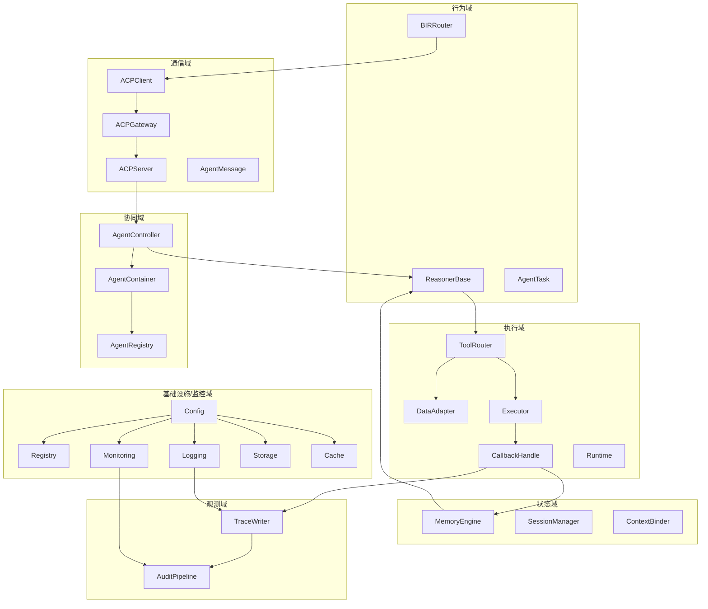
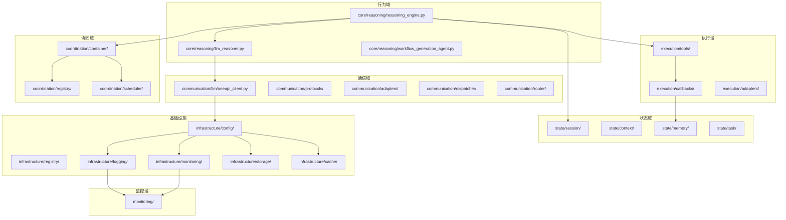

# 分布式智能体集群架构全链路七大模块

## 目录
1. 总览与设计理念
2. 分层与控制域全景
3. 系统目录结构与代码映射
4. BIR-ACP-Reasoner行为链闭环机制
5. 核心模块工程实现
6. 闭环行为链路全流程与模块交互  
7. 工程建议与最佳实践

---

# 1. 总览与设计理念

## 1.1 架构核心思想

咱们在做智能体系统的架构设计，目标不是简单地让多个 Agent 协同工作，而是要构建一个可信可追溯的**分布式智能体集群框架**，所以咱们要制定下智能架构设计的核心思想，其核心思想应该包括：

1. **以Agent为中心的分层解耦**
   - Agent是系统的核心单元，代表主动智能体，核心流程上以agent为核心，同时围绕核心打造，任务分发，核心推理，上下文记忆，工具调用四大基础模块，具备感知、推理、决策、执行、反馈等全生命周期能力。
   - 分层解耦：在系统上，我们按照控制域范围划分为行为核心（Agent/推理/工具/记忆）、通信、执行、状态、协同、基础设施、监控等层，每层职责单一、边界清晰，便于独立演进和横向扩展。
   - 行为链驱动：所有任务和行为以trace_id为主线，形成可追踪、可回放、可审计的行为链路，支撑企业级合规和溯源需求，每增加一个模块咱们都要先思考一下能不能以trace_id为主线做到追踪。

2. **先业务闭环再智能进化**
   - 意图-推理-行为-回调闭环：架构演进上，咱们先从用户意图识别、推理决策、工具执行到结果回调，形成一个agent的完整业务闭环，支持智能体自我进化和持续学习，一个能闭环的agent胜过不能闭环的多agent系统。
   - 数据驱动优化：在形成闭环之后，通过采集用户行为数据采集与分析，引入强化学习，持续优化推理策略、工具能力和系统性能，形成系统差异化个性化的优势。


3. **插件化与可插拔**
   - 推理器、工具、回调、注册中心，外部大模型调用，工具调用，智能体发现，api调用等均支持插件化，可按需动态加载、热更新，满足企业多场景、快速迭代的需求。
   - 策略热替换：推理、调度、路由等核心策略可在不中断服务的情况下灵活切换，提升系统弹性和可维护性。

4. **全链路治理与可观测**
   - 统一注册中心：所有Agent、工具、服务均注册于统一中心，支持服务发现、健康检查、动态扩缩容。
   - 全链路trace/日志/监控/告警：trace_id、session_id、task_id等全程贯穿，便于问题定位、性能分析和行为审计。
   - 权限与审计体系：细粒度权限控制和行为审计，保障安全与合规。

5. **多Agent协同与分布式能力**
   - 多Agent协同：支持多智能体并发、协作、竞争，适配复杂业务流程和多租户场景。
   - 分布式与容器化：多个智能体，咱们采用容器化隔离，共享记忆状态的方式，支持分布式部署、容器编排、弹性伸缩，适应高可用和大规模并发需求。

6. **工程化与可维护性**
   - 标准化接口与协议：各层采用标准接口和协议，引入外部标准的A2A,MCP，便于第三方集成和生态扩展。内部采用BIR和ACP做核心的通信协议，保证流转过程中可追溯。A2A,BIR,ACP,MCP的通信格式和作用可见前文。
 。

---

# 2. 分层与控制域全景

在企业级智能体系统的工程实践中，简单的功能堆叠和模块拼接难以支撑复杂业务的可控性、可扩展性和长期演进。为此，我们必须对系统进行**控制域**和**基础设施/监控层**的明确划分：

- **控制域划分**（行为、通信、执行、状态、协同、观测等）能够让每一类核心能力职责单一、边界清晰，便于团队分工、独立演进和横向扩展。每个控制域只关注一类主线能力，支持策略热替换、插件化注册和多场景快速适配。
- **基础设施/监控层**作为系统的底座，统一提供配置、注册、日志、监控、存储、缓存、trace、审计等能力，保障系统的可治理、可观测、安全合规和高可用。
- 这种分层不仅让trace_id、权限、上下文等元信息能够全链路强制传递，形成完整的可观测链路，也让多控制域模块可以灵活组合，支撑单Agent、Multi-Agent、RL策略等多种链路模式。
- 对于企业级落地，只有这样分层，才能实现“意图-推理-行为-回调-状态-再推理”的完整闭环，支撑复杂业务和多智能体协作，提升系统的可维护性、可追溯性和工程治理能力。
## 2.1 五大控制域与基础设施的职责划分与行为定义

| 控制域   | 主要职责 | 典型行为/模块 |
|----------|----------|--------------|
| **行为域**（Behavior） | 负责Agent的意图识别、推理决策、行为链路的发起与主控。 | 意图生成、推理决策、行为trace起点、Reasoner、BIRRouter、AgentTask |
| **通信域**（Communication） | 负责Agent间、模块间的消息传递、协议封装、权限注入、trace流转。 | 协议适配、消息分发、ACPClient/Server、AgentMessage、Dispatcher |
| **执行域**（Execution） | 负责工具/动作的注册、调度、执行与回调，行为结果的标准化反馈。 | ToolRouter、DataAdapter、CallbackHandle、Executor |
| **状态域**（State） | 负责上下文、记忆、会话、任务等多维状态的存储、检索与演化。 | MemoryEngine、SessionManager、ContextBinder、TaskManager |
| **协同域**（Coordination） | 负责多Agent的调度、注册、生命周期管理、消息链路的编排。 | AgentController、AgentContainer、AgentRegistry、Scheduler |
| **基础设施/监控域** | 提供统一的配置、注册、日志、监控、存储、缓存、trace、审计等底座能力。 | Config、Registry、Logging、Monitoring、Storage、Cache、TraceWriter、AuditPipeline |


## 2.2 行为链驱动的协同关系

- **行为域 → 通信域**：意图/行为决策后，封装为标准协议消息，进入系统流转。
- **通信域 → 执行域**：协议解包后，分发到工具/动作调度与执行。
- **执行域 → 状态域**：执行结果回写到记忆/上下文/任务状态。
- **状态域 → 行为域**：下一个行为/推理会基于最新状态做决策，形成闭环。
- **全流转 → 协同域**：多Agent调度、生命周期管理、消息编排由协同域主控。

### 2.3 全链路结构图




---

# 3. 系统目录结构与代码映射

在企业级智能体系统中，清晰的目录结构和模块划分不仅有助于团队协作和代码维护，更是实现分层解耦、可控性和可扩展性的基础。本章将详细介绍各个核心模块和目录的工程作用：

- 每个一级目录（如core、communication、execution、state、coordination、infrastructure、monitoring等）都对应系统的一个控制域或基础设施层，职责单一、边界清晰。
- 这些模块共同支撑了从意图识别、推理决策、工具调用、状态管理、通信调度到监控审计的全链路闭环。
- 代码结构与架构分层一一映射，便于快速定位功能、独立演进和横向扩展。
- 通过标准化接口和目录规范，支持插件化开发、策略热替换和多团队协作。

本章将结合实际目录结构，说明每个模块的主要职责、典型类/方法、以及它们在系统分层中的位置和作用，帮助读者建立从架构到代码的清晰认知。

## 3.1 项目完整目录结构与模块说明

```
/src
├── communication/         # 通信层：协议适配、消息分发、API网关、外部平台集成
│   ├── llm/               # 大模型API客户端（如OneAPI）
│   ├── protocols/         # 多协议支持（A2A、ACP、MCP等）
│   ├── adapters/          # 外部系统适配器
│   ├── dispatcher/        # 消息分发、调度
│   ├── router/            # 路由策略
│   ├── external/          # 外部平台/工具集成
│   └── README.md
├── core/                  # 核心推理与决策层（Agent本体、推理、工具、记忆等）
│   ├── agent/             # Agent基类与生命周期管理、任务执行
│   │   ├── base_agent.py  # Agent基类，生命周期、行为接口
│   │   ├── task_agent.py  # 任务型Agent实现
│   │   └── ...
│   ├── reasoning/         # 推理相关所有模块
│   │   ├── llm_reasoner.py            # LLM推理器
│   │   ├── hybrid_reasoner.py         # 混合推理器
│   │   ├── rule_reasoner.py           # 规则推理器
│   │   ├── rl_reasoner.py             # 强化学习推理器
│   │   ├── workflow_generation_agent.py # 工作流自动生成
│   │   ├── reasoning_engine.py        # 推理引擎主控
│   │   └── ...
│   ├── tools/             # 工具注册与管理、工具基类
│   │   ├── tool_registry.py           # 工具注册表
│   │   ├── base_tool.py               # 工具基类
│   │   └── ...
│   ├── memory/            # 记忆管理（短期/长期）、记忆模板
│   │   └── templates/                 # 记忆模板等
│   └── README.md
├── execution/             # 执行与工具层
│   ├── tools/             # 工具/插件管理与调用
│   ├── callbacks/         # 回调机制，支持Webhook等
│   ├── adapters/          # 外部动作适配
│   └── README.md
├── state/                 # 状态管理层
│   ├── session/           # 会话管理
│   ├── context/           # 上下文管理
│   ├── memory/            # 长期记忆管理
│   ├── task/              # 任务状态管理
│   └── README.md
├── coordination/          # 协同与调度层
│   ├── container/         # Agent容器与资源管理
│   ├── registry/          # 服务注册与发现
│   ├── scheduler/         # 任务调度与优先级队列
│   └── README.md
├── infrastructure/        # 基础设施层
│   ├── config/            # 统一配置管理
│   ├── registry/          # 注册中心
│   ├── logging/           # 日志
│   ├── monitoring/        # 监控、告警、追踪
│   ├── storage/           # 数据存储
│   ├── cache/             # 缓存
│   └── README.md
├── monitoring/            # 监控层（全链路监控、指标、追踪）
│   ├── tracing/           # Trace链路追踪
│   ├── metrics/           # 指标采集
│   ├── logging/           # 日志采集
│   └── README.md
└── README.md              # 项目总览说明
```

**说明：**
- core/下包含agent（Agent本体/生命周期）、reasoning（推理）、tools（工具注册/管理）、memory（记忆管理）等核心子模块。
- 每个一级目录下均有README.md，详细说明该层/模块的职责、主要类/方法、典型调用链。
- 目录结构与架构分层、控制域一一对应，便于团队理解、开发和扩展。
- 具体模块实现可参考各目录下的README和源码。

## 3.2 控制域与/src目录映射

| 控制域   | 主要目录/文件（@/src） | 典型模块/类（举例） |
|----------|------------------------|---------------------|
| 行为域   | core/reasoning/        | llm_reasoner.py、reasoning_engine.py、workflow_generation_agent.py、hybrid_reasoner.py、rule_reasoner.py、rl_reasoner.py |
| 通信域   | communication/         | llm/oneapi_client.py、protocols/、adapters/、dispatcher/、router/、external/ |
| 执行域   | execution/             | tools/、callbacks/、adapters/ |
| 状态域   | state/                 | session/、context/、memory/、task/ |
| 协同域   | coordination/          | container/、registry/、scheduler/ |
| 基础设施 | infrastructure/        | config/、registry/、logging/、monitoring/、storage/、cache/ |
| 监控域   | monitoring/            | tracing/、metrics/、logging/ |

## 3.3 代码结构与控制域关系图



---
## 4 BIR-ACP-Reasoner行为链闭环机制

### 4.1 为什么“可控性”是Agent架构的第一性问题

企业在部署智能体系统时，最常见的失败，不是模型不好，也不是插件太少，而是“系统失控”：输入可以随机给，输出却没人知道怎么来的，状态一旦变化就无法还原。这类问题可以归结为三个核心失控现象：

- **行为不可控**：同样的输入，不同状态返回不同输出。状态未被显式建模，推理策略散落在prompt中，行为链隐式组装，导致行为漂移。
- **状态不可追**：调用链未显式记录，日志未形成链式结构，只能看到LLM响应，无法还原完整行为流程树，难以Debug和审计。
- **系统不可控**：模块无上下文约束，组件可任意调用，权限未封装，安全性、可控性、复用性全部丧失。

**工程视角下的“Agent可控性”定义：**
- 是否以“行为链”为主线进行状态控制（行为驱动）
- 是否所有交互都通过统一协议结构传递（通信封装）
- 是否所有推理结果都走统一决策通道执行（决策闭环）

为了解决上述问题，工程系统中引入三大核心模块：
1. **BIR Router**：接收行为意图、生成行为链指令
2. **ACP 协议**：传递封装行为结构+Trace+权限
3. **ReasonerBase**：注入上下文+执行决策推理+行为选择执行

**工程建议：**
- 所有行为都应有trace_id主线，形成可追溯、可回放、可审计的行为链。
- 各模块接口需标准化，所有调用都走统一协议和决策通道。
- 权限、上下文、trace等元信息必须在行为包和通信协议中强制注入。

---

### 4.2 BIR消息驱动机制

BIR（Behavior Intent Router）消息调度模型是系统行为链的起点。它负责将“输入意图”解析成可被系统接收、执行、追踪的**行为指令包**，实现行为驱动、解耦和可追踪。

#### 4.2.1 行为包结构设计

BIR行为包是发送给ACP的标准化入口，由BIRRouter生成并签名。

```json
{
  "intent": "analyze_complaint_and_solve",
  "from": "customer_service_system", 
  "to": "complaint_analysis_agent",
  "context_id": "session-98a7",
  "trace_id": "trace-7e1b9",
  "timestamp": 1714032341,
  "payload": {
    "complaint_id": "COMP-2025-001",
    "customer_id": "CUST-789",
    "complaint_content": "产品功能异常，影响正常使用",
    "priority": "high",
    "customer_tier": "premium"
  }
}
```

#### 4.2.2 BIRRouter接口结构

```python
class BIRRouter:
    def __init__(self, acp_client, trace_writer):
        self.acp = acp_client
        self.trace = trace_writer

    def dispatch(self, intent: str, from_id: str, to_id: str, context_id: str, payload: dict):
        trace_id = self.trace.new_trace(intent=intent, context_id=context_id)
        behavior_package = {
            "intent": intent,
            "from": from_id,
            "to": to_id,
            "context_id": context_id,
            "trace_id": trace_id,
            "timestamp": int(time.time()),
            "payload": payload
        }
        self.trace.record_event(trace_id, "BIR_DISPATCH", behavior_package)
        self.acp.send(to_id, behavior_package)
```

#### 4.2.3 TraceWriter协作与链式日志

- 每个dispatch注册新的trace_id，记录BIR_DISPATCH事件，行为包交由ACP处理。
- 行为链条锚点：输入意图→trace_id绑定→行为结构封装→通信模块传递。

#### 4.2.4 真实调用示例

```python
router = BIRRouter(acp_client=ACPClient(), trace_writer=TraceWriter())
router.dispatch(
    intent="generate_report",
    from_id="user",
    to_id="report_agent",
    context_id="session-001",
    payload={"date": "2025-04-25", "project": "AlphaX"}
)
```

**工程建议：**
- 所有行为必须通过BIRRouter标准化处理，dispatch绑定trace_id，形成链式日志结构。
- 行为包是智能体系统唯一的“行为单元入口”，不是函数调用结果。

---

### 4.3 ACP通信协议

ACP（Agent Communication Protocol）是行为调用的语义边界层，负责行为语义封装（含trace_id、权限、上下文）和行为执行路径的trace写入与校验。

#### 4.3.1 ACP三层结构封装

```json
{
  "meta": {
    "trace_id": "trace-7e1b9",
    "timestamp": 1714032341,
    "from": "user",
    "to": "report_agent"
  },
  "context": {
    "context_id": "session-001",
    "locale": "zh-CN",
    "auth_token": "JWT-ABCDEF",
    "permissions": ["read:data", "write:report"]
  },
  "command": {
    "intent": "analyze_complaint_and_solve",
    "payload": {
      "complaint_id": "COMP-2025-001",
      "customer_id": "CUST-789",
      "complaint_content": "产品功能异常，影响正常使用",
      "priority": "high",
      "customer_tier": "premium"
    }
  }
}
```

#### 4.3.2 Client/Server/Gateway职责拆解

- **ACPClient**：行为包发送端（如BIRRouter调用）

```python
class ACPClient:
    def __init__(self, gateway_host):
        self.gateway = gateway_host
    def send(self, to_id: str, behavior_package: dict):
        requests.post(f"{self.gateway}/agent/{to_id}", json=behavior_package)
```

- **ACPServer**：行为接收并转发到Reasoner的入口

```python
class ACPServer:
    def __init__(self, agent_registry, trace_writer):
        self.registry = agent_registry
        self.trace = trace_writer
    def receive(self, request):
        behavior = request.json
        trace_id = behavior["meta"]["trace_id"]
        self.trace.record_event(trace_id, "ACP_RECEIVE", behavior)
        agent = self.registry.get(behavior["meta"]["to"])
        agent.handle(behavior)
```

- **ACPGateway**：统一通信入口，可挂WAF/认证/审计
  - 用于请求频控、认证头校验、结构格式验证、TraceWriter初始化挂载点。

#### 4.3.3 TraceWriter如何挂载于ACP调用链

- 在ACPServer中：`self.trace.record_event(trace_id, "ACP_RECEIVE", behavior)`
- 事件写入链式日志，行为包被记录，系统进入“可审计”状态。

#### 4.3.4 ACP模块调用链结构图

```mermaid
flowchart TD
    A[BIRRouter.dispatch()] --> B[ACPClient.send()]
    B --> C[ACPGateway（统一入口）]
    C --> D[ACPServer.receive()]
    D --> E[TraceWriter.record_event("ACP_RECEIVE")]
    E --> F[Agent.handle(behavior_package)]
```

**工程建议：**
- ACP是行为链路的封装边界和Trace挂载中枢，所有行为必须被ACP包装成三段式结构（meta/context/command）。
- 所有调用必须进入ACPServer，再进入Reasoner，形成链路闭环。

### 4.4 Reasoner推理模块

Reasoner模块是Agent系统中最核心的决策与行为编排单元。它不仅仅是一个“LLM调用器”或“规则树”，而是一个以**上下文、行为意图、工具可用性**为输入，输出**Action指令集**的中控执行模块。Reasoner的设计直接决定了系统的可控性、可追溯性和可扩展性。

#### 4.4.1 Reasoner的行为控制职责

Reasoner的核心职责是回答：“现在这个Agent应该干什么？”
它的决策过程不是简单的prompt拼接，而是完整的行为链路：

- **输入**：上下文状态（Memory）、当前行为意图（Intent）、系统工具栅格（ToolRegistry）
- **推理**：ReasonerBase模块，结合上下文和意图，生成决策prompt
- **输出**：Action指令集，分发给下游执行，并写入Trace

**工程要点：**
- Reasoner必须与Memory、ToolRegistry、TraceWriter深度集成，保证决策有据可查。
- 每一次推理都要有trace_id，便于后续审计和复现。
- 推理结果必须结构化输出，便于下游模块自动处理。

---

#### 4.4.2 ReasonerBase接口结构定义

ReasonerBase是所有推理模块的基类，定义了推理链路的标准接口。

```python
class ReasonerBase:
    def __init__(self, memory_engine, tool_registry, trace_writer):
        self.memory = memory_engine
        self.tools = tool_registry
        self.trace = trace_writer

    def inject_prompt(self, behavior: dict) -> str:
        context = self.memory.query(behavior["context_id"])
        prompt = f"""
        You are acting as {behavior['meta']['to']}.
        Current context: {context}
        Current intent: {behavior['command']['intent']}
        Payload: {behavior['command']['payload']}
        Please select the most appropriate action/tool.
        """
        trace_id = behavior["meta"]["trace_id"]
        self.trace.record_event(trace_id, "REASONER_PROMPT", {"prompt": prompt})
        return prompt

    def select_action(self, prompt: str) -> dict:
        result = call_llm(prompt)
        action = json.loads(result)["action"]
        self.trace.record_event(current_trace_id(), "REASONER_ACTION", {"action": action})
        return action

    def feedback(self, action_result: dict):
        self.memory.store_result(action_result)
        self.trace.record_event(current_trace_id(), "REASONER_FEEDBACK", action_result)
```

**主要接口说明：**
- `inject_prompt(behavior: dict) -> str`  
  作用：根据行为包和上下文生成决策prompt，并写入Trace。
  输入：行为包（含meta、context、command）
  输出：prompt字符串
  Trace写入点：`REASONER_PROMPT`
- `select_action(prompt: str) -> dict`  
  作用：调用LLM或规则引擎，解析决策结果，结构化输出Action，并写入Trace。
  输入：prompt字符串
  输出：Action字典（如{"tool": "DataQuery", "args": {...}})
  Trace写入点：`REASONER_ACTION`
- `feedback(action_result: dict)`  
  作用：将工具执行结果写入Memory，并记录反馈到Trace。
  输入：Action执行结果
  Trace写入点：`REASONER_FEEDBACK`

---

#### 4.4.3 Reasoner在行为链中的决策路径

Reasoner在整个行为链中的位置如下：

1. **ACPServer.receive(behavior_package)**  
   → 2. **agent.handle(behavior_package)**  
   → 3. **ReasonerBase.inject_prompt()**  
   → 4. **LLM推理/规则推理 → ReasonerBase.select_action()**  
   → 5. **生成Action，分发给ToolRouter**  
   → 6. **ToolRouter调用工具，返回结果**  
   → 7. **ReasonerBase.feedback()，写入Memory和Trace**

**详细流程说明：**
- 行为包进入Reasoner：由ACPServer转发，agent.handle()调用Reasoner。
- 上下文注入：Reasoner从Memory查询当前上下文，生成决策prompt。
- 推理决策：调用LLM或规则引擎，选择最优Action。
- 工具调用：Action分发给ToolRouter，执行具体工具。
- 结果反馈：工具执行结果回写Memory，并写入Trace，形成完整闭环。

---

#### 4.4.4 TraceWriter在Reasoner中的写入点

Reasoner模块与TraceWriter深度集成，保证每一步决策都可追溯。

| 阶段         | TraceWriter事件名      | 说明                   |
|--------------|-----------------------|------------------------|
| prompt注入   | REASONER_PROMPT       | LLM输入日志            |
| 动作选择完成 | REASONER_ACTION       | 推理动作选择结果       |
| 工具反馈处理 | REASONER_FEEDBACK     | 工具执行结果与反馈     |

**事件结构示例：**
```json
{
  "trace_id": "trace-7e1b9",
  "event": "REASONER_ACTION",
  "timestamp": 1714032358,
  "payload": {
    "action": {
      "tool": "DataQuery",
      "args": {"date": "2025-04-25"}
    }
  }
}
```

---

#### 4.4.5 推理路径结构图（真实链路结构）

```mermaid
flowchart TD
    A[ACPServer.receive()] --> B[Agent.handle()]
    B --> C[ReasonerBase.inject_prompt()]
    C --> D[调用LLM返回JSON]
    D --> E[ReasonerBase.select_action()]
    E --> F[调用ToolRouter执行Tool]
    F --> G[ReasonerBase.feedback()]
    G --> H[Memory.store_result()]
    G --> I[TraceWriter.record_event("REASONER_FEEDBACK")]
```

---

#### 4.4.6 工程实现建议与可扩展性

- **多种推理策略支持**：ReasonerBase可扩展为LLMReasoner、RuleReasoner、HybridReasoner等，支持不同推理方式。
- **插件化工具管理**：ToolRegistry支持动态注册/注销工具，Reasoner可根据上下文动态选择可用工具。
- **行为链可插拔**：TraceWriter、MemoryEngine等均为可插拔组件，便于系统扩展和定制。
- **异常处理与回滚**：Reasoner应支持异常捕获、Trace异常写入、行为回滚等机制，提升系统健壮性。

---

#### 4.4.7 小结

Reasoner模块是Agent系统的“中枢大脑”，它将上下文、意图、工具、反馈等多维信息融合，形成可控、可追溯、可扩展的决策链路。
通过标准化接口、深度集成Trace与Memory、结构化Action输出，Reasoner为企业级Agent系统提供了强大的决策闭环能力，是实现“可控智能体”的关键基石。

### 4.5 三者协作的全链路闭环结构图与锚点

企业级Agent系统的可控性、可追溯性和健壮性，最终体现在BIR、ACP、Reasoner三大核心模块的协作闭环。下面详细说明全链路结构、控制权流动、闭环锚点及工程实现建议。

#### 4.5.1 全链路行为闭环结构图

```mermaid
flowchart TD
    U[用户意图输入：如"生成日报"] --> A[BIRRouter.dispatch()]
    A --> B[ACPClient.send()]
    B --> C[ACPGateway]
    C --> D[ACPServer.receive()]
    D --> E[TraceWriter.record("ACP_RECEIVE")]
    D --> F[Agent.handle()]
    F --> G[Reasoner.inject_prompt()]
    G --> H[调用LLM推理 → JSON]
    H --> I[Reasoner.select_action()]
    I --> J[TraceWriter.record("REASONER_ACTION")]
    I --> K[ToolRouter 执行 Tool]
    K --> L[Tool 执行结果返回]
    L --> M[Reasoner.feedback()]
    M --> N[Memory.store_result()]
    M --> O[TraceWriter.record("REASONER_FEEDBACK")]
```

#### 4.5.2 行为控制权流动路径表

| 流程段           | 控制模块                  | Trace 注入点         | 可替换接口/说明           |
|------------------|--------------------------|----------------------|--------------------------|
| 用户 → BIR       | BIRRouter.dispatch()     | BIR_DISPATCH         | 可自定义行为发起者        |
| BIR → ACP        | ACPClient/ACPServer      | ACP_RECEIVE          | Gateway/Server可抽象      |
| ACP → 推理       | Agent.handle()/Reasoner  | REASONER_PROMPT      | Prompt策略可替换          |
| 推理 → 执行      | Reasoner.select_action() | REASONER_ACTION      | ToolRouter可插件化        |
| 执行 → 回写      | Reasoner.feedback()      | REASONER_FEEDBACK    | MemoryEngine可多策略      |

#### 4.5.3 系统五个闭环锚点工程说明

1. **BIR是行为入口锚点**：所有行为都从BIRRouter标准化发起，绑定trace_id，形成行为主线。
2. **ACP是通信协议锚点**：所有行为必须结构化封装，权限受控，trace全链路传递，支持审计。
3. **Reasoner是决策核心锚点**：注入上下文、决定动作、执行反馈，所有推理走统一决策通道。
4. **TraceWriter是链路追踪锚点**：每一步写入链式日志，支撑行为审计、回放和异常溯源。
5. **Memory是状态落地锚点**：每个行为执行结果都持久化，供后续推理和状态恢复。

#### 4.5.4 典型全链路调用链流程

1. 用户输入意图（如“生成日报”），通过BIRRouter标准化为行为包，分配trace_id。
2. BIRRouter通过ACPClient发送行为包，ACPGateway统一入口校验、转发。
3. ACPServer接收行为包，TraceWriter记录ACP_RECEIVE事件，分发给目标Agent。
4. Agent.handle()调用Reasoner，Reasoner注入上下文生成prompt，TraceWriter记录REASONER_PROMPT。
5. Reasoner调用LLM/规则推理，select_action结构化输出Action，TraceWriter记录REASONER_ACTION。
6. Action分发给ToolRouter，执行工具，结果回传。
7. Reasoner.feedback()写入Memory，TraceWriter记录REASONER_FEEDBACK，形成完整闭环。

#### 4.5.5 工程实现建议

- trace_id、权限、上下文等元信息应全链路强制传递，便于追踪和调试。
- 各环节接口标准化，便于插件化、扩展和替换。
- TraceWriter建议支持多种后端（如本地、ElasticSearch、分布式日志），便于大规模审计。
- MemoryEngine支持多级存储和快照，提升系统健壮性。
- 全链路异常处理和回滚机制，保障系统可恢复和高可用。

---

# 5. 核心模块工程实现

### 5.1 Agent基类与上下文管理
- **典型实现**：`core/agent/base_agent.py`、`core/agent/task_agent.py`
- **设计理念**：Agent是主动行为的执行者，负责任务接收、上下文管理、推理决策、行为执行和结果反馈。
- **关键接口**：
  - `initialize()`：初始化Agent，加载配置和依赖模块。
  - `execute(context)`：执行任务，标准输入格式为dict，包含input、task_id、memory_ref等。
  - `shutdown()`：关闭Agent，释放资源。
- **调用链说明**：
  1. Dispatcher分发任务到Agent。
  2. Agent读取上下文和历史状态（Memory）。
  3. 调用Reasoner做推理决策，选择行为。
  4. 调用ToolChain执行具体动作。
  5. 结果写入Memory和Trace，供后续追踪和回放。
- **典型代码片段**：
```python
class BaseAgent:
    def __init__(self, name, memory, reasoner, toolchain):
        self.name = name
        self.memory = memory
        self.reasoner = reasoner
        self.toolchain = toolchain

    def execute(self, context):
        input_data = context["input"]
        state = self.memory.load_state(context)
        decision = self.reasoner.decide({"input": input_data, "memory": state})
        action = decision["action"]
        result = self.toolchain.execute(action, context)
        trace = decision.get("trace", [])
        self.memory.update(context, result)
        return {"output": result, "trace": trace + [f"{self.name}:{action}"]}
```
- **工程建议**：每步行为都追加trace，工具执行后写入memory，支持任务快照与恢复。

### 5.2 Memory/Session状态持久化
- **典型实现**：`core/memory/`、`state/memory/`、`state/session/`
- **设计理念**：Memory模块负责记录Agent的历史输入输出、对话上下文、工具使用、决策反馈等，支持多级存储和多轮对话。
- **关键接口**：
  - `store(key, value, memory_type)`：存储记忆。
  - `retrieve(key, memory_type)`：检索记忆。
  - `update(key, value, memory_type)`：更新记忆。
- **典型代码片段**：
```python
class AgentMemory:
    def __init__(self):
        self.store = {}

    def load_state(self, context):
        task_id = context["task_id"]
        return self.store.get(task_id, {})

    def update(self, context, result):
        task_id = context["task_id"]
        self.store.setdefault(task_id, {})
        self.store[task_id]["last_output"] = result
        self.store[task_id]["updated_at"] = time.time()
```
- **工程建议**：
  - Memory Summary可用LLM做摘要后嵌入，提升检索效率。
  - 支持多轮对话和历史Trace的存储，便于上下文联动。

### 5.3 Reasoner模块注册与动态策略融合
- **典型实现**：`core/reasoning/llm_reasoner.py`、`hybrid_reasoner.py`、`rule_reasoner.py`、`rl_reasoner.py`
- **设计理念**：Reasoner负责根据上下文和任务目标，选择最合适的行为路径或动作，支持多种推理策略（规则、LLM、RL、Planner）。
- **关键接口**：
  - `decide(context: dict) -> dict`：输入上下文，输出决策结果（action、params、trace等）。
- **典型代码片段**：
```python
class BaseReasoner:
    def decide(self, context: dict) -> dict:
        raise NotImplementedError

class ReasonerRouter(BaseReasoner):
    def __init__(self, rule, llm, rl):
        self.rule = rule
        self.llm = llm
        self.rl = rl
    def decide(self, context):
        if "合规" in context["input"]:
            return self.rule.decide(context)
        elif context.get("use_rl", False):
            return self.rl.decide(context)
        else:
            return self.llm.decide(context)
```
- **工程建议**：
  - 支持插件化推理器，便于策略热替换和扩展。
  - RLPolicyReasoner可集成PPO/DPO等强化学习模型，优化行为路径。

### 5.4 Tool使用与注册模块
- **典型实现**：`core/tools/tool_registry.py`、`execution/tools/`、`execution/callbacks/`
- **设计理念**：Tool模块是Agent的“手”，负责调用外部API、系统服务或其他Agent，实现行为落地。
- **关键接口**：
  - `register_tool(tool)`：注册工具。
  - `get_tool(tool_name)`：获取工具。
  - `list_tools()`：列出所有工具。
  - `execute(action, context)`：执行指定工具。
- **典型代码片段**：
```python
TOOL_REGISTRY = {}

def register_tool(name):
    def wrapper(fn):
        TOOL_REGISTRY[name] = fn
        return fn
    return wrapper

@register_tool("translate")
def tool_translate(ctx):
    return external_api_call("translate", ctx["text"])

class ToolChain:
    def execute(self, action, context):
        tool_fn = TOOL_REGISTRY.get(action)
        if not tool_fn:
            raise Exception(f"No tool found for action {action}")
        return tool_fn(context)
```
- **工程建议**：
  - 工具注册推荐Callback机制，支持同步/异步/HTTP/RPC等多种调用。
  - 多Agent可共享ToolChain，支持权限控制和动态扩展。

### 5.5 RL推理策略集成
- **典型实现**：`core/reasoning/rl_reasoner.py`
- **设计理念**：RLPolicyReasoner基于强化学习模型（如PPO/DPO），根据reward信号优化推理路径，实现智能体自我进化。
- **关键接口**：
  - `decide(context)`：输出离散动作编号，映射到具体行为。
- **典型代码片段**：
```python
ACTIONS = [
    "memory_lookup",
    "tool_invoke",
    "delegate_to_agent",
    "skip",
    "terminate"
]

class RLPolicyReasoner(BaseReasoner):
    def __init__(self, model, tokenizer):
        self.model = model
        self.tokenizer = tokenizer
    def decide(self, context):
        prompt = context["input"]
        input_ids = self.tokenizer(prompt, return_tensors="pt").input_ids
        logits = self.model(input_ids)[0][:, -1, :]
        action_id = torch.argmax(logits, dim=-1).item()
        return {
            "action": ACTIONS[action_id],
            "params": {},
            "trace": [f"RL@{action_id}"]
        }
```
- **工程建议**：
  - 动作空间（ACTIONS）需结合业务场景灵活定义。
  - 支持reward信号与行为结构的绑定，便于策略训练和回放。

### 5.6 Trace行为链记录与可视化
- **典型实现**：`monitoring/tracing/`、`infrastructure/logging/`
- **设计理念**：TraceWriter记录每次Agent行为决策、工具调用、状态变更，支撑全链路可追踪、可回放、可审计。
- **关键接口**：
  - `append(task_id, step)`：追加trace步骤。
  - `get(task_id)`：获取指定任务的trace链。
- **典型代码片段**：
```python
class TraceWriter:
    def __init__(self):
        self.logs = {}
    def append(self, task_id, step):
        self.logs.setdefault(task_id, []).append({
            "time": time.strftime("%Y-%m-%dT%H:%M:%S"),
            **step
        })
    def get(self, task_id):
        return self.logs.get(task_id, [])
```
- **工程建议**：
  - Trace回放调试工具建议提供API接口，便于问题定位和行为审计。
  - Trace结构建议标准化，便于跨模块索引和分析。

### 5.7 Agent生命周期与任务中断恢复
- **典型实现**：`core/agent/base_agent.py`、`state/task/`
- **设计理念**：Agent需具备完整的生命周期管理能力，支持任务中断、恢复、快照和回滚，提升系统健壮性和可维护性。
- **关键接口**：
  - `pause(task_id, checkpoint)`：中断任务并保存快照。
  - `resume()`：恢复任务执行。
- **典型代码片段**：
```python
class AgentLifecycle:
    def __init__(self):
        self.status = "idle"  # idle / running / paused / error / done
        self.last_checkpoint = None
    def pause(self, task_id, checkpoint):
        self.status = "paused"
        self.last_checkpoint = checkpoint
    def resume(self):
        self.status = "running"
        return self.last_checkpoint
```
- **工程建议**：
  - 生命周期状态建模（idle/running/paused/error/done），便于监控和调度。
  - 支持多种中断触发机制（用户、调度器、异常等）。

---

# 6 闭环行为链路全流程与模块交互

一个企业级智能体系统的行为链路闭环，通常包括以下关键步骤。每一步都对应具体的工程模块和接口，下面结合/src结构详细说明各环节的交互与实现：

## 6.1 智能体发现与注册
- **模块**：`coordination/registry/`、`core/agent/base_agent.py`
- **交互说明**：
  - 系统启动时，所有Agent向注册中心注册自身能力、接口。
  - 注册中心（AgentRegistry）负责服务发现、健康检查。
- **关键代码片段**：
```python
# coordination/registry/agent_registry.py
class AgentRegistry:
    def __init__(self):
        self.agents = {}
    def register(self, agent_name, agent_instance):
        self.agents[agent_name] = agent_instance
    def get(self, agent_name):
        return self.agents.get(agent_name)
```
- **交互链路**：注册中心被Dispatcher等用于查找目标Agent。

## 6.2 意图识别与分发
- **模块**：`communication/dispatcher/`、`communication/protocols/`、`core/agent/base_agent.py`
- **交互说明**：
  - 用户请求或外部事件通过API/协议进入系统。
  - Dispatcher解析请求，识别意图，查找目标Agent。
  - 通过ACP等协议封装消息，分发到目标Agent。
- **关键代码片段**：
```python
# communication/dispatcher/dispatcher.py
class Dispatcher:
    def __init__(self, registry):
        self.registry = registry
    def dispatch(self, acp_packet):
        agent = self.registry.get(acp_packet["receiver"])
        context = {
            "task_id": acp_packet["task_id"],
            "input": acp_packet["params"],
            "trace": acp_packet.get("trace", [])
        }
        return agent.execute(context)
```
- **交互链路**：Dispatcher → Agent（execute）

## 6.3 推理决策
- **模块**：`core/reasoning/reasoning_engine.py`、`llm_reasoner.py`、`hybrid_reasoner.py`
- **交互说明**：
  - Agent收到任务后，调用Reasoner进行推理决策。
  - Reasoner可融合规则、LLM、RL等多种策略，输出action和trace。
- **关键代码片段**：
```python
# core/reasoning/llm_reasoner.py
class LLMReasoner:
    def reason(self, context):
        prompt = self.build_prompt(context)
        result = self.llm_api.call(prompt)
        action = self.parse_action(result)
        return {"action": action, "trace": [f"llm:{action}"]}
```
- **交互链路**：Agent（execute）→ Reasoner（reason/decide）

## 6.4 工具/动作调用
- **模块**：`core/tools/tool_registry.py`、`execution/tools/`、`execution/callbacks/`
- **交互说明**：
  - Reasoner决策后，Agent通过ToolChain调用具体工具或动作。
  - 工具可为内部函数、外部API、甚至其他Agent。
- **关键代码片段**：
```python
# core/tools/tool_registry.py
class ToolRegistry:
    def __init__(self):
        self.tools = {}
    def register_tool(self, name, fn):
        self.tools[name] = fn
    def execute(self, action, context):
        tool_fn = self.tools.get(action)
        if not tool_fn:
            raise Exception(f"No tool found for action {action}")
        return tool_fn(context)
```
- **交互链路**：Agent（execute）→ ToolChain（execute）

## 6.5 回调与反馈
- **模块**：`execution/callbacks/`
- **交互说明**：
  - 工具执行完成后，结果通过回调机制反馈给Agent或上游模块。
  - 支持Webhook、异步反馈等多种方式。
- **关键代码片段**：
```python
# execution/callbacks/callbacks.py
def on_tool_success(context, result):
    # 可写入日志、触发下游、通知用户等
    print(f"Tool executed successfully: {result}")
```
- **交互链路**：ToolChain（execute）→ Callback（on_tool_success）

## 6.6 状态与记忆更新
- **模块**：`core/memory/`、`state/memory/`、`state/session/`
- **交互说明**：
  - 工具/行为执行结果写入Memory，更新上下文和任务状态。
  - 支持多轮对话、历史追踪、快照与恢复。
- **关键代码片段**：
```python
# core/memory/memory_manager.py
class MemoryManager:
    def update(self, context, result):
        task_id = context["task_id"]
        # 更新记忆
        ...
```
- **交互链路**：Agent（execute）→ Memory（update）

## 6.7 链路闭环与追踪
- **模块**：`monitoring/tracing/`、`infrastructure/logging/`
- **交互说明**：
  - 全链路trace_id贯穿每个环节，TraceWriter记录每次行为、决策、工具调用、状态变更。
  - 支持trace回放、行为审计、异常溯源。
- **关键代码片段**：
```python
# monitoring/tracing/trace_writer.py
class TraceWriter:
    def append(self, task_id, step):
        # 追加trace步骤
        ...
```
- **交互链路**：Agent/Tool/Callback等各环节均应append trace

## 6.8 行为链路闭环流程伪代码总览

```python
# 用户请求 -> Dispatcher -> Agent -> Reasoner -> Tool -> Callback -> Memory/Trace
acp_packet = {
    "task_id": "task-001",
    "receiver": "writer_agent",
    "params": {"text": "请生成周报"}
}
result = dispatcher.dispatch(acp_packet)
# dispatcher -> agent.execute(context)
# agent -> reasoner.decide(context)
# agent -> toolchain.execute(action, context)
# tool -> callback.on_tool_success(context, result)
# agent -> memory.update(context, result)
# trace_writer.append(task_id, step)
```

---

**工程建议：**
- trace_id、session_id、task_id等应全链路传递，便于追踪和调试。
- 每个环节都应有trace记录，支持回放与审计。
- 各模块接口标准化，便于插件化和扩展。
- 业务闭环优先，确保每个任务都能完整走完“发现-分发-推理-执行-反馈-状态更新-追踪”全流程。

---

# 7. 总结与后续计划

现在的两篇文章介绍了分布式群体智能体系统的分层架构、控制域划分、核心协议（A2A、BIR、ACP、MCP）、行为链闭环机制、各核心模块的工程实现要点，以及全链路的模块交互与trace主线。通过标准化分层、协议结构和trace机制，确保了系统的可控性、可追溯性、可扩展性和工程可落地性，为企业级多智能体系统的建设提供了坚实的理论与工程基础。

接下来，我们将以“一个模块一个模块”的方式，逐步实现和完善上述架构中的各个核心模块。每期聚焦一个关键模块，深入讲解其工程实现、接口设计、调用链路和最佳实践。

**下期预告**：
我们将率先实现“执行链”相关模块，详细拆解工具注册、调度、执行、回调与trace写入的全流程。

敬请期待！


