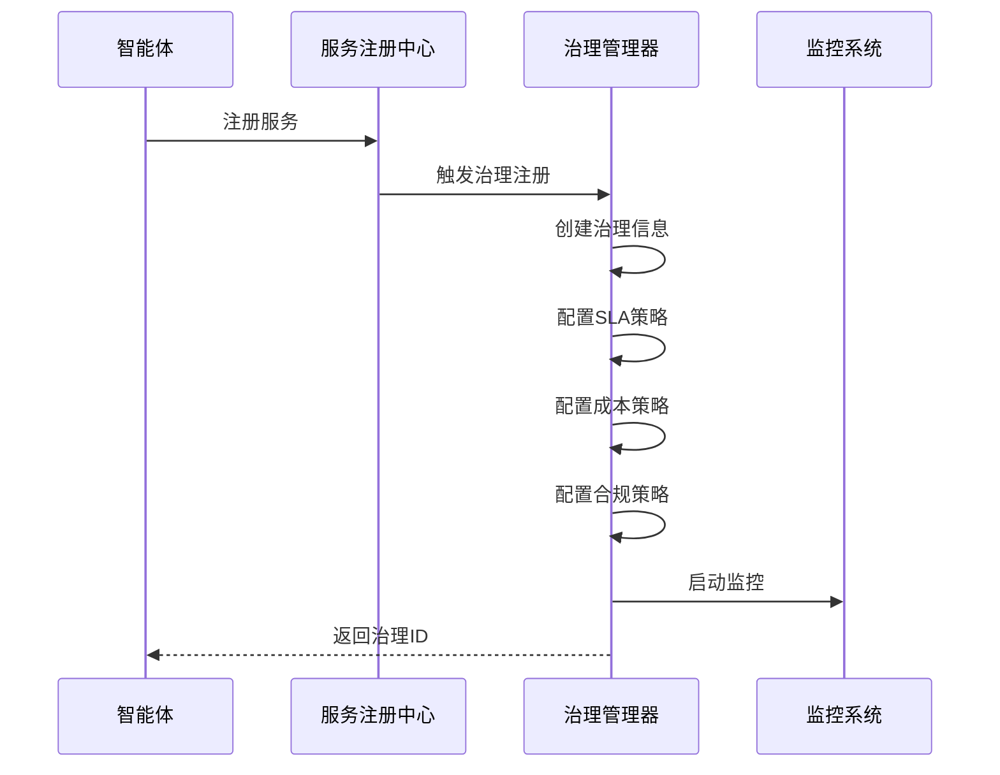
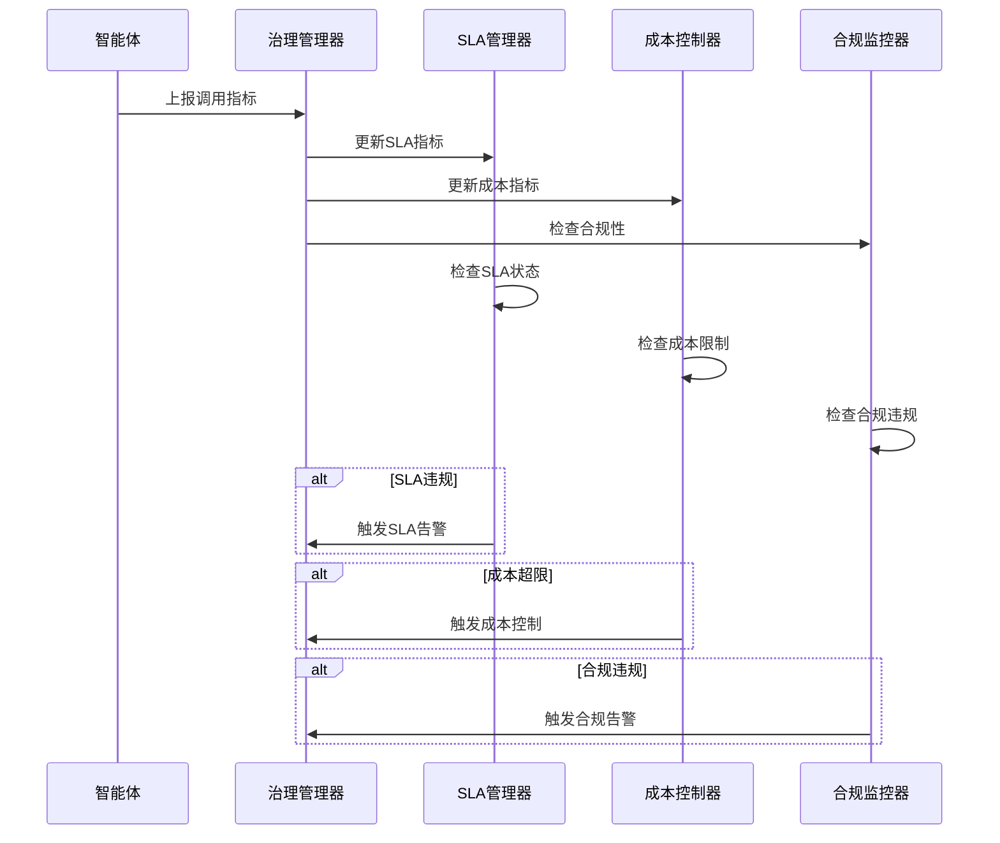

# 协调域治理层设计方案

## 项目概述

本文档描述了企业级Agent系统中协调域治理层的完整设计方案。治理层是协调域的核心组成部分，负责统一管理内部和外部智能体，提供SLA、成本、合规管控等企业级治理能力。

## 设计目标

### 核心目标
1. **统一管理**：内部和外部智能体的统一注册、监控、管理
2. **SLA保障**：服务水平协议的监控、报警、自动处理
3. **成本控制**：精细化成本管理、预算控制、自动限流
4. **合规管控**：数据安全、合规监控、违规处理
5. **可视化治理**：实时仪表板、报告生成、决策支持

### 技术目标
- **高可用性**：治理服务可用性 > 99.9%
- **实时监控**：指标更新延迟 < 10秒
- **自动化程度**：90%以上的治理决策自动化
- **扩展性**：支持1000+智能体同时治理
- **数据准确性**：治理数据准确率 > 99%

## 整体架构设计

### 架构层次

```
┌─────────────────────────────────────────────────────────────┐
│              Governance Dashboard 治理仪表板                │
│  ┌─────────────────┐  ┌─────────────────┐  ┌─────────────────┐ │
│  │ SLA Dashboard   │  │ Cost Dashboard  │  │ Compliance      │ │
│  │                 │  │                 │  │ Dashboard       │ │
│  └─────────────────┘  └─────────────────┘  └─────────────────┘ │
└─────────────────────────────────────────────────────────────┘
                              │ Management API
┌─────────────────────────────────────────────────────────────┐
│               Governance Manager 治理管理器                  │
│  ┌─────────────────┐  ┌─────────────────┐  ┌─────────────────┐ │
│  │ SLA Manager     │  │ Cost Controller │  │ Compliance      │ │
│  │                 │  │                 │  │ Monitor         │ │
│  └─────────────────┘  └─────────────────┘  └─────────────────┘ │
└─────────────────────────────────────────────────────────────┘
                              │ Governance Interface
┌─────────────────────────────────────────────────────────────┐
│              Agent Registry 智能体注册表                     │
│  ┌─────────────────┐  ┌─────────────────┐  ┌─────────────────┐ │
│  │ Internal Agents │  │ A2A Agents      │  │ MCP Tools       │ │
│  │                 │  │                 │  │                 │ │
│  └─────────────────┘  └─────────────────┘  └─────────────────┘ │
└─────────────────────────────────────────────────────────────┘
                              │ Agent Interface
┌─────────────────────────────────────────────────────────────┐
│                Multi-Agent Ecosystem 多智能体生态            │
│  ┌─────────────────┐  ┌─────────────────┐  ┌─────────────────┐ │
│  │ Task Agent      │  │ Claude Agent    │  │ Data Analysis   │ │
│  │ Review Agent    │  │ GPT Agent       │  │ Tool            │ │
│  │ Writer Agent    │  │ Custom Agent    │  │ External API    │ │
│  └─────────────────┘  └─────────────────┘  └─────────────────┘ │
└─────────────────────────────────────────────────────────────┘
```

### 模块目录结构

```
src/coordination/governance/              # 治理层核心模块
├── __init__.py                          # 模块导出
├── agent_governance.py                  # 治理管理器核心
├── sla/                                 # SLA管理模块
│   ├── __init__.py
│   ├── sla_manager.py                   # SLA管理器
│   ├── metrics_collector.py             # 指标收集器
│   └── violation_handler.py             # 违规处理器
├── cost/                                # 成本控制模块
│   ├── __init__.py
│   ├── cost_controller.py               # 成本控制器
│   ├── budget_manager.py                # 预算管理器
│   └── billing_calculator.py            # 计费计算器
├── compliance/                          # 合规管控模块
│   ├── __init__.py
│   ├── compliance_monitor.py            # 合规监控器
│   ├── policy_engine.py                 # 策略引擎
│   └── audit_logger.py                  # 审计日志器
└── dashboard/                           # 仪表板模块
    ├── __init__.py
    ├── dashboard_api.py                 # 仪表板API
    ├── report_generator.py              # 报告生成器
    └── alert_manager.py                 # 告警管理器

examples/coordination_governance_demo.py  # 治理层演示
docs/协调域治理层设计方案.md              # 本设计文档
```

## 核心模块详细设计

### 1. 智能体治理管理器

#### 1.1 核心数据结构

```python
@dataclass
class AgentGovernanceInfo:
    """智能体治理信息"""
    agent_id: str
    agent_name: str
    agent_type: AgentType
    
    # SLA管理
    sla_metrics: SLAMetrics
    sla_status: SLAStatus
    
    # 成本控制
    cost_metrics: CostMetrics
    cost_status: str
    
    # 合规管控
    compliance_policy: CompliancePolicy
    compliance_status: str
    
    # 统计信息
    registration_time: datetime
    last_activity: datetime
    total_invocations: int
```

#### 1.2 智能体类型定义

```python
class AgentType(Enum):
    """智能体类型"""
    INTERNAL = "internal"        # 内部智能体
    A2A_EXTERNAL = "a2a_external"  # 外部A2A智能体
    MCP_EXTERNAL = "mcp_external"  # 外部MCP工具
    HYBRID = "hybrid"           # 混合智能体
```

### 2. SLA管理模块

#### 2.1 SLA指标定义

```python
@dataclass
class SLAMetrics:
    """SLA指标"""
    # 目标指标
    availability_target: float = 99.9      # 可用性目标 (%)
    response_time_target: float = 500.0    # 响应时间目标 (ms)
    throughput_target: int = 1000          # 吞吐量目标 (requests/min)
    error_rate_target: float = 1.0         # 错误率目标 (%)
    
    # 当前指标
    current_availability: float = 0.0
    current_response_time: float = 0.0
    current_throughput: int = 0
    current_error_rate: float = 0.0
    
    # 统计窗口
    measurement_window: int = 3600  # 测量窗口 (秒)
    last_updated: datetime
```

#### 2.2 SLA状态管理

```python
class SLAStatus(Enum):
    """SLA状态"""
    HEALTHY = "healthy"         # 健康
    WARNING = "warning"         # 警告
    CRITICAL = "critical"       # 严重
    BREACHED = "breached"       # 违约
```

#### 2.3 SLA监控算法

```python
async def _check_sla_compliance(self, governance_info: AgentGovernanceInfo) -> None:
    """检查SLA合规性"""
    sla = governance_info.sla_metrics
    
    # 检查响应时间
    response_time_ok = sla.current_response_time <= sla.response_time_target
    
    # 检查错误率
    error_rate_ok = sla.current_error_rate <= sla.error_rate_target
    
    # 确定SLA状态
    if response_time_ok and error_rate_ok:
        governance_info.sla_status = SLAStatus.HEALTHY
    elif sla.current_response_time > sla.response_time_target * 1.5 or \
         sla.current_error_rate > sla.error_rate_target * 2:
        governance_info.sla_status = SLAStatus.CRITICAL
    else:
        governance_info.sla_status = SLAStatus.WARNING
```

### 3. 成本控制模块

#### 3.1 成本指标定义

```python
@dataclass 
class CostMetrics:
    """成本指标"""
    # 成本配置
    cost_per_request: float = 0.01         # 每请求成本
    cost_per_token: float = 0.0001         # 每Token成本
    cost_per_minute: float = 0.1           # 每分钟成本
    monthly_budget: float = 1000.0         # 月度预算
    
    # 当前成本
    current_daily_cost: float = 0.0
    current_monthly_cost: float = 0.0
    total_requests: int = 0
    total_tokens: int = 0
    total_minutes: int = 0
    
    # 成本控制
    budget_alert_threshold: float = 80.0   # 预算警告阈值 (%)
    budget_limit_threshold: float = 95.0   # 预算限制阈值 (%)
    last_updated: datetime
```

#### 3.2 成本控制算法

```python
async def _check_cost_limits(self, governance_info: AgentGovernanceInfo) -> None:
    """检查成本限制"""
    cost = governance_info.cost_metrics
    
    # 计算预算使用率
    budget_usage = (cost.current_monthly_cost / cost.monthly_budget) * 100
    
    if budget_usage >= cost.budget_limit_threshold:
        governance_info.cost_status = "limit_exceeded"
        # 自动实施成本控制措施
        await self._apply_cost_control_measures(governance_info)
    elif budget_usage >= cost.budget_alert_threshold:
        governance_info.cost_status = "alert"
        # 发送成本告警
        await self._send_cost_alert(governance_info)
    else:
        governance_info.cost_status = "normal"
```

### 4. 合规管控模块

#### 4.1 合规策略定义

```python
class ComplianceLevel(Enum):
    """合规级别"""
    PUBLIC = "public"           # 公开数据
    INTERNAL = "internal"       # 内部数据
    CONFIDENTIAL = "confidential"  # 机密数据
    RESTRICTED = "restricted"   # 限制数据

@dataclass
class CompliancePolicy:
    """合规策略"""
    data_classification: ComplianceLevel = ComplianceLevel.INTERNAL
    allowed_regions: List[str] = field(default_factory=lambda: ["CN", "US", "EU"])
    data_retention_days: int = 90
    encryption_required: bool = True
    audit_logging: bool = True
    pii_detection: bool = True
    external_agent_allowed: bool = True
    cross_border_transfer: bool = False
    
    # 违规行为记录
    compliance_violations: List[Dict[str, Any]] = field(default_factory=list)
    last_audit: datetime = field(default_factory=datetime.utcnow)
```

#### 4.2 合规检查流程

```python
async def check_compliance(self, agent_id: str, operation: str, data: Dict[str, Any]) -> bool:
    """检查合规性"""
    governance_info = await self._find_governance_info_by_agent_id(agent_id)
    if not governance_info:
        return False
    
    policy = governance_info.compliance_policy
    
    # 检查数据分级
    if not await self._check_data_classification(data, policy.data_classification):
        await self._record_compliance_violation(agent_id, "data_classification", data)
        return False
    
    # 检查地域限制
    if not await self._check_region_compliance(operation, policy.allowed_regions):
        await self._record_compliance_violation(agent_id, "region_restriction", data)
        return False
    
    # 检查加密要求
    if policy.encryption_required and not await self._check_encryption(data):
        await self._record_compliance_violation(agent_id, "encryption_required", data)
        return False
    
    return True
```

## 治理流程设计

### 1. 智能体注册流程



### 2. 实时监控流程



### 3. 自动化治理决策流程

```python
async def auto_governance_decision(self, agent_id: str, metrics: Dict[str, Any]):
    """自动化治理决策"""
    governance_info = await self._find_governance_info_by_agent_id(agent_id)
    
    # SLA自动处理
    if governance_info.sla_status == SLAStatus.CRITICAL:
        # 自动切换到备用智能体
        await self._switch_to_backup_agent(agent_id)
        
        # 降级服务质量
        await self._apply_service_degradation(agent_id)
    
    # 成本自动控制
    if governance_info.cost_status == "limit_exceeded":
        # 自动限制调用频率
        await self._apply_rate_limiting(agent_id)
        
        # 切换到低成本模式
        await self._switch_to_low_cost_mode(agent_id)
    
    # 合规自动响应
    if len(governance_info.compliance_policy.compliance_violations) > 5:
        # 自动暂停服务并通知管理员
        await self._suspend_agent_and_notify(agent_id)
```

## 与其他域的集成设计

### 1. 与服务注册中心集成

```python
# 扩展服务注册中心支持治理
class ServiceRegistry:
    async def register_service_with_governance(
        self,
        service_info: ServiceInfo,
        governance_config: Dict[str, Any]
    ) -> str:
        """注册服务并创建治理信息"""
        # 注册服务
        service_id = await self.register_service(**service_info.to_dict())
        
        # 创建治理信息
        governance_id = await self.governance_manager.register_agent(
            agent_id=service_info.service_id,
            agent_name=service_info.service_name,
            agent_type=self._determine_agent_type(service_info),
            **governance_config
        )
        
        return service_id
```

### 2. 与任务调度器集成

```python
# 任务调度器考虑治理状态
class TaskScheduler:
    async def schedule_with_governance(
        self,
        task: TaskInfo,
        governance_constraints: Dict[str, Any]
    ) -> str:
        """基于治理约束进行任务调度"""
        # 获取可用智能体
        available_agents = await self.get_available_agents(task.task_type)
        
        # 过滤治理状态异常的智能体
        healthy_agents = []
        for agent in available_agents:
            governance_status = await self.governance_manager.get_agent_governance_status(
                agent.agent_id
            )
            
            if governance_status and governance_status["sla_status"] == "healthy":
                healthy_agents.append(agent)
        
        # 基于成本和性能选择最优智能体
        selected_agent = await self._select_optimal_agent(
            healthy_agents, 
            governance_constraints
        )
        
        return await self.submit_task_to_agent(task, selected_agent)
```

### 3. 与监控域集成

```python
# 监控域收集治理指标
class MetricsCollector:
    async def collect_governance_metrics(self) -> Dict[str, Any]:
        """收集治理指标"""
        dashboard = await self.governance_manager.get_governance_dashboard()
        
        governance_metrics = {
            "governance.total_agents": dashboard["overview"]["total_agents"],
            "governance.sla_compliant_agents": dashboard["overview"]["sla_compliant_agents"],
            "governance.cost_alert_agents": dashboard["overview"]["cost_alert_agents"],
            "governance.compliance_violations": dashboard["overview"]["compliance_violations"],
            "governance.total_cost": dashboard["cost_summary"]["total_cost"],
            "governance.budget_usage": dashboard["cost_summary"]["budget_usage"]
        }
        
        return governance_metrics
```

## 配置管理

### 治理配置 (config/governance.yaml)

```yaml
governance:
  enabled: true
  
  # 全局SLA策略
  global_sla:
    availability_target: 99.9
    response_time_target: 500.0
    throughput_target: 1000
    error_rate_target: 1.0
    measurement_window: 3600
  
  # 全局成本策略
  global_cost:
    default_monthly_budget: 1000.0
    cost_per_request: 0.01
    cost_per_token: 0.0001
    cost_per_minute: 0.1
    budget_alert_threshold: 80.0
    budget_limit_threshold: 95.0
  
  # 全局合规策略
  global_compliance:
    default_data_classification: "internal"
    allowed_regions: ["CN", "US", "EU"]
    data_retention_days: 90
    encryption_required: true
    audit_logging: true
    pii_detection: true
  
  # 智能体类型特定配置
  agent_type_configs:
    internal:
      sla:
        availability_target: 99.9
        response_time_target: 200.0
        error_rate_target: 0.5
      cost:
        monthly_budget: 500.0
        cost_per_request: 0.005
      compliance:
        data_classification: "internal"
        external_agent_allowed: false
    
    a2a_external:
      sla:
        availability_target: 99.0
        response_time_target: 500.0
        error_rate_target: 1.0
      cost:
        monthly_budget: 2000.0
        cost_per_request: 0.05
        cost_per_token: 0.0001
      compliance:
        data_classification: "confidential"
        external_agent_allowed: true
        cross_border_transfer: true
    
    mcp_external:
      sla:
        availability_target: 95.0
        response_time_target: 1000.0
        error_rate_target: 2.0
      cost:
        monthly_budget: 300.0
        cost_per_minute: 0.1
      compliance:
        data_classification: "internal"
        external_agent_allowed: true
  
  # 监控配置
  monitoring:
    sla_check_interval: 60          # SLA检查间隔（秒）
    cost_check_interval: 300        # 成本检查间隔（秒）
    compliance_check_interval: 3600 # 合规检查间隔（秒）
    report_generation_interval: 86400 # 报告生成间隔（秒）
    
    # 告警配置
    alerts:
      sla_critical_webhook: "https://alerts.company.com/sla"
      cost_limit_webhook: "https://alerts.company.com/cost"
      compliance_violation_webhook: "https://alerts.company.com/compliance"
  
  # 自动化配置
  automation:
    enable_auto_sla_handling: true
    enable_auto_cost_control: true
    enable_auto_compliance_response: true
    
    # 自动化响应策略
    sla_response:
      critical_threshold: 2          # 连续2次违规触发自动响应
      auto_switch_backup: true       # 自动切换备用智能体
      auto_degrade_service: true     # 自动降级服务
    
    cost_response:
      auto_rate_limiting: true       # 自动限流
      auto_low_cost_mode: true       # 自动低成本模式
      auto_suspend_threshold: 100.0  # 自动暂停阈值（预算使用率%）
    
    compliance_response:
      auto_suspend_violations: 5     # 5次违规自动暂停
      auto_notification: true        # 自动通知管理员
      auto_audit_logging: true       # 自动审计日志
```

## 监控和告警

### 关键指标

#### SLA指标
- **可用性**：系统正常运行时间比例
- **响应时间**：平均响应时间和P99响应时间
- **吞吐量**：每分钟处理请求数
- **错误率**：失败请求占总请求的比例

#### 成本指标
- **日成本**：每日智能体使用成本
- **月成本**：每月智能体使用成本
- **预算使用率**：当前成本占预算的比例
- **成本分布**：各智能体的成本占比

#### 合规指标
- **合规率**：合规智能体占总智能体的比例
- **违规次数**：合规违规事件数量
- **数据分级分布**：各数据分级的智能体分布
- **审计覆盖率**：审计日志覆盖的操作比例

### 告警策略

```python
# 告警规则配置
alert_rules = {
    "sla_critical": {
        "condition": "sla_status == 'critical'",
        "duration": "5m",
        "action": "immediate_notification",
        "escalation": "auto_switch_backup"
    },
    "cost_budget_80": {
        "condition": "budget_usage >= 80",
        "duration": "0s",
        "action": "cost_alert_notification"
    },
    "cost_budget_95": {
        "condition": "budget_usage >= 95",
        "duration": "0s",
        "action": "cost_limit_enforcement"
    },
    "compliance_violation": {
        "condition": "compliance_violations > 0",
        "duration": "0s",
        "action": "compliance_alert_notification"
    }
}
```

## 性能优化

### 1. 数据存储优化

```python
# 使用Redis缓存热点数据
class GovernanceDataCache:
    def __init__(self, redis_client):
        self.redis = redis_client
        self.cache_ttl = 300  # 5分钟缓存
    
    async def cache_governance_info(self, agent_id: str, info: AgentGovernanceInfo):
        """缓存治理信息"""
        key = f"governance:{agent_id}"
        await self.redis.setex(key, self.cache_ttl, info.to_json())
    
    async def get_cached_governance_info(self, agent_id: str) -> Optional[AgentGovernanceInfo]:
        """获取缓存的治理信息"""
        key = f"governance:{agent_id}"
        data = await self.redis.get(key)
        if data:
            return AgentGovernanceInfo.from_json(data)
        return None
```

### 2. 批量处理优化

```python
# 批量更新指标以提高性能
class BatchMetricsUpdater:
    def __init__(self, batch_size: int = 100, flush_interval: int = 10):
        self.batch_size = batch_size
        self.flush_interval = flush_interval
        self.metric_queue = []
        
    async def add_metric_update(self, agent_id: str, metrics: Dict[str, Any]):
        """添加指标更新到批处理队列"""
        self.metric_queue.append((agent_id, metrics))
        
        if len(self.metric_queue) >= self.batch_size:
            await self._flush_metrics()
    
    async def _flush_metrics(self):
        """批量刷新指标"""
        if not self.metric_queue:
            return
            
        # 批量更新数据库
        await self._batch_update_database(self.metric_queue)
        self.metric_queue.clear()
```

### 3. 异步处理优化

```python
# 使用消息队列处理大量治理事件
class GovernanceEventProcessor:
    def __init__(self, message_queue):
        self.queue = message_queue
        
    async def process_governance_event(self, event: Dict[str, Any]):
        """处理治理事件"""
        # 将事件放入队列异步处理
        await self.queue.put(event)
    
    async def event_worker(self):
        """事件处理工作者"""
        while True:
            event = await self.queue.get()
            try:
                await self._handle_event(event)
            except Exception as e:
                logger.error(f"Error processing governance event: {e}")
            finally:
                self.queue.task_done()
```

## 安全考虑

### 1. 数据安全

- **数据加密**：治理数据传输和存储加密
- **访问控制**：基于角色的访问控制（RBAC）
- **数据脱敏**：敏感信息脱敏处理
- **审计日志**：完整的操作审计日志

### 2. 系统安全

- **认证授权**：多因素认证和细粒度授权
- **网络安全**：VPN和防火墙保护
- **漏洞扫描**：定期安全漏洞扫描
- **入侵检测**：实时入侵检测和响应

## 部署和运维

### 1. 部署架构

```yaml
# Docker Compose 部署配置
version: '3.8'
services:
  governance-manager:
    image: nagent/governance-manager:latest
    ports:
      - "8080:8080"
    environment:
      - REDIS_URL=redis://redis:6379
      - POSTGRES_URL=postgresql://postgres:5432/governance
    depends_on:
      - redis
      - postgres
  
  redis:
    image: redis:7-alpine
    ports:
      - "6379:6379"
  
  postgres:
    image: postgres:15-alpine
    environment:
      - POSTGRES_DB=governance
      - POSTGRES_USER=postgres
      - POSTGRES_PASSWORD=password
    volumes:
      - governance_data:/var/lib/postgresql/data

volumes:
  governance_data:
```

### 2. 监控部署

```yaml
# Prometheus 监控配置
scrape_configs:
  - job_name: 'governance-manager'
    static_configs:
      - targets: ['governance-manager:8080']
    metrics_path: '/metrics'
    scrape_interval: 15s

# Grafana 仪表板
dashboard_config:
  - title: "治理层监控仪表板"
    panels:
      - title: "SLA状态分布"
        type: "pie"
        metrics: "governance_sla_status"
      - title: "成本趋势"
        type: "graph"
        metrics: "governance_cost_total"
      - title: "合规违规数"
        type: "stat"
        metrics: "governance_compliance_violations"
```

## 总结

协调域治理层为企业级Agent系统提供了完整的治理能力：

### 核心价值
1. **统一管控**：内部和外部智能体的统一治理
2. **风险防控**：SLA、成本、合规风险的主动防控
3. **自动化运维**：90%以上的治理决策自动化
4. **可视化管理**：实时仪表板和报告支持
5. **企业级特性**：满足企业级的安全、合规、审计要求

### 技术特点
- **高性能**：支持1000+智能体并发治理
- **高可用**：分布式架构，故障自动恢复
- **可扩展**：模块化设计，支持水平扩展
- **易集成**：标准化接口，易于与现有系统集成

### 应用效果
通过治理层的实施，企业级Agent系统能够：
- 确保服务质量和可用性
- 控制运营成本和预算
- 满足合规和安全要求
- 提供数据驱动的决策支持
- 实现自动化的运维管理

治理层是构建可信、可控、可管理的企业级智能体生态的关键基础设施。 