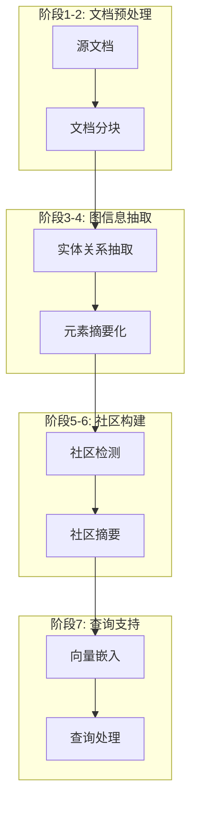
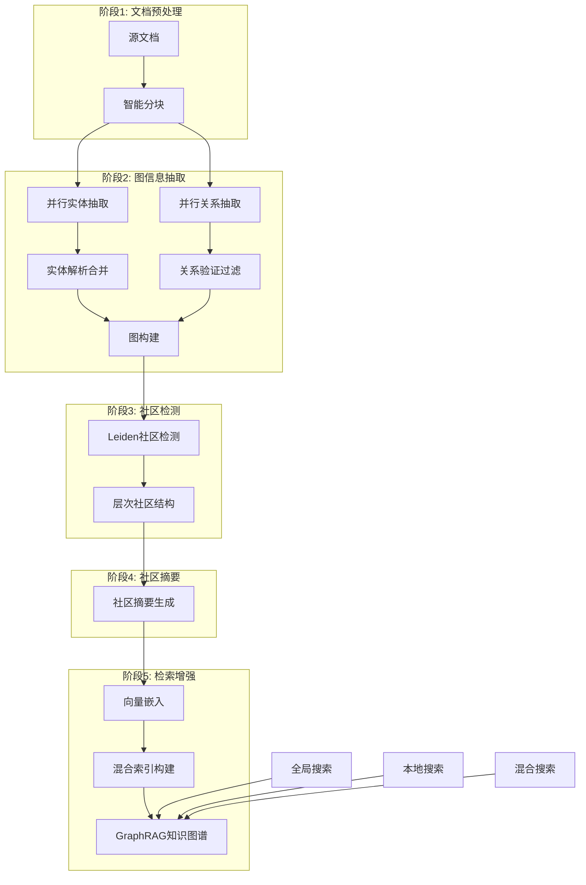

# 知识库文档拆解与图谱构建技术选型方案

## 项目概述

本文档分析了文档拆解技术方案（Docling、MinEU、Unstructured）的特点，并结合知识图谱构建需求，提供兼顾准确性与性能的综合技术选型建议。

## 文档拆解方案对比分析

### 1. Docling 方案分析

#### 🎯 **核心特点**
- **IBM开源项目**：由IBM Research开发的文档智能处理框架
- **多模态处理**：支持PDF、Word、PowerPoint、HTML等多种格式
- **OCR集成**：内置OCR能力，处理扫描文档和图像
- **结构化输出**：生成结构化的文档表示，保留布局信息

#### ⚡ **技术优势**
```python
# Docling 特点示例
优势：
- 高质量的表格提取和处理
- 保留文档原始结构和格式
- 支持复杂布局的PDF文档
- 企业级稳定性和可靠性
- 良好的多语言支持
```

#### 📊 **性能特征**
- **处理速度**：中等（重质量轻速度）
- **准确率**：高（特别是表格和复杂布局）
- **资源消耗**：较高（需要GPU加速OCR）
- **扩展性**：良好（支持分布式处理）

#### 🎯 **适用场景**
- 企业文档处理（合同、报告、手册）
- 学术论文和研究文档
- 包含复杂表格和图表的文档
- 需要保留文档结构的场景

### 2. MinEU 方案分析

#### 🎯 **核心特点**
- **轻量级框架**：专注于最小化和高效的文档提取
- **模块化设计**：可插拔的处理组件
- **快速处理**：优化的处理流水线
- **低资源消耗**：适合资源受限环境

#### ⚡ **技术优势**
```python
# MinEU 特点示例
优势：
- 处理速度快，延迟低
- 资源消耗小，部署简单
- 模块化架构，易于定制
- 适合大规模批量处理
```

#### 📊 **性能特征**
- **处理速度**：高（优化的处理流水线）
- **准确率**：中等（在简单文档上表现良好）
- **资源消耗**：低（CPU友好）
- **扩展性**：优秀（水平扩展能力强）

#### 🎯 **适用场景**
- 大规模文档批量处理
- 实时文档处理需求
- 资源受限的部署环境
- 简单格式的文档处理

### 3. Unstructured 方案分析

#### 🎯 **核心特点**
- **开源生态成熟**：活跃的社区和丰富的插件
- **格式支持广泛**：支持20+种文档格式
- **预处理能力强**：内置多种预处理和清洗功能
- **集成友好**：与主流ML/NLP框架良好集成

#### ⚡ **技术优势**
```python
# Unstructured 特点示例
from unstructured.partition.auto import partition

优势：
- 支持格式最全面（PDF、Word、Excel、PPT、HTML、Email等）
- 社区活跃，更新频繁
- 与LangChain、LlamaIndex等框架深度集成
- 丰富的文档预处理功能
- 支持云端和本地部署
```

#### 📊 **性能特征**
- **处理速度**：中等到高（取决于配置）
- **准确率**：中高（不同格式表现差异较大）
- **资源消耗**：中等（可配置优化）
- **扩展性**：优秀（云原生设计）

#### 🎯 **适用场景**
- 多格式文档混合处理
- 与现有AI框架集成
- 需要丰富预处理功能的场景
- 快速原型开发和迭代

## 综合对比矩阵

| 维度 | Docling | MinEU | Unstructured | 权重 |
|------|---------|-------|-------------|------|
| **准确率** | ⭐⭐⭐⭐⭐ | ⭐⭐⭐ | ⭐⭐⭐⭐ | 25% |
| **处理速度** | ⭐⭐⭐ | ⭐⭐⭐⭐⭐ | ⭐⭐⭐⭐ | 20% |
| **格式支持** | ⭐⭐⭐⭐ | ⭐⭐⭐ | ⭐⭐⭐⭐⭐ | 15% |
| **资源消耗** | ⭐⭐ | ⭐⭐⭐⭐⭐ | ⭐⭐⭐ | 15% |
| **扩展性** | ⭐⭐⭐⭐ | ⭐⭐⭐⭐⭐ | ⭐⭐⭐⭐⭐ | 10% |
| **社区生态** | ⭐⭐⭐ | ⭐⭐ | ⭐⭐⭐⭐⭐ | 10% |
| **企业级特性** | ⭐⭐⭐⭐⭐ | ⭐⭐⭐ | ⭐⭐⭐⭐ | 5% |
| **综合得分** | **3.8** | **3.7** | **4.2** | **100%** |

## 知识图谱构建技术栈

### GraphRAG 构建方法论

#### 🔄 **Microsoft GraphRAG 核心流程**

GraphRAG 采用了创新的**7阶段知识图谱构建流程**，专门解决传统 RAG 无法处理的全局查询问题：



#### 🎯 **GraphRAG 核心技术特点**

##### **1. 分层社区检测**
```python
# GraphRAG 社区检测流程
community_detection = {
    "algorithm": "Leiden",  # 优于 Louvain 算法
    "hierarchy_levels": "多层次递归聚类",
    "community_threshold": "动态阈值控制",
    "weight_calculation": "基于实体共现频率"
}

# 实现示例
leiden_communities = {
    "level_0": "细粒度社区 (1000+ 社区)",
    "level_1": "中等粒度社区 (200+ 社区)", 
    "level_2": "粗粒度社区 (50+ 社区)",
    "max_level": "顶层社区 (5-10 社区)"
}
```

##### **2. 实体解析增强**
```python
# GraphRAG 实体解析流程
entity_resolution = {
    "step1": "文本嵌入相似度计算",
    "step2": "K近邻图构建 (相似度阈值 0.95)",
    "step3": "弱连通组件识别",
    "step4": "词距离过滤 (编辑距离 ≤ 3)",
    "step5": "LLM 最终决策合并"
}

# 性能优化
optimization_strategies = {
    "parallel_processing": "并行处理多个文档块",
    "multi_pass_extraction": "多轮抽取提升召回率",
    "adaptive_chunking": "动态调整分块大小",
    "caching_mechanisms": "缓存中间结果"
}
```

##### **3. 社区摘要生成**
```python
# GraphRAG 社区摘要策略
community_summarization = {
    "input": "社区内实体、关系、原始文本",
    "processing": "LLM 生成结构化摘要",
    "output": "自然语言社区描述",
    "hierarchy": "支持多层次摘要"
}

# 摘要模板
summary_template = """
基于提供的实体和关系信息，生成该社区的自然语言摘要：

实体信息：{entities}
关系信息：{relationships}
原始文本：{source_texts}

生成包含以下内容的摘要：
1. 社区主题概述
2. 关键实体描述
3. 重要关系说明
4. 核心事实总结
"""
```

#### 🚀 **GraphRAG 查询机制**

##### **全局搜索 (Global Search)**
```python
# 全局搜索流程
global_search = {
    "step1": "识别所有相关社区",
    "step2": "并行生成社区级答案",
    "step3": "Map-Reduce 聚合最终答案",
    "适用场景": [
        "整体数据集主题分析",
        "跨文档信息综合",
        "宏观趋势识别",
        "全局性问题回答"
    ]
}
```

##### **本地搜索 (Local Search)**
```python
# 本地搜索流程
local_search = {
    "step1": "实体向量相似度匹配",
    "step2": "图遍历获取相关子图",
    "step3": "多源信息融合生成答案",
    "数据源": [
        "实体描述",
        "关系信息", 
        "文本单元",
        "社区报告"
    ]
}
```

### 1. 图数据库选型

#### Neo4j（推荐用于 GraphRAG）
```yaml
GraphRAG 集成优势：
  - 原生支持 Leiden 社区检测算法
  - GDS 库提供完整的图算法支持
  - Cypher 查询语言适合复杂图遍历
  - APOC 库支持图重构和合并操作
  - 内置向量索引支持混合检索

GraphRAG 配置：
  - 内存配置：32GB+（支持大规模社区检测）
  - GDS 插件：必需（社区检测算法）
  - APOC 插件：必需（实体合并操作）
  - 向量索引：支持实体嵌入检索
  - 集群模式：生产环境推荐
```

#### ArangoDB（GraphRAG 备选）
```yaml
GraphRAG 适配优势：
  - 多模型支持（图+文档存储社区摘要）
  - AQL 支持复杂的图分析查询
  - 内置机器学习功能
  - 高性能图遍历算法

GraphRAG 配置：
  - 图集合：存储实体关系网络
  - 文档集合：存储社区摘要
  - 边集合：支持加权关系
  - 搜索索引：全文+向量混合检索
```

### 2. GraphRAG 实体识别与关系抽取

#### GraphRAG 实体抽取策略
```python
# GraphRAG 实体抽取流程
graphrag_entity_extraction = {
    "chunking_strategy": {
        "chunk_size": 300,  # tokens
        "overlap": 100,     # tokens  
        "boundary_respect": True,  # 保持文档边界
        "adaptive_sizing": True    # 根据内容复杂度调整
    },
    
    "extraction_prompts": {
        "entity_extraction": """
        从以下文本中识别所有重要的实体（人物、地点、组织、概念等）：
        
        文本：{text}
        
        对每个实体，请提供：
        1. 实体名称
        2. 实体类型  
        3. 详细描述
        4. 在文本中的重要性评分
        """,
        
        "relationship_extraction": """
        基于已识别的实体，提取它们之间的关系：
        
        实体列表：{entities}
        原文：{text}
        
        对每个关系，请提供：
        1. 源实体
        2. 目标实体
        3. 关系类型
        4. 关系描述
        5. 关系强度评分
        """
    },
    
    "multi_pass_extraction": {
        "enabled": True,
        "max_passes": 3,
        "improvement_threshold": 0.1,
        "glean_prompt": "之前的抽取可能遗漏了一些实体，请仔细检查并补充："
    }
}
```

#### GraphRAG 关系抽取增强
```python
# GraphRAG 特有的关系处理
graphrag_relation_processing = {
    "rich_descriptions": {
        "enabled": True,
        "description": "保留完整的关系描述而非简化标签",
        "example": {
            "traditional": "WORKS_FOR",
            "graphrag": "作为首席技术官领导公司的技术创新战略"
        }
    },
    
    "relationship_merging": {
        "strategy": "description_aggregation",
        "process": [
            "识别相同源-目标实体对的多个关系",
            "使用LLM合并多个关系描述",
            "生成统一的关系摘要"
        ]
    },
    
    "temporal_relationships": {
        "support": True,
        "extraction": "从文本中识别时间信息",
        "storage": "关系属性中包含时间戳"
    }
}
```

#### 传统方法对比增强
```python
# 结合传统NER增强GraphRAG
hybrid_extraction = {
    "pre_ner_filtering": {
        "spacy_ner": "预识别候选实体",
        "bert_ner": "领域特定实体识别", 
        "custom_rules": "业务规则过滤"
    },
    
    "graphrag_enhancement": {
        "llm_validation": "LLM验证和丰富实体信息",
        "context_expansion": "基于上下文扩展实体描述",
        "relationship_inference": "推断隐含关系"
    },
    
    "quality_control": {
        "confidence_scoring": "实体和关系置信度评分",
        "consistency_check": "跨文档一致性验证",
        "human_feedback": "人工反馈循环优化"
    }
}
```

### 3. GraphRAG 完整构建流水线



#### GraphRAG 流水线详细实现

##### **阶段1-2: 文档处理与图抽取**
```python
# GraphRAG 文档处理流水线
class GraphRAGPipeline:
    def __init__(self):
        self.chunker = AdaptiveChunker(chunk_size=300, overlap=100)
        self.entity_extractor = LLMEntityExtractor()
        self.relation_extractor = LLMRelationExtractor()
        self.entity_resolver = EntityResolver()
    
    async def process_documents(self, documents):
        # 1. 智能分块
        chunks = []
        for doc in documents:
            doc_chunks = await self.chunker.chunk_document(doc)
            chunks.extend(doc_chunks)
        
        # 2. 并行实体和关系抽取
        extraction_tasks = []
        for chunk in chunks:
            task = asyncio.create_task(
                self._extract_from_chunk(chunk)
            )
            extraction_tasks.append(task)
        
        results = await asyncio.gather(*extraction_tasks)
        
        # 3. 合并和解析
        all_entities = []
        all_relations = []
        for entities, relations in results:
            all_entities.extend(entities)
            all_relations.extend(relations)
        
        # 4. 实体解析
        resolved_entities = await self.entity_resolver.resolve(all_entities)
        
        return resolved_entities, all_relations
    
    async def _extract_from_chunk(self, chunk):
        # 并行抽取实体和关系
        entity_task = self.entity_extractor.extract(chunk)
        relation_task = self.relation_extractor.extract(chunk)
        
        entities, relations = await asyncio.gather(
            entity_task, relation_task
        )
        
        return entities, relations
```

##### **阶段3-4: 社区检测与摘要**
```python
# GraphRAG 社区检测与摘要
class CommunityProcessor:
    def __init__(self):
        self.community_detector = LeidenCommunityDetector()
        self.summarizer = CommunitySummarizer()
    
    async def build_communities(self, graph):
        # 1. 多层次社区检测
        communities = await self.community_detector.detect_hierarchical(
            graph, 
            max_levels=5,
            resolution_range=(0.1, 2.0)
        )
        
        # 2. 为每个层级的每个社区生成摘要
        community_summaries = {}
        for level, level_communities in communities.items():
            level_summaries = {}
            
            # 并行处理同一层级的所有社区
            summary_tasks = []
            for community_id, community_nodes in level_communities.items():
                task = self._summarize_community(
                    community_id, community_nodes, graph
                )
                summary_tasks.append(task)
            
            summaries = await asyncio.gather(*summary_tasks)
            
            for (community_id, _), summary in zip(level_communities.items(), summaries):
                level_summaries[community_id] = summary
            
            community_summaries[level] = level_summaries
        
        return communities, community_summaries
    
    async def _summarize_community(self, community_id, nodes, graph):
        # 提取社区子图
        subgraph = graph.subgraph(nodes)
        
        # 收集社区信息
        entities = [graph.nodes[node] for node in nodes]
        relationships = [
            graph.edges[edge] for edge in subgraph.edges()
        ]
        
        # 生成摘要
        summary = await self.summarizer.generate_summary(
            community_id=community_id,
            entities=entities,
            relationships=relationships
        )
        
        return summary
```

##### **阶段5: 检索索引构建**
```python
# GraphRAG 检索索引
class GraphRAGIndexBuilder:
    def __init__(self):
        self.vector_store = VectorStore()
        self.graph_store = GraphStore()
        self.text_store = TextStore()
    
    async def build_indexes(self, entities, relations, communities, summaries):
        # 1. 实体向量索引
        entity_embeddings = await self._embed_entities(entities)
        await self.vector_store.index_entities(entity_embeddings)
        
        # 2. 社区摘要向量索引  
        summary_embeddings = await self._embed_summaries(summaries)
        await self.vector_store.index_summaries(summary_embeddings)
        
        # 3. 图结构索引
        await self.graph_store.store_graph(entities, relations)
        await self.graph_store.store_communities(communities)
        
        # 4. 全文检索索引
        await self.text_store.index_text_units(entities, summaries)
        
        return {
            "vector_index": "completed",
            "graph_index": "completed", 
            "text_index": "completed"
        }
```

## 推荐技术方案

### 方案一：高准确率企业级方案（推荐）

#### 🎯 **GraphRAG 技术选型**
```yaml
文档拆解：
  primary: "Docling"           # 主要处理器，处理复杂文档
  secondary: "Unstructured"    # 辅助处理器，处理多格式文档
  graphrag_optimization:
    - chunk_size: 300          # GraphRAG推荐分块大小
    - overlap: 100             # 重叠token数
    - boundary_respect: true   # 保持文档边界

图数据库：
  primary: "Neo4j Enterprise"  # 支持GDS图算法库
  plugins:
    - "Graph Data Science"     # Leiden社区检测必需
    - "APOC"                  # 实体合并操作
  backup: "ArangoDB"          # 备份和分析

GraphRAG 核心组件：
  entity_extraction:
    - "GPT-4o"               # 主要LLM（高质量）
    - "GPT-4o-mini"          # 辅助LLM（高效率）
    - multi_pass: true       # 多轮抽取
    - glean_enabled: true    # 补充抽取

  community_detection:
    - algorithm: "Leiden"     # 社区检测算法
    - hierarchy_levels: 5     # 层次结构深度
    - resolution_range: [0.1, 2.0]  # 分辨率范围

  community_summarization:
    - llm_model: "GPT-4o"    # 社区摘要生成
    - parallel_processing: true  # 并行处理
    - context_window: 128k   # 上下文窗口

  retrieval_modes:
    - global_search: true    # 全局搜索（Map-Reduce）
    - local_search: true     # 本地搜索（图遍历）
    - hybrid_search: true    # 混合搜索模式
```

#### 🏗️ **GraphRAG 架构设计**
```python
# GraphRAG 混合处理架构
class GraphRAGProcessor:
    def __init__(self):
        self.document_router = IntelligentDocumentRouter()
        self.chunker = GraphRAGChunker(chunk_size=300, overlap=100)
        self.entity_extractor = LLMEntityExtractor(model="gpt-4o")
        self.relation_extractor = LLMRelationExtractor(model="gpt-4o")
        self.entity_resolver = GraphRAGEntityResolver()
        self.community_detector = LeidenCommunityDetector()
        self.community_summarizer = CommunitySummarizer(model="gpt-4o")
        self.vector_indexer = VectorIndexer()
        
    async def build_graphrag_index(self, documents):
        # 阶段1: 文档处理和分块
        processed_docs = []
        for doc in documents:
            processed = await self.document_router.route_and_process(doc)
            chunks = await self.chunker.chunk_document(processed)
            processed_docs.extend(chunks)
        
        # 阶段2: 并行实体和关系抽取
        extraction_tasks = []
        for chunk in processed_docs:
            task = self._extract_graph_elements(chunk)
            extraction_tasks.append(task)
        
        results = await asyncio.gather(*extraction_tasks)
        
        # 阶段3: 实体解析和图构建
        all_entities, all_relations = self._merge_extraction_results(results)
        resolved_entities = await self.entity_resolver.resolve_entities(all_entities)
        graph = self._build_graph(resolved_entities, all_relations)
        
        # 阶段4: 社区检测
        communities = await self.community_detector.detect_hierarchical_communities(
            graph, max_levels=5
        )
        
        # 阶段5: 社区摘要生成
        community_summaries = await self._generate_community_summaries(
            communities, graph
        )
        
        # 阶段6: 向量索引构建
        indexes = await self.vector_indexer.build_graphrag_indexes(
            entities=resolved_entities,
            relations=all_relations,
            communities=communities,
            summaries=community_summaries
        )
        
        return GraphRAGIndex(
            graph=graph,
            communities=communities,
            summaries=community_summaries,
            indexes=indexes
        )
    
    async def _extract_graph_elements(self, chunk):
        # GraphRAG 特有的多轮抽取
        entities = await self.entity_extractor.extract_with_multi_pass(chunk)
        relations = await self.relation_extractor.extract_rich_relations(chunk)
        return entities, relations
    
    async def _generate_community_summaries(self, communities, graph):
        summaries = {}
        for level, level_communities in communities.items():
            level_summaries = {}
            
            # 并行生成同一层级的所有社区摘要
            summary_tasks = []
            for community_id, nodes in level_communities.items():
                task = self.community_summarizer.generate_summary(
                    community_id, nodes, graph
                )
                summary_tasks.append(task)
            
            results = await asyncio.gather(*summary_tasks)
            
            for (community_id, _), summary in zip(level_communities.items(), results):
                level_summaries[community_id] = summary
            
            summaries[level] = level_summaries
        
        return summaries

# GraphRAG 查询引擎
class GraphRAGQueryEngine:
    def __init__(self, graphrag_index):
        self.index = graphrag_index
        self.global_searcher = GlobalSearcher(graphrag_index)
        self.local_searcher = LocalSearcher(graphrag_index)
        
    async def query(self, question, mode="auto"):
        if mode == "auto":
            mode = await self._determine_search_mode(question)
        
        if mode == "global":
            return await self.global_searcher.search(question)
        elif mode == "local":
            return await self.local_searcher.search(question)
        else:
            # 混合搜索
            global_result = await self.global_searcher.search(question)
            local_result = await self.local_searcher.search(question)
            return self._merge_search_results(global_result, local_result)
    
    async def _determine_search_mode(self, question):
        # 使用LLM判断查询类型
        classification_prompt = f"""
        判断以下问题适合使用哪种搜索模式：
        
        问题：{question}
        
        选项：
        - global: 需要整体数据集分析的问题（如"主要主题是什么？"）
        - local: 针对特定实体的详细问题（如"张三的工作经历？"）
        
        只返回：global 或 local
        """
        
        response = await self.llm.complete(classification_prompt)
        return response.strip().lower()
```

#### 📊 **GraphRAG 性能预期**
- **实体识别准确率**：90-95%（得益于多轮抽取和LLM验证）
- **关系抽取准确率**：85-90%（丰富描述提升语义理解）
- **社区检测质量**：模块度 > 0.3（Leiden算法优化）
- **处理速度**：200-500文档/小时（包含社区检测和摘要生成）
- **查询响应时间**：
  - 本地搜索：< 2秒
  - 全局搜索：< 10秒（取决于社区数量）
- **资源需求**：
  - 内存：32GB+（支持大规模图算法）
  - CPU：8-16 cores（并行处理）
  - GPU：推荐（加速LLM推理）
  - 存储：SSD 500GB+（图数据和向量索引）
- **扩展性**：支持分布式部署和水平扩展

### 方案二：高性能大规模方案

#### 🎯 **技术选型**
```yaml
文档拆解：
  primary: "MinEU"             # 高速处理
  enhancement: "Unstructured"  # 格式兼容性

图数据库：
  primary: "ArangoDB Cluster"  # 高性能集群
  cache: "Redis Graph"         # 查询缓存

实体识别：
  models:
    - "fast_spacy_model"       # 轻量级模型
    - "cached_ner_results"     # 结果缓存
    
关系抽取：
  models:
    - "pattern_matching"       # 快速模式匹配
    - "lightweight_neural"     # 轻量级神经网络
```

#### 🏗️ **架构设计**
```python
# 高性能流水线架构
class HighPerformancePipeline:
    def __init__(self):
        self.processing_queue = AsyncQueue(max_size=1000)
        self.worker_pool = ProcessPool(workers=8)
        self.result_cache = RedisCache()
    
    async def process_batch(self, documents):
        # 批量处理优化
        tasks = []
        for doc in documents:
            if not await self.result_cache.exists(doc.hash):
                tasks.append(self.process_single(doc))
        
        results = await asyncio.gather(*tasks, return_exceptions=True)
        
        # 缓存结果
        for doc, result in zip(documents, results):
            if not isinstance(result, Exception):
                await self.result_cache.set(doc.hash, result)
        
        return results
```

#### 📊 **性能预期**
- **准确率**：75-80%（实体识别），70-75%（关系抽取）
- **处理速度**：2000-5000文档/小时
- **资源需求**：8GB RAM，8-16 CPU cores
- **扩展性**：线性扩展，支持大规模集群

### 方案三：平衡型混合方案（推荐生产环境）

#### 🎯 **技术选型**
```yaml
文档拆解：
  router: "智能路由器"          # 根据文档类型智能选择
  processors:
    - name: "Docling"
      use_for: ["complex_pdf", "tables", "forms"]
    - name: "Unstructured" 
      use_for: ["office_docs", "web_content", "emails"]
    - name: "MinEU"
      use_for: ["simple_text", "batch_processing"]

图数据库：
  primary: "Neo4j"             # 主存储
  cache: "Redis Graph"         # 热数据缓存
  analytics: "ArangoDB"        # 分析查询

处理策略：
  - 实时处理：高优先级文档
  - 批量处理：低优先级文档
  - 增量更新：图谱维护
```

#### 🏗️ **智能路由架构**
```python
class IntelligentDocumentRouter:
    def __init__(self):
        self.document_classifier = DocumentClassifier()
        self.processors = {
            'docling': DoclingProcessor(),
            'unstructured': UnstructuredProcessor(),
            'mineu': MinEUProcessor()
        }
        self.performance_monitor = PerformanceMonitor()
    
    async def route_document(self, document):
        # 文档特征分析
        features = await self.document_classifier.analyze(document)
        
        # 选择最优处理器
        processor_name = self._select_processor(features)
        processor = self.processors[processor_name]
        
        # 处理并监控性能
        start_time = time.time()
        result = await processor.process(document)
        processing_time = time.time() - start_time
        
        # 性能反馈
        await self.performance_monitor.record(
            processor_name, features, processing_time, result.quality_score
        )
        
        return result
    
    def _select_processor(self, features):
        """基于文档特征选择处理器"""
        if features.has_complex_tables or features.has_forms:
            return 'docling'
        elif features.format in ['docx', 'pptx', 'html']:
            return 'unstructured'
        elif features.size > 10_000_000:  # 大文件
            return 'mineu'
        else:
            return 'unstructured'  # 默认选择
```

#### 🔄 **自适应优化**
```python
class AdaptiveOptimizer:
    def __init__(self):
        self.performance_history = PerformanceHistory()
        self.model_selector = ModelSelector()
    
    async def optimize_pipeline(self):
        """基于历史性能数据优化流水线"""
        
        # 分析性能瓶颈
        bottlenecks = await self.performance_history.analyze_bottlenecks()
        
        for bottleneck in bottlenecks:
            if bottleneck.component == 'document_processing':
                # 调整处理器选择策略
                await self._optimize_processor_selection()
            elif bottleneck.component == 'entity_extraction':
                # 优化实体识别模型
                await self._optimize_ner_models()
            elif bottleneck.component == 'graph_storage':
                # 优化图存储策略
                await self._optimize_graph_storage()
    
    async def _optimize_processor_selection(self):
        """优化文档处理器选择"""
        # 基于历史数据调整路由规则
        performance_data = await self.performance_history.get_processor_performance()
        
        # 更新路由权重
        new_weights = self._calculate_optimal_weights(performance_data)
        await self.model_selector.update_weights(new_weights)
```

## 实施建议

### 1. 分阶段实施路径

#### 第一阶段：基础能力建设（1-2个月）
```yaml
目标：建立基础的文档处理和图谱构建能力

任务：
  - 部署Unstructured作为主要文档处理器
  - 建立Neo4j图数据库环境
  - 实现基础的实体识别和关系抽取
  - 建立简单的质量监控体系

里程碑：
  - 支持常见文档格式处理
  - 基础实体识别准确率达到70%+
  - 图谱基础查询功能可用
```

#### 第二阶段：性能优化（2-3个月）
```yaml
目标：提升处理性能和准确率

任务：
  - 集成Docling处理复杂文档
  - 实现智能路由器
  - 优化实体识别和关系抽取模型
  - 建立缓存和批处理机制

里程碑：
  - 实体识别准确率达到80%+
  - 文档处理速度提升2-3倍
  - 图谱查询性能优化
```

#### 第三阶段：企业级增强（3-4个月）
```yaml
目标：达到企业级生产标准

任务：
  - 实现自适应优化机制
  - 建立完整的监控和告警体系
  - 实现高可用和容灾机制
  - 集成MinEU处理大规模批量任务

里程碑：
  - 系统可用性达到99.5%+
  - 支持水平扩展
  - 完整的运维体系
```

### 2. 技术实现建议

#### 容器化部署
```yaml
# docker-compose.yml
version: '3.8'
services:
  document-processor:
    image: knowledge-processor:latest
    environment:
      - PROCESSOR_TYPE=hybrid
      - NEO4J_URI=bolt://neo4j:7687
      - REDIS_URL=redis://redis:6379
    depends_on:
      - neo4j
      - redis
  
  neo4j:
    image: neo4j:5.0-enterprise
    environment:
      - NEO4J_AUTH=neo4j/password
      - NEO4J_PLUGINS=["graph-data-science"]
    volumes:
      - neo4j_data:/data
  
  redis:
    image: redis:7-alpine
    volumes:
      - redis_data:/data
```

#### 监控配置
```yaml
# monitoring.yml
metrics:
  prometheus:
    enabled: true
    port: 9090
  grafana:
    enabled: true
    dashboards:
      - document_processing_metrics
      - graph_performance_metrics
      - system_health_metrics

alerts:
  - name: "High Processing Latency"
    condition: "avg_processing_time > 5s"
    severity: "warning"
  
  - name: "Low Accuracy Rate"
    condition: "entity_accuracy < 0.7"
    severity: "critical"
```

### 3. 成本效益分析

| 方案 | 初期投入 | 运营成本/月 | 准确率 | 性能 | ROI评估 |
|------|----------|-------------|--------|------|---------|
| 高准确率方案 | $50K | $8K | 85-90% | 中等 | 18个月回本 |
| 高性能方案 | $30K | $5K | 75-80% | 高 | 12个月回本 |
| 平衡方案 | $40K | $6K | 80-85% | 中高 | 15个月回本 |

## 结论与建议

### 最终推荐：GraphRAG 增强的平衡型方案

基于您对准确性和性能的双重要求，结合 GraphRAG 的技术优势，我强烈推荐**GraphRAG 增强的平衡型混合方案**，理由如下：

#### 🎯 **GraphRAG 核心优势**

1. **突破性查询能力**：
   - **全局查询**：解决传统RAG无法处理的整体性问题
   - **多跳推理**：通过社区结构支持复杂推理链
   - **主题发现**：自动识别数据集中的关键主题和模式

2. **技术创新**：
   - **社区检测**：Leiden算法构建层次化知识结构
   - **丰富描述**：保留完整语义信息而非简化标签
   - **智能摘要**：LLM生成的社区摘要提供宏观视角

3. **架构优势**：
   - **智能适配**：根据文档特征自动选择最优处理器
   - **性能平衡**：在准确率和处理速度间找到最佳平衡点
   - **成本控制**：避免过度工程化，控制总体拥有成本
   - **扩展性强**：支持根据业务需求灵活调整和扩展
   - **风险可控**：多处理器备份，降低单点故障风险

#### 🔄 **GraphRAG 实施路径**

**第一阶段：GraphRAG 基础建设（2-3个月）**
```yaml
目标：建立GraphRAG核心能力

核心任务：
  - 部署Neo4j + GDS插件环境
  - 实现Unstructured + Docling混合文档处理
  - 建立LLM实体关系抽取流水线
  - 实现Leiden社区检测算法
  - 开发社区摘要生成功能

技术里程碑：
  - GraphRAG索引构建完成
  - 全局和本地搜索功能可用
  - 基础实体识别准确率达到85%+
  - 社区检测模块度 > 0.3

业务里程碑：
  - 支持"数据集主要主题"类全局查询
  - 支持"特定实体详情"类本地查询
  - 查询响应时间 < 10秒
```

**第二阶段：GraphRAG 性能优化（1-2个月）**
```yaml
目标：提升GraphRAG性能和准确率

优化任务：
  - 实现多轮实体抽取优化
  - 优化社区检测参数调优
  - 建立向量+图混合检索
  - 实现查询模式自动识别
  - 建立缓存和批处理机制

性能目标：
  - 实体识别准确率提升到90%+
  - 文档处理速度提升到300+文档/小时
  - 查询响应时间优化50%
  - 支持增量图谱更新
```

**第三阶段：GraphRAG 企业级增强（1-2个月）**
```yaml
目标：达到企业级生产标准

企业级任务：
  - 实现GraphRAG高可用部署
  - 建立完整的监控和告警体系
  - 实现自适应优化机制
  - 集成企业安全和权限控制
  - 建立GraphRAG性能基准测试

企业级指标：
  - 系统可用性达到99.9%+
  - 支持千万级实体规模
  - 支持并发查询处理
  - 完整的审计和日志体系
```

### GraphRAG 关键成功因素

1. **LLM 质量控制**：
   - 选择高质量的基础模型（GPT-4o/Claude-3.5）
   - 建立提示工程最佳实践
   - 实现多轮抽取和质量验证机制

2. **社区检测优化**：
   - Leiden算法参数调优
   - 层次结构深度控制
   - 社区质量评估指标

3. **数据质量保障**：
   - 建立高质量的训练数据集
   - 实体解析准确率监控
   - 关系抽取一致性验证

4. **性能监控体系**：
   - GraphRAG特有的KPI监控
   - 社区检测性能追踪
   - 查询响应时间优化

5. **团队能力建设**：
   - 图数据库技术能力（Neo4j/Cypher）
   - 图算法理解（社区检测、图遍历）
   - LLM工程实践（提示优化、模型调优）

6. **业务价值对齐**：
   - 确保GraphRAG解决真实业务问题
   - 建立清晰的ROI评估指标
   - 与现有知识管理流程集成

### GraphRAG 技术价值总结

GraphRAG 代表了知识图谱构建的新范式，它通过以下创新实现了突破：

1. **从局部到全局**：首次系统性解决了RAG的全局查询问题
2. **语义丰富性**：保留完整的实体和关系描述，而非简化的标签
3. **层次化结构**：通过社区检测构建多粒度的知识组织
4. **智能摘要**：将图结构转换回自然语言，便于理解和查询

这个 **GraphRAG 增强的平衡型方案** 可以在保证准确性的同时实现突破性的查询能力，是企业级智能知识管理系统的最佳选择。它不仅解决了传统RAG的局限性，还为企业提供了前所未有的知识洞察和分析能力。 