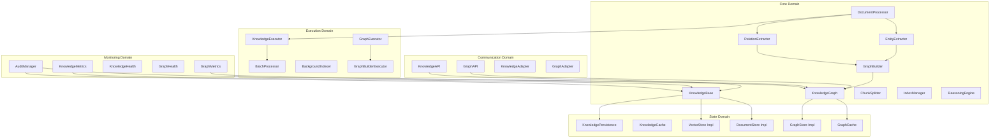

# 知识库管理系统设计方案

## 项目概述

本文档描述了企业级Agent架构中知识库管理系统的完整设计方案。该系统负责知识的存储、索引、检索和管理，为智能体提供强大的知识支撑能力。

## 设计目标

### 核心目标
1. **知识存储**：建立多层次、多格式的知识存储体系
2. **高效索引**：实现快速的文档索引和向量化处理
3. **智能检索**：提供语义检索、关键词检索和混合检索能力
4. **GraphRAG图谱**：基于Microsoft GraphRAG方法构建分层知识图谱，支持全局和本地查询
5. **企业级管理**：支持权限控制、版本管理、审计追踪
6. **可扩展性**：支持多种存储后端和处理策略

### 技术目标

#### 基础阶段目标
- **存储容量**：支持10万级文档存储
- **检索速度**：平均检索响应时间 < 500ms
- **索引效率**：文档索引处理速度 > 500文档/分钟
- **并发支持**：支持100+并发检索请求

#### 进阶阶段目标
- **存储容量**：支持50万级文档存储
- **检索速度**：平均检索响应时间 < 300ms
- **索引效率**：文档索引处理速度 > 800文档/分钟
- **并发支持**：支持300+并发检索请求
- **GraphRAG基础**：支持基本的实体关系抽取和社区检测

#### 完整阶段目标
- **存储容量**：支持百万级文档存储
- **检索速度**：平均检索响应时间 < 200ms
- **索引效率**：文档索引处理速度 > 1000文档/分钟
- **并发支持**：支持500+并发检索请求
- **GraphRAG完整**：支持完整的7阶段GraphRAG流程
- **图谱规模**：支持千万级实体和关系存储
- **图谱查询**：图谱查询响应时间 < 500ms
- **全局查询**：支持Map-Reduce全局搜索 < 2000ms
- **本地查询**：支持图遍历本地搜索 < 300ms
- **可用性**：知识库服务可用性 > 99.5%

## 整体架构设计

### 架构层次

```
┌─────────────────────────────────────────────────────────────────────────────────┐
│                        Knowledge Management Layer 知识管理层                      │
│  ┌─────────────────┐  ┌─────────────────┐  ┌─────────────────┐  ┌─────────────────┐ │
│  │ Knowledge Base  │  │ Document        │  │ Knowledge Graph │  │ Knowledge       │ │
│  │ Manager         │  │ Manager         │  │ Manager         │  │ API Gateway     │ │
│  └─────────────────┘  └─────────────────┘  └─────────────────┘  └─────────────────┘ │
└─────────────────────────────────────────────────────────────────────────────────┘
┌─────────────────────────────────────────────────────────────────────────────────┐
│                            Processing Layer 处理层                               │
│  ┌─────────────────┐  ┌─────────────────┐  ┌─────────────────┐  ┌─────────────────┐ │
│  │ Document        │  │ Chunk           │  │ Embedding       │  │ Entity          │ │
│  │ Processor       │  │ Splitter        │  │ Generator       │  │ Extractor       │ │
│  └─────────────────┘  └─────────────────┘  └─────────────────┘  └─────────────────┘ │
│  ┌─────────────────┐  ┌─────────────────┐  ┌─────────────────┐  ┌─────────────────┐ │
│  │ Index Builder   │  │ Quality         │  │ Version         │  │ Relation        │ │
│  │                 │  │ Controller      │  │ Manager         │  │ Extractor       │ │
│  └─────────────────┘  └─────────────────┘  └─────────────────┘  └─────────────────┘ │
│  ┌─────────────────┐  ┌─────────────────┐  ┌─────────────────┐  ┌─────────────────┐ │
│  │ Graph Builder   │  │ Reasoning       │  │ Graph           │  │ Ontology        │ │
│  │                 │  │ Engine          │  │ Validator       │  │ Manager         │ │
│  └─────────────────┘  └─────────────────┘  └─────────────────┘  └─────────────────┘ │
└─────────────────────────────────────────────────────────────────────────────────┘
┌─────────────────────────────────────────────────────────────────────────────────┐
│                             Storage Layer 存储层                                 │
│  ┌─────────────────┐  ┌─────────────────┐  ┌─────────────────┐  ┌─────────────────┐ │
│  │ Vector Store    │  │ Document Store  │  │ Metadata Store  │  │ Graph Store     │ │
│  │ (Chroma/FAISS)  │  │ (Local/S3)      │  │ (SQLite/PG)     │  │ (Neo4j/ArangoDB)│ │
│  └─────────────────┘  └─────────────────┘  └─────────────────┘  └─────────────────┘ │
│  ┌─────────────────┐  ┌─────────────────┐  ┌─────────────────┐  ┌─────────────────┐ │
│  │ Cache Layer     │  │ Backup          │  │ Archive         │  │ Graph Cache     │ │
│  │ (Redis)         │  │ Manager         │  │ Storage         │  │ (Redis Graph)   │ │
│  └─────────────────┘  └─────────────────┘  └─────────────────┘  └─────────────────┘ │
└─────────────────────────────────────────────────────────────────────────────────┘
```

### 模块目录结构（调整后）

基于现有企业级Agent五大控制域架构，知识库管理系统的目录结构调整如下：

```
# 1. 核心域集成 - 知识库核心功能
src/core/knowledge/                    # 知识库核心模块
├── __init__.py
├── README.md
├── knowledge_base.py                  # 知识库管理核心
├── knowledge_types.py                 # 知识库类型定义
├── stores/                            # 存储抽象层
│   ├── __init__.py
│   ├── vector_store.py                # 向量存储抽象
│   ├── document_store.py              # 文档存储抽象
│   ├── metadata_store.py              # 元数据存储抽象
│   └── graph_store.py                 # 图数据库存储抽象
├── processing/                        # 知识处理模块
│   ├── __init__.py
│   ├── document_processor.py          # 文档处理器
│   ├── chunk_splitter.py              # 文档分块器
│   ├── embedding_generator.py         # 嵌入向量生成器
│   ├── quality_controller.py          # 质量控制器
│   ├── version_manager.py             # 版本管理器
│   ├── entity_extractor.py            # 实体抽取器
│   ├── relation_extractor.py          # 关系抽取器
│   └── ontology_manager.py            # 本体管理器
├── indexing/                          # 索引管理模块
│   ├── __init__.py
│   ├── index_builder.py               # 索引构建器
│   ├── index_manager.py               # 索引管理器
│   ├── search_engine.py               # 搜索引擎
│   └── query_processor.py             # 查询处理器
└── graph/                             # 知识图谱核心模块
    ├── __init__.py
    ├── knowledge_graph.py             # 知识图谱管理器
    ├── graph_builder.py               # 图谱构建器
    ├── graph_types.py                 # 图谱类型定义
    ├── reasoning_engine.py            # 推理引擎
    ├── graph_validator.py             # 图谱验证器
    ├── cypher_generator.py            # Cypher查询生成器
    └── graph_analytics.py             # 图谱分析器

# 2. 状态域集成 - 知识持久化和缓存
src/state/knowledge/                   # 知识状态管理
├── __init__.py
├── knowledge_memory.py                # 知识内存管理
├── knowledge_cache.py                 # 知识缓存管理
├── knowledge_persistence.py          # 知识持久化
├── graph_state.py                     # 图谱状态管理
└── stores/                            # 具体存储实现
    ├── __init__.py
    ├── chroma_store.py                # Chroma向量存储实现
    ├── faiss_store.py                 # FAISS向量存储实现
    ├── local_document_store.py        # 本地文档存储实现
    ├── s3_document_store.py           # S3文档存储实现
    ├── cache_store.py                 # 缓存存储实现
    ├── neo4j_store.py                 # Neo4j图数据库实现
    ├── arangodb_store.py              # ArangoDB图数据库实现
    └── graph_cache_store.py           # 图谱缓存存储实现

# 3. 执行域集成 - 知识库操作执行
src/execution/knowledge/               # 知识库执行模块
├── __init__.py
├── knowledge_executor.py             # 知识库操作执行器
├── batch_processor.py               # 批量处理器
├── background_indexer.py            # 后台索引器
├── graph_executor.py                # 图谱操作执行器
├── graph_builder_executor.py        # 图谱构建执行器
└── optimization/                     # 性能优化
    ├── __init__.py
    ├── query_optimizer.py            # 查询优化器
    ├── storage_optimizer.py          # 存储优化器
    ├── graph_optimizer.py            # 图谱查询优化器
    └── reasoning_optimizer.py        # 推理优化器

# 4. 通信域集成 - 知识库API和适配器
src/communication/knowledge/           # 知识库通信模块
├── __init__.py
├── knowledge_api.py                  # 知识库API网关
├── knowledge_adapter.py              # 知识库适配器
├── graph_api.py                      # 知识图谱API
├── graph_adapter.py                  # 图谱适配器
└── protocols/                        # 知识库协议
    ├── __init__.py
    ├── knowledge_protocol.py         # 知识库协议定义
    ├── graph_protocol.py             # 图谱协议定义
    ├── rest_api.py                   # REST API实现
    └── graphql_api.py                # GraphQL API实现

# 5. 监控域集成 - 知识库监控和管理
src/monitoring/knowledge/              # 知识库监控模块
├── __init__.py
├── knowledge_metrics.py             # 知识库指标收集
├── knowledge_health.py              # 知识库健康检查
├── audit_manager.py                 # 审计管理器
├── graph_metrics.py                 # 图谱指标收集
├── graph_health.py                  # 图谱健康检查
└── management/                       # 管理功能
    ├── __init__.py
    ├── backup_manager.py             # 备份管理器
    ├── archive_manager.py            # 归档管理器
    ├── permission_manager.py         # 权限管理器
    ├── graph_backup_manager.py       # 图谱备份管理器
    └── ontology_manager.py           # 本体管理器

# 6. 协调域集成 - 知识库服务协调
src/coordination/knowledge/            # 知识库协调模块
├── __init__.py
├── knowledge_service.py             # 知识库服务注册
├── knowledge_discovery.py           # 知识库服务发现
├── knowledge_scheduler.py           # 知识库任务调度
├── graph_service.py                 # 图谱服务注册
├── graph_scheduler.py               # 图谱任务调度
└── reasoning_scheduler.py           # 推理任务调度
```

### 目录结构调整说明

#### 🎯 **设计理念对齐**
- **遵循五大控制域**：将知识库功能按照现有架构分布到各个控制域
- **职责分离**：每个域负责特定的功能职责，避免耦合
- **接口标准化**：与现有模块保持一致的接口设计

#### 📁 **具体调整内容**

##### 1. **核心域 (src/core/knowledge/)**
- **保留核心逻辑**：知识库管理、文档处理、索引构建等核心功能
- **抽象层设计**：存储后端抽象，便于扩展不同存储实现
- **处理流水线**：文档处理、分块、向量化的完整流程

##### 2. **状态域 (src/state/knowledge/)**  
- **存储实现**：具体的存储后端实现（Chroma、FAISS、S3等）
- **持久化管理**：知识数据的持久化和恢复
- **缓存策略**：知识检索的缓存优化

##### 3. **执行域 (src/execution/knowledge/)**
- **操作执行**：知识库的增删改查操作执行
- **批量处理**：大规模文档的批量处理
- **性能优化**：查询和存储的性能优化

##### 4. **通信域 (src/communication/knowledge/)**
- **API网关**：知识库的统一API接口
- **协议适配**：与其他系统的协议适配
- **服务接口**：RESTful API和内部服务接口

##### 5. **监控域 (src/monitoring/knowledge/)**
- **指标监控**：知识库性能和使用指标
- **健康检查**：知识库服务健康状态监控
- **管理功能**：备份、归档、权限等管理功能

##### 6. **协调域 (src/coordination/knowledge/)**
- **服务注册**：知识库服务的注册和发现
- **任务调度**：知识库相关任务的调度管理
- **资源协调**：知识库资源的分配和管理

#### 🔄 **与现有模块的集成**

##### **与core/memory的关系**
```python
# src/core/memory/ 专注于Agent运行时内存
# src/core/knowledge/ 专注于持久化知识存储
# 两者通过适配器模式集成

from src.core.knowledge import KnowledgeBase
from src.core.memory import MemoryManager

class KnowledgeEnhancedMemory(MemoryManager):
    def __init__(self, knowledge_base: KnowledgeBase, ...):
        super().__init__(...)
        self.knowledge_base = knowledge_base
    
    async def retrieve_enhanced(self, query: str):
        # 结合知识库和内存的检索
        memory_results = await super().retrieve(query)
        knowledge_results = await self.knowledge_base.search_documents(query)
        return self._merge_results(memory_results, knowledge_results)
```

##### **与state/memory的关系**
```python
# src/state/memory/ 专注于内存状态持久化
# src/state/knowledge/ 专注于知识状态持久化
# 共享持久化基础设施

from src.state.knowledge import KnowledgePersistence
from src.state.memory import MemoryPersistence

class UnifiedStatePersistence:
    def __init__(self):
        self.knowledge_persistence = KnowledgePersistence()
        self.memory_persistence = MemoryPersistence()
    
    async def save_unified_state(self, session_id: str, state_data: dict):
        # 统一保存内存和知识状态
        await self.memory_persistence.save_state(session_id, state_data['memory'])
        await self.knowledge_persistence.save_knowledge_state(session_id, state_data['knowledge'])
```

#### 🚀 **集成优势**

1. **架构一致性**：完全符合现有五大控制域架构
2. **职责清晰**：每个域的职责明确，便于开发和维护
3. **可扩展性**：新功能可以按域扩展，不影响其他模块
4. **复用性**：充分复用现有基础设施和工具链
5. **监控统一**：使用统一的监控和管理体系

## 核心模块详细设计

### 模块间协作关系



### 1. 知识库管理核心

#### 1.1 知识库管理器 (knowledge_base.py)

```python
from typing import Dict, List, Optional, Any, Union
from datetime import datetime
import asyncio
import logging
from .stores.vector_store import VectorStore
from .stores.document_store import DocumentStore
from .stores.metadata_store import MetadataStore
from .processing.embedding_generator import EmbeddingGenerator
from .knowledge_types import KnowledgeConfig, SearchResult, DocumentInfo

logger = logging.getLogger(__name__)

class KnowledgeBase:
    """企业级知识库管理核心"""
    
    def __init__(
        self,
        vector_store: VectorStore,
        document_store: DocumentStore,
        metadata_store: MetadataStore,
        embedding_generator: EmbeddingGenerator,
        config: KnowledgeConfig = None
    ):
        """
        初始化知识库
        
        Args:
            vector_store: 向量存储后端
            document_store: 文档存储后端
            metadata_store: 元数据存储后端
            embedding_generator: 嵌入向量生成器
            config: 配置信息
        """
        self.vector_store = vector_store
        self.document_store = document_store
        self.metadata_store = metadata_store
        self.embedding_generator = embedding_generator
        self.config = config or KnowledgeConfig()
        
        # 初始化状态
        self._initialized = False
        self._stats = {
            "total_documents": 0,
            "total_chunks": 0,
            "last_updated": None
        }
        
    async def initialize(self) -> bool:
        """初始化知识库"""
        try:
            # 初始化各个存储后端
            await self.vector_store.initialize()
            await self.document_store.initialize()
            await self.metadata_store.initialize()
            await self.embedding_generator.initialize()
            
            # 加载统计信息
            await self._load_stats()
            
            self._initialized = True
            logger.info("Knowledge base initialized successfully")
            return True
            
        except Exception as e:
            logger.error(f"Failed to initialize knowledge base: {str(e)}")
            return False
        
    async def add_document(
        self,
        content: str,
        metadata: Dict[str, Any],
        doc_type: str = "text",
        source: str = "user",
        context_id: Optional[str] = None
    ) -> str:
        """
        添加文档到知识库
        
        Args:
            content: 文档内容
            metadata: 文档元数据
            doc_type: 文档类型
            source: 文档来源
            context_id: 上下文ID
            
        Returns:
            文档ID
        """
        if not self._initialized:
            raise RuntimeError("Knowledge base not initialized")
            
        try:
            # 生成文档ID
            doc_id = self._generate_doc_id()
            
            # 准备文档信息
            doc_info = DocumentInfo(
                doc_id=doc_id,
                content=content,
                metadata=metadata,
                doc_type=doc_type,
                source=source,
                context_id=context_id,
                created_at=datetime.utcnow(),
                updated_at=datetime.utcnow()
            )
            
            # 存储原始文档
            await self.document_store.store_document(doc_info)
            
            # 处理文档并生成向量
            await self._process_and_index_document(doc_info)
            
            # 更新元数据
            await self.metadata_store.store_metadata(doc_id, doc_info.to_dict())
            
            # 更新统计信息
            await self._update_stats(doc_added=True)
            
            logger.info(f"Document added successfully: {doc_id}")
            return doc_id
            
        except Exception as e:
            logger.error(f"Failed to add document: {str(e)}")
            raise
        
    async def search_documents(
        self,
        query: str,
        filters: Dict[str, Any] = None,
        top_k: int = 10,
        similarity_threshold: float = 0.7,
        search_type: str = "semantic"
    ) -> List[SearchResult]:
        """
        搜索相关文档
        
        Args:
            query: 查询文本
            filters: 过滤条件
            top_k: 返回文档数量
            similarity_threshold: 相似度阈值
            search_type: 搜索类型 (semantic/keyword/hybrid)
            
        Returns:
            搜索结果列表
        """
        if not self._initialized:
            raise RuntimeError("Knowledge base not initialized")
            
        try:
            # 根据搜索类型执行不同的搜索策略
            if search_type == "semantic":
                results = await self._semantic_search(query, filters, top_k, similarity_threshold)
            elif search_type == "keyword":
                results = await self._keyword_search(query, filters, top_k)
            elif search_type == "hybrid":
                results = await self._hybrid_search(query, filters, top_k, similarity_threshold)
            else:
                raise ValueError(f"Unsupported search type: {search_type}")
            
            logger.info(f"Search completed: {len(results)} results found")
            return results
            
        except Exception as e:
            logger.error(f"Search failed: {str(e)}")
            raise
        
    async def update_document(
        self,
        doc_id: str,
        content: str = None,
        metadata: Dict[str, Any] = None
    ) -> bool:
        """更新文档"""
        if not self._initialized:
            raise RuntimeError("Knowledge base not initialized")
            
        try:
            # 获取现有文档信息
            existing_doc = await self.metadata_store.get_metadata(doc_id)
            if not existing_doc:
                raise ValueError(f"Document not found: {doc_id}")
            
            # 准备更新信息
            updated_doc = DocumentInfo.from_dict(existing_doc)
            if content:
                updated_doc.content = content
            if metadata:
                updated_doc.metadata.update(metadata)
            updated_doc.updated_at = datetime.utcnow()
            
            # 更新文档存储
            await self.document_store.update_document(updated_doc)
            
            # 如果内容有变化，重新处理和索引
            if content:
                await self._process_and_index_document(updated_doc, update=True)
            
            # 更新元数据
            await self.metadata_store.update_metadata(doc_id, updated_doc.to_dict())
            
            logger.info(f"Document updated successfully: {doc_id}")
            return True
            
        except Exception as e:
            logger.error(f"Failed to update document {doc_id}: {str(e)}")
            return False
        
    async def delete_document(self, doc_id: str) -> bool:
        """删除文档"""
        if not self._initialized:
            raise RuntimeError("Knowledge base not initialized")
            
        try:
            # 从向量存储中删除
            await self.vector_store.delete_vectors(doc_id)
            
            # 从文档存储中删除
            await self.document_store.delete_document(doc_id)
            
            # 从元数据存储中删除
            await self.metadata_store.delete_metadata(doc_id)
            
            # 更新统计信息
            await self._update_stats(doc_deleted=True)
            
            logger.info(f"Document deleted successfully: {doc_id}")
            return True
            
        except Exception as e:
            logger.error(f"Failed to delete document {doc_id}: {str(e)}")
            return False
        
    async def get_document_stats(self) -> Dict[str, Any]:
        """获取知识库统计信息"""
        try:
            # 获取实时统计信息
            vector_stats = await self.vector_store.get_stats()
            document_stats = await self.document_store.get_stats()
            metadata_stats = await self.metadata_store.get_stats()
            
            return {
                "total_documents": self._stats["total_documents"],
                "total_chunks": self._stats["total_chunks"],
                "last_updated": self._stats["last_updated"],
                "vector_store": vector_stats,
                "document_store": document_stats,
                "metadata_store": metadata_stats,
                "storage_usage": await self._calculate_storage_usage()
            }
            
        except Exception as e:
            logger.error(f"Failed to get stats: {str(e)}")
            return {}
    
    # 私有方法
    def _generate_doc_id(self) -> str:
        """生成文档ID"""
        import uuid
        return f"doc_{uuid.uuid4().hex[:12]}"
    
    async def _process_and_index_document(
        self,
        doc_info: DocumentInfo,
        update: bool = False
    ):
        """处理文档并建立索引"""
        from .processing.document_processor import DocumentProcessor
        from .processing.chunk_splitter import ChunkSplitter
        
        # 初始化处理器
        processor = DocumentProcessor(self.config.processing)
        splitter = ChunkSplitter(self.config.chunking)
        
        # 处理文档
        processed_doc = await processor.process_document(
            content=doc_info.content,
            doc_type=doc_info.doc_type,
            metadata=doc_info.metadata
        )
        
        # 分割文档
        chunks = await splitter.split_document(processed_doc)
        
        # 生成嵌入向量
        embeddings = []
        for chunk in chunks:
            embedding = await self.embedding_generator.generate_embedding(chunk.content)
            embeddings.append(embedding)
        
        # 存储向量
        if update:
            await self.vector_store.update_vectors(doc_info.doc_id, chunks, embeddings)
        else:
            await self.vector_store.store_vectors(doc_info.doc_id, chunks, embeddings)
        
        # 更新块统计
        self._stats["total_chunks"] += len(chunks)
    
    async def _semantic_search(
        self,
        query: str,
        filters: Dict[str, Any],
        top_k: int,
        similarity_threshold: float
    ) -> List[SearchResult]:
        """语义搜索"""
        # 生成查询向量
        query_embedding = await self.embedding_generator.generate_embedding(query)
        
        # 向量搜索
        vector_results = await self.vector_store.search_vectors(
            query_embedding=query_embedding,
            top_k=top_k,
            filters=filters,
            similarity_threshold=similarity_threshold
        )
        
        # 转换为搜索结果
        results = []
        for result in vector_results:
            search_result = SearchResult(
                doc_id=result.doc_id,
                chunk_id=result.chunk_id,
                content=result.content,
                similarity_score=result.similarity_score,
                metadata=result.metadata,
                search_type="semantic"
            )
            results.append(search_result)
        
        return results
    
    async def _keyword_search(
        self,
        query: str,
        filters: Dict[str, Any],
        top_k: int
    ) -> List[SearchResult]:
        """关键词搜索"""
        # 使用文档存储的全文搜索功能
        doc_results = await self.document_store.search_documents(
            query=query,
            filters=filters,
            top_k=top_k
        )
        
        # 转换为搜索结果
        results = []
        for result in doc_results:
            search_result = SearchResult(
                doc_id=result.doc_id,
                content=result.content,
                similarity_score=result.relevance_score,
                metadata=result.metadata,
                search_type="keyword"
            )
            results.append(search_result)
        
        return results
    
    async def _hybrid_search(
        self,
        query: str,
        filters: Dict[str, Any],
        top_k: int,
        similarity_threshold: float
    ) -> List[SearchResult]:
        """混合搜索"""
        # 并行执行语义搜索和关键词搜索
        semantic_results, keyword_results = await asyncio.gather(
            self._semantic_search(query, filters, top_k, similarity_threshold),
            self._keyword_search(query, filters, top_k)
        )
        
        # 合并和重排序结果
        combined_results = self._merge_search_results(
            semantic_results,
            keyword_results,
            semantic_weight=0.7
        )
        
        return combined_results[:top_k]
    
    def _merge_search_results(
        self,
        semantic_results: List[SearchResult],
        keyword_results: List[SearchResult],
        semantic_weight: float = 0.7
    ) -> List[SearchResult]:
        """合并搜索结果"""
        # 创建结果字典
        result_dict = {}
        
        # 添加语义搜索结果
        for result in semantic_results:
            key = f"{result.doc_id}_{result.chunk_id or ''}"
            result.similarity_score *= semantic_weight
            result_dict[key] = result
        
        # 添加关键词搜索结果
        keyword_weight = 1.0 - semantic_weight
        for result in keyword_results:
            key = f"{result.doc_id}_{result.chunk_id or ''}"
            if key in result_dict:
                # 合并分数
                result_dict[key].similarity_score += result.similarity_score * keyword_weight
                result_dict[key].search_type = "hybrid"
            else:
                result.similarity_score *= keyword_weight
                result_dict[key] = result
        
        # 按分数排序
        sorted_results = sorted(
            result_dict.values(),
            key=lambda x: x.similarity_score,
            reverse=True
        )
        
        return sorted_results
    
    async def _load_stats(self):
        """加载统计信息"""
        try:
            stats = await self.metadata_store.get_global_metadata("knowledge_stats")
            if stats:
                self._stats.update(stats)
        except Exception as e:
            logger.warning(f"Failed to load stats: {str(e)}")
    
    async def _update_stats(self, doc_added: bool = False, doc_deleted: bool = False):
        """更新统计信息"""
        try:
            if doc_added:
                self._stats["total_documents"] += 1
            elif doc_deleted:
                self._stats["total_documents"] -= 1
            
            self._stats["last_updated"] = datetime.utcnow().isoformat()
            
            # 保存统计信息
            await self.metadata_store.set_global_metadata("knowledge_stats", self._stats)
            
        except Exception as e:
            logger.warning(f"Failed to update stats: {str(e)}")
    
    async def _calculate_storage_usage(self) -> Dict[str, Any]:
        """计算存储使用情况"""
        try:
            vector_usage = await self.vector_store.get_storage_usage()
            document_usage = await self.document_store.get_storage_usage()
            metadata_usage = await self.metadata_store.get_storage_usage()
            
            return {
                "vector_store_mb": vector_usage,
                "document_store_mb": document_usage,
                "metadata_store_mb": metadata_usage,
                "total_mb": vector_usage + document_usage + metadata_usage
            }
        except Exception as e:
            logger.warning(f"Failed to calculate storage usage: {str(e)}")
            return {}
```

#### 1.2 文档管理器 (document_manager.py)

```python
from typing import Dict, List, Optional, Any, Union
import asyncio
import logging
from datetime import datetime
from .knowledge_types import DocumentInfo, ProcessedDocument, DocumentChunk
from .processing.document_processor import DocumentProcessor
from .processing.chunk_splitter import ChunkSplitter
from .processing.quality_controller import QualityController
from .processing.version_manager import VersionManager

logger = logging.getLogger(__name__)

class DocumentManager:
    """文档管理器，负责文档的全生命周期管理"""
    
    def __init__(
        self,
        processor: DocumentProcessor,
        splitter: ChunkSplitter,
        quality_controller: QualityController,
        version_manager: VersionManager,
        config: Dict[str, Any] = None
    ):
        """
        初始化文档管理器
        
        Args:
            processor: 文档处理器
            splitter: 文档分块器
            quality_controller: 质量控制器
            version_manager: 版本管理器
            config: 配置信息
        """
        self.processor = processor
        self.splitter = splitter
        self.quality_controller = quality_controller
        self.version_manager = version_manager
        self.config = config or {}
        
        # 处理统计
        self.processing_stats = {
            "total_processed": 0,
            "successful_processed": 0,
            "failed_processed": 0,
            "quality_rejected": 0
        }
    
    async def process_document(
        self,
        content: Union[str, bytes],
        doc_type: str,
        metadata: Dict[str, Any] = None,
        quality_check: bool = True,
        create_version: bool = True
    ) -> ProcessedDocument:
        """
        处理文档的完整流程
        
        Args:
            content: 文档内容
            doc_type: 文档类型
            metadata: 文档元数据
            quality_check: 是否进行质量检查
            create_version: 是否创建版本
            
        Returns:
            处理后的文档对象
        """
        try:
            self.processing_stats["total_processed"] += 1
            
            # 1. 基础文档处理
            processed_doc = await self.processor.process_document(
                content=content,
                doc_type=doc_type,
                metadata=metadata or {}
            )
            
            # 2. 质量检查
            if quality_check:
                quality_result = await self.quality_controller.check_quality(processed_doc)
                if not quality_result.passed:
                    self.processing_stats["quality_rejected"] += 1
                    raise ValueError(f"Document quality check failed: {quality_result.reason}")
                
                # 应用质量改进建议
                if quality_result.improvements:
                    processed_doc = await self._apply_quality_improvements(
                        processed_doc,
                        quality_result.improvements
                    )
            
            # 3. 文档分块
            chunks = await self.splitter.split_document(processed_doc)
            processed_doc.chunks = chunks
            
            # 4. 版本管理
            if create_version:
                version_info = await self.version_manager.create_version(processed_doc)
                processed_doc.version_info = version_info
            
            self.processing_stats["successful_processed"] += 1
            logger.info(f"Document processed successfully: {processed_doc.doc_id}")
            
            return processed_doc
            
        except Exception as e:
            self.processing_stats["failed_processed"] += 1
            logger.error(f"Document processing failed: {str(e)}")
            raise
    
    async def batch_process_documents(
        self,
        documents: List[Dict[str, Any]],
        max_concurrent: int = 10,
        quality_check: bool = True
    ) -> List[ProcessedDocument]:
        """
        批量处理文档
        
        Args:
            documents: 文档列表，每个包含content, doc_type, metadata
            max_concurrent: 最大并发处理数
            quality_check: 是否进行质量检查
            
        Returns:
            处理后的文档列表
        """
        semaphore = asyncio.Semaphore(max_concurrent)
        
        async def process_single(doc_data):
            async with semaphore:
                return await self.process_document(
                    content=doc_data["content"],
                    doc_type=doc_data["doc_type"],
                    metadata=doc_data.get("metadata"),
                    quality_check=quality_check
                )
        
        # 并发处理所有文档
        tasks = [process_single(doc) for doc in documents]
        results = await asyncio.gather(*tasks, return_exceptions=True)
        
        # 分离成功和失败的结果
        successful_results = []
        failed_count = 0
        
        for result in results:
            if isinstance(result, Exception):
                failed_count += 1
                logger.error(f"Batch processing error: {str(result)}")
            else:
                successful_results.append(result)
        
        logger.info(f"Batch processing completed: {len(successful_results)} successful, {failed_count} failed")
        return successful_results
    
    async def update_document(
        self,
        doc_id: str,
        new_content: str = None,
        new_metadata: Dict[str, Any] = None,
        create_version: bool = True
    ) -> ProcessedDocument:
        """
        更新文档
        
        Args:
            doc_id: 文档ID
            new_content: 新内容
            new_metadata: 新元数据
            create_version: 是否创建新版本
            
        Returns:
            更新后的文档对象
        """
        try:
            # 获取现有文档
            existing_doc = await self.version_manager.get_latest_version(doc_id)
            if not existing_doc:
                raise ValueError(f"Document not found: {doc_id}")
            
            # 准备更新内容
            content_to_process = new_content or existing_doc.content
            metadata_to_use = existing_doc.metadata.copy()
            if new_metadata:
                metadata_to_use.update(new_metadata)
            
            # 处理更新后的文档
            updated_doc = await self.process_document(
                content=content_to_process,
                doc_type=existing_doc.doc_type,
                metadata=metadata_to_use,
                create_version=create_version
            )
            
            # 保持原有的文档ID
            updated_doc.doc_id = doc_id
            updated_doc.updated_at = datetime.utcnow()
            
            logger.info(f"Document updated successfully: {doc_id}")
            return updated_doc
            
        except Exception as e:
            logger.error(f"Failed to update document {doc_id}: {str(e)}")
            raise
    
    async def get_document_versions(self, doc_id: str) -> List[Dict[str, Any]]:
        """获取文档版本历史"""
        try:
            return await self.version_manager.get_version_history(doc_id)
        except Exception as e:
            logger.error(f"Failed to get document versions {doc_id}: {str(e)}")
            return []
    
    async def rollback_document(self, doc_id: str, version_id: str) -> ProcessedDocument:
        """回滚文档到指定版本"""
        try:
            return await self.version_manager.rollback_to_version(doc_id, version_id)
        except Exception as e:
            logger.error(f"Failed to rollback document {doc_id} to version {version_id}: {str(e)}")
            raise
    
    async def get_processing_stats(self) -> Dict[str, Any]:
        """获取处理统计信息"""
        return {
            **self.processing_stats,
            "success_rate": (
                self.processing_stats["successful_processed"] / 
                max(self.processing_stats["total_processed"], 1)
            ),
            "quality_rejection_rate": (
                self.processing_stats["quality_rejected"] / 
                max(self.processing_stats["total_processed"], 1)
            )
        }
    
    # 私有方法
    async def _apply_quality_improvements(
        self,
        document: ProcessedDocument,
        improvements: List[Dict[str, Any]]
    ) -> ProcessedDocument:
        """应用质量改进建议"""
        for improvement in improvements:
            improvement_type = improvement.get("type")
            
            if improvement_type == "text_cleaning":
                document.content = await self._clean_text(
                    document.content,
                    improvement.get("rules", [])
                )
            elif improvement_type == "metadata_enhancement":
                document.metadata.update(improvement.get("metadata", {}))
            elif improvement_type == "structure_optimization":
                document = await self._optimize_structure(
                    document,
                    improvement.get("optimizations", [])
                )
        
        return document
    
    async def _clean_text(self, text: str, rules: List[str]) -> str:
        """清理文本"""
        cleaned_text = text
        
        for rule in rules:
            if rule == "remove_extra_whitespace":
                import re
                cleaned_text = re.sub(r'\s+', ' ', cleaned_text).strip()
            elif rule == "normalize_line_breaks":
                cleaned_text = cleaned_text.replace('\r\n', '\n').replace('\r', '\n')
            elif rule == "remove_empty_lines":
                lines = [line for line in cleaned_text.split('\n') if line.strip()]
                cleaned_text = '\n'.join(lines)
        
        return cleaned_text
    
    async def _optimize_structure(
        self,
        document: ProcessedDocument,
        optimizations: List[str]
    ) -> ProcessedDocument:
        """优化文档结构"""
        # 这里可以实现各种结构优化逻辑
        # 例如：标题层级调整、段落重组等
        
        for optimization in optimizations:
            if optimization == "normalize_headings":
                # 标准化标题格式
                pass
            elif optimization == "merge_short_paragraphs":
                # 合并过短的段落
                pass
        
        return document
```

### 2. GraphRAG知识图谱管理核心

#### 2.1 GraphRAG图谱管理器 (graph/graphrag_manager.py)

```python
from typing import Dict, List, Optional, Any, Union, Tuple
import asyncio
import logging
from datetime import datetime
from .graph_types import Entity, Relation, Community, GraphQuery, GraphResult, GraphRAGConfig
from .graphrag_builder import GraphRAGBuilder
from .community_detector import CommunityDetector
from .reasoning_engine import ReasoningEngine
from ..stores.graph_store import GraphStore

logger = logging.getLogger(__name__)

class GraphRAGManager:
    """GraphRAG知识图谱管理核心 - 基于Microsoft GraphRAG方法"""
    
    def __init__(
        self,
        graph_store: GraphStore,
        graphrag_builder: GraphRAGBuilder,
        community_detector: CommunityDetector,
        reasoning_engine: ReasoningEngine,
        config: GraphRAGConfig = None
    ):
        """
        初始化GraphRAG知识图谱
        
        Args:
            graph_store: 图数据库存储
            graphrag_builder: GraphRAG构建器
            community_detector: 社区检测器
            reasoning_engine: 推理引擎
            config: GraphRAG配置
        """
        self.graph_store = graph_store
        self.graphrag_builder = graphrag_builder
        self.community_detector = community_detector
        self.reasoning_engine = reasoning_engine
        self.config = config or GraphRAGConfig()
        
        # 初始化状态
        self._initialized = False
        self._stats = {
            "total_entities": 0,
            "total_relations": 0,
            "total_communities": 0,
            "total_documents": 0,
            "total_text_units": 0,
            "last_updated": None,
            "graphrag_version": "1.0"
        }
    
    async def initialize(self) -> bool:
        """初始化知识图谱"""
        try:
            # 初始化图存储
            await self.graph_store.initialize()
            await self.graph_builder.initialize()
            await self.reasoning_engine.initialize()
            
            # 加载统计信息
            await self._load_stats()
            
            self._initialized = True
            logger.info("Knowledge graph initialized successfully")
            return True
            
        except Exception as e:
            logger.error(f"Failed to initialize knowledge graph: {str(e)}")
            return False
    
    async def build_graphrag_from_documents(
        self,
        documents: List[Dict[str, Any]],
        chunk_size: int = 300,
        chunk_overlap: int = 100
    ) -> Dict[str, Any]:
        """
        基于GraphRAG方法从文档集合构建知识图谱
        
        Args:
            documents: 文档列表，每个包含doc_id, content, metadata
            chunk_size: 文档分块大小（tokens）
            chunk_overlap: 分块重叠大小（tokens）
            
        Returns:
            GraphRAG构建结果统计
        """
        if not self._initialized:
            raise RuntimeError("GraphRAG manager not initialized")
            
        try:
            start_time = asyncio.get_event_loop().time()
            
            # GraphRAG 7阶段流程
            logger.info("Starting GraphRAG 7-stage process...")
            
            # 阶段1: 文档分块
            logger.info("Stage 1: Document chunking...")
            text_units = await self.graphrag_builder.chunk_documents(
                documents=documents,
                chunk_size=chunk_size,
                chunk_overlap=chunk_overlap
            )
            
            # 阶段2: 图信息抽取（实体和关系）
            logger.info("Stage 2: Graph information extraction...")
            extraction_result = await self.graphrag_builder.extract_graph_info(
                text_units=text_units
            )
            
            # 阶段3: 图增强（社区检测）
            logger.info("Stage 3: Graph augmentation with community detection...")
            communities = await self.community_detector.detect_communities(
                entities=extraction_result.entities,
                relations=extraction_result.relations
            )
            
            # 阶段4: 社区摘要生成
            logger.info("Stage 4: Community summarization...")
            community_reports = await self.graphrag_builder.generate_community_summaries(
                communities=communities,
                text_units=text_units
            )
            
            # 阶段5: 文档处理（链接文档与文本单元）
            logger.info("Stage 5: Document processing and linking...")
            document_links = await self.graphrag_builder.link_documents_to_units(
                documents=documents,
                text_units=text_units
            )
            
            # 阶段6: 网络可视化（图嵌入）
            logger.info("Stage 6: Network visualization preparation...")
            graph_embeddings = await self.graphrag_builder.generate_graph_embeddings(
                entities=extraction_result.entities,
                relations=extraction_result.relations
            )
            
            # 阶段7: 文本嵌入
            logger.info("Stage 7: Text embeddings...")
            text_embeddings = await self.graphrag_builder.generate_text_embeddings(
                text_units=text_units
            )
            
            # 存储所有构建的数据
            await self._store_graphrag_data(
                entities=extraction_result.entities,
                relations=extraction_result.relations,
                communities=communities,
                community_reports=community_reports,
                text_units=text_units,
                document_links=document_links,
                graph_embeddings=graph_embeddings,
                text_embeddings=text_embeddings
            )
            
            processing_time = (asyncio.get_event_loop().time() - start_time) * 1000
            
            # 更新统计信息
            await self._update_stats(
                entities_added=len(extraction_result.entities),
                relations_added=len(extraction_result.relations),
                communities_added=len(communities),
                documents_added=len(documents),
                text_units_added=len(text_units)
            )
            
            result = {
                "documents_processed": len(documents),
                "text_units_created": len(text_units),
                "entities_extracted": len(extraction_result.entities),
                "relations_extracted": len(extraction_result.relations),
                "communities_detected": len(communities),
                "community_reports_generated": len(community_reports),
                "processing_time_ms": processing_time,
                "timestamp": datetime.utcnow().isoformat(),
                "graphrag_version": self._stats["graphrag_version"]
            }
            
            logger.info(f"GraphRAG construction completed: {result}")
            return result
            
        except Exception as e:
            logger.error(f"Failed to build GraphRAG from documents: {str(e)}")
            raise
    
    async def query_graphrag(
        self,
        query: str,
        query_type: str = "global",
        max_tokens: int = 4000,
        community_level: int = 2
    ) -> Dict[str, Any]:
        """
        GraphRAG查询 - 支持全局和本地搜索
        
        Args:
            query: 查询文本
            query_type: 查询类型 ("global" 或 "local")
            max_tokens: 最大返回token数
            community_level: 社区层级（用于全局搜索）
            
        Returns:
            查询结果
        """
        if not self._initialized:
            raise RuntimeError("GraphRAG manager not initialized")
            
        try:
            start_time = asyncio.get_event_loop().time()
            
            if query_type == "global":
                # 全局搜索：使用Map-Reduce方法查询社区摘要
                logger.info(f"Executing global GraphRAG search: {query}")
                results = await self._global_search(
                    query=query,
                    community_level=community_level,
                    max_tokens=max_tokens
                )
                
            elif query_type == "local":
                # 本地搜索：基于实体的图遍历搜索
                logger.info(f"Executing local GraphRAG search: {query}")
                results = await self._local_search(
                    query=query,
                    max_tokens=max_tokens
                )
                
            else:
                raise ValueError(f"Unsupported query type: {query_type}")
            
            query_time = (asyncio.get_event_loop().time() - start_time) * 1000
            
            result = {
                "query": query,
                "query_type": query_type,
                "results": results,
                "query_time_ms": query_time,
                "timestamp": datetime.utcnow().isoformat()
            }
            
            logger.info(f"GraphRAG query completed in {query_time:.2f}ms")
            return result
            
        except Exception as e:
            logger.error(f"GraphRAG query failed: {str(e)}")
            raise
    
    async def _global_search(
        self,
        query: str,
        community_level: int,
        max_tokens: int
    ) -> List[Dict[str, Any]]:
        """
        全局搜索：Map-Reduce方式查询社区摘要
        适用于需要整体数据集理解的问题
        """
        # 1. 获取指定层级的社区摘要
        community_reports = await self.graph_store.get_community_reports(
            level=community_level
        )
        
        # 2. Map阶段：对每个社区摘要进行查询
        map_results = []
        for report in community_reports:
            relevance_score = await self._calculate_relevance(query, report.summary)
            if relevance_score > 0.5:  # 相关性阈值
                map_results.append({
                    "community_id": report.community_id,
                    "summary": report.summary,
                    "relevance_score": relevance_score,
                    "entities": report.entities,
                    "relationships": report.relationships
                })
        
        # 3. Reduce阶段：合并和排序结果
        sorted_results = sorted(map_results, key=lambda x: x["relevance_score"], reverse=True)
        
        # 4. 生成最终答案（基于LLM）
        final_answer = await self._generate_global_answer(
            query=query,
            community_data=sorted_results,
            max_tokens=max_tokens
        )
        
        return {
            "answer": final_answer,
            "source_communities": sorted_results[:5],  # 返回前5个相关社区
            "search_type": "global"
        }
    
    async def _local_search(
        self,
        query: str,
        max_tokens: int
    ) -> Dict[str, Any]:
        """
        本地搜索：基于实体的图遍历搜索
        适用于特定实体相关的详细问题
        """
        # 1. 实体识别和链接
        query_entities = await self.graphrag_builder.extract_entities_from_query(query)
        
        # 2. 构建局部图
        local_graph_data = []
        for entity in query_entities:
            # 获取实体的邻居和关系
            neighbors = await self.graph_store.get_entity_neighbors(
                entity_id=entity.id,
                max_depth=2,
                limit=50
            )
            local_graph_data.extend(neighbors)
        
        # 3. 获取相关文本单元
        relevant_text_units = await self.graph_store.get_text_units_for_entities(
            entity_ids=[e.id for e in query_entities]
        )
        
        # 4. 生成本地答案（基于LLM）
        final_answer = await self._generate_local_answer(
            query=query,
            entities=query_entities,
            graph_data=local_graph_data,
            text_units=relevant_text_units,
            max_tokens=max_tokens
        )
        
        return {
            "answer": final_answer,
            "source_entities": [e.dict() for e in query_entities],
            "local_graph_size": len(local_graph_data),
            "text_units_used": len(relevant_text_units),
            "search_type": "local"
        }
    
    async def get_entity_neighbors(
        self,
        entity_id: str,
        relation_types: List[str] = None,
        max_depth: int = 1,
        limit: int = 100
    ) -> List[Dict[str, Any]]:
        """获取实体的邻居节点"""
        try:
            return await self.graph_store.get_neighbors(
                entity_id=entity_id,
                relation_types=relation_types,
                max_depth=max_depth,
                limit=limit
            )
        except Exception as e:
            logger.error(f"Failed to get neighbors for entity {entity_id}: {str(e)}")
            return []
    
    async def find_shortest_path(
        self,
        start_entity_id: str,
        end_entity_id: str,
        max_depth: int = 5
    ) -> List[Dict[str, Any]]:
        """查找两个实体间的最短路径"""
        try:
            return await self.graph_store.find_shortest_path(
                start_entity_id=start_entity_id,
                end_entity_id=end_entity_id,
                max_depth=max_depth
            )
        except Exception as e:
            logger.error(f"Failed to find path between {start_entity_id} and {end_entity_id}: {str(e)}")
            return []
    
    async def get_graph_stats(self) -> Dict[str, Any]:
        """获取知识图谱统计信息"""
        try:
            # 获取实时统计信息
            store_stats = await self.graph_store.get_stats()
            
            return {
                **self._stats,
                "store_stats": store_stats,
                "graph_density": await self._calculate_graph_density(),
                "average_degree": await self._calculate_average_degree(),
                "connected_components": await self._count_connected_components()
            }
            
        except Exception as e:
            logger.error(f"Failed to get graph stats: {str(e)}")
            return {}
    
    # 私有方法
    async def _search_entities(self, query: GraphQuery) -> List[Entity]:
        """搜索实体"""
        return await self.graph_store.search_entities(
            query_text=query.query_text,
            entity_types=query.filters.get("entity_types"),
            limit=query.limit
        )
    
    async def _search_relations(self, query: GraphQuery) -> List[Relation]:
        """搜索关系"""
        return await self.graph_store.search_relations(
            relation_types=query.filters.get("relation_types"),
            entity_id=query.filters.get("entity_id"),
            limit=query.limit
        )
    
    async def _find_paths(self, query: GraphQuery) -> List[List[Dict[str, Any]]]:
        """查找路径"""
        start_entity = query.filters.get("start_entity")
        end_entity = query.filters.get("end_entity")
        max_depth = query.filters.get("max_depth", 3)
        
        if not start_entity or not end_entity:
            raise ValueError("Path finding requires start_entity and end_entity")
        
        return await self.graph_store.find_all_paths(
            start_entity_id=start_entity,
            end_entity_id=end_entity,
            max_depth=max_depth,
            limit=query.limit
        )
    
    async def _extract_subgraph(self, query: GraphQuery) -> Dict[str, Any]:
        """提取子图"""
        center_entity = query.filters.get("center_entity")
        radius = query.filters.get("radius", 2)
        
        if not center_entity:
            raise ValueError("Subgraph extraction requires center_entity")
        
        return await self.graph_store.extract_subgraph(
            center_entity_id=center_entity,
            radius=radius
        )
    
    async def _perform_reasoning(self, query: GraphQuery) -> List[Dict[str, Any]]:
        """执行推理查询"""
        reasoning_type = query.filters.get("reasoning_type", "deduction")
        premises = query.filters.get("premises", [])
        
        return await self.reasoning_engine.reason(
            reasoning_type=reasoning_type,
            premises=premises,
            query_text=query.query_text
        )
    
    async def _execute_cypher(self, query: GraphQuery) -> List[Dict[str, Any]]:
        """执行Cypher查询"""
        cypher_query = query.query_text
        parameters = query.filters.get("parameters", {})
        
        return await self.graph_store.execute_cypher(
            query=cypher_query,
            parameters=parameters
        )
    
    async def _merge_entities(self, existing: Entity, new: Entity) -> Entity:
        """合并实体属性"""
        merged_properties = existing.properties.copy()
        merged_properties.update(new.properties)
        
        merged_entity = Entity(
            id=existing.id,
            label=new.label or existing.label,
            entity_type=new.entity_type or existing.entity_type,
            properties=merged_properties,
            confidence=max(existing.confidence, new.confidence)
        )
        
        return merged_entity
    
    async def _merge_relations(self, existing: Relation, new: Relation) -> Relation:
        """合并关系属性"""
        merged_properties = existing.properties.copy()
        merged_properties.update(new.properties)
        
        merged_relation = Relation(
            head_entity_id=existing.head_entity_id,
            tail_entity_id=existing.tail_entity_id,
            relation_type=existing.relation_type,
            properties=merged_properties,
            confidence=max(existing.confidence, new.confidence)
        )
        
        return merged_relation
    
    async def _apply_validation_fixes(
        self,
        entities: List[Entity],
        relations: List[Relation],
        fixes: List[Dict[str, Any]]
    ) -> Tuple[List[Entity], List[Relation]]:
        """应用验证修正"""
        # 实现验证修正逻辑
        return entities, relations
    
    async def _load_stats(self):
        """加载统计信息"""
        try:
            stats = await self.graph_store.get_global_stats()
            if stats:
                self._stats.update(stats)
        except Exception as e:
            logger.warning(f"Failed to load graph stats: {str(e)}")
    
    async def _update_stats(self, entities_added: int = 0, relations_added: int = 0):
        """更新统计信息"""
        try:
            self._stats["total_entities"] += entities_added
            self._stats["total_relations"] += relations_added
            self._stats["total_triples"] += relations_added
            self._stats["last_updated"] = datetime.utcnow().isoformat()
            
            # 保存统计信息
            await self.graph_store.save_global_stats(self._stats)
            
        except Exception as e:
            logger.warning(f"Failed to update graph stats: {str(e)}")
    
    async def _calculate_graph_density(self) -> float:
        """计算图密度"""
        try:
            num_entities = self._stats["total_entities"]
            num_relations = self._stats["total_relations"]
            
            if num_entities <= 1:
                return 0.0
            
            max_possible_edges = num_entities * (num_entities - 1)
            return num_relations / max_possible_edges if max_possible_edges > 0 else 0.0
            
        except Exception as e:
            logger.warning(f"Failed to calculate graph density: {str(e)}")
            return 0.0
    
    async def _calculate_average_degree(self) -> float:
        """计算平均度数"""
        try:
            num_entities = self._stats["total_entities"]
            num_relations = self._stats["total_relations"]
            
            return (2 * num_relations) / num_entities if num_entities > 0 else 0.0
            
        except Exception as e:
            logger.warning(f"Failed to calculate average degree: {str(e)}")
            return 0.0
    
    async def _count_connected_components(self) -> int:
        """计算连通分量数"""
        try:
            return await self.graph_store.count_connected_components()
        except Exception as e:
            logger.warning(f"Failed to count connected components: {str(e)}")
            return 0
```

#### 2.2 图谱构建器 (graph/graph_builder.py)

```python
from typing import Dict, List, Optional, Any, Tuple
import asyncio
import logging
from datetime import datetime
from .graph_types import Entity, Relation, ExtractionResult
from ..processing.entity_extractor import EntityExtractor
from ..processing.relation_extractor import RelationExtractor
from ..processing.ontology_manager import OntologyManager

logger = logging.getLogger(__name__)

class GraphBuilder:
    """知识图谱构建器"""
    
    def __init__(
        self,
        entity_extractor: EntityExtractor,
        relation_extractor: RelationExtractor,
        ontology_manager: OntologyManager,
        config: Dict[str, Any] = None
    ):
        """
        初始化图谱构建器
        
        Args:
            entity_extractor: 实体抽取器
            relation_extractor: 关系抽取器
            ontology_manager: 本体管理器
            config: 配置信息
        """
        self.entity_extractor = entity_extractor
        self.relation_extractor = relation_extractor
        self.ontology_manager = ontology_manager
        self.config = config or {}
        
        # 构建统计
        self.building_stats = {
            "total_extractions": 0,
            "successful_extractions": 0,
            "entities_extracted": 0,
            "relations_extracted": 0
        }
    
    async def initialize(self) -> bool:
        """初始化图谱构建器"""
        try:
            await self.entity_extractor.initialize()
            await self.relation_extractor.initialize()
            await self.ontology_manager.initialize()
            
            logger.info("Graph builder initialized successfully")
            return True
            
        except Exception as e:
            logger.error(f"Failed to initialize graph builder: {str(e)}")
            return False
    
    async def extract_from_text(
        self,
        text: str,
        doc_id: str = None,
        metadata: Dict[str, Any] = None
    ) -> ExtractionResult:
        """
        从文本中提取实体和关系
        
        Args:
            text: 输入文本
            doc_id: 文档ID
            metadata: 元数据
            
        Returns:
            提取结果
        """
        start_time = asyncio.get_event_loop().time()
        
        try:
            self.building_stats["total_extractions"] += 1
            
            # 1. 并行提取实体和关系
            entity_task = self.entity_extractor.extract_entities(text, metadata)
            relation_task = self.relation_extractor.extract_relations(text, metadata)
            
            entities, relations = await asyncio.gather(entity_task, relation_task)
            
            # 2. 本体对齐和标准化
            if self.config.get("enable_ontology_alignment", True):
                entities = await self.ontology_manager.align_entities(entities)
                relations = await self.ontology_manager.align_relations(relations)
            
            # 3. 实体链接和去重
            entities = await self._deduplicate_entities(entities)
            relations = await self._filter_relations(relations, entities)
            
            # 4. 质量评估
            entity_quality = await self._assess_entity_quality(entities)
            relation_quality = await self._assess_relation_quality(relations)
            
            processing_time = (asyncio.get_event_loop().time() - start_time) * 1000
            
            # 更新统计
            self.building_stats["successful_extractions"] += 1
            self.building_stats["entities_extracted"] += len(entities)
            self.building_stats["relations_extracted"] += len(relations)
            
            result = ExtractionResult(
                doc_id=doc_id,
                entities=entities,
                relations=relations,
                entity_quality_score=entity_quality,
                relation_quality_score=relation_quality,
                processing_time=processing_time,
                metadata=metadata or {}
            )
            
            logger.info(f"Extraction completed: {len(entities)} entities, {len(relations)} relations")
            return result
            
        except Exception as e:
            logger.error(f"Failed to extract from text: {str(e)}")
            raise
    
    async def _deduplicate_entities(self, entities: List[Entity]) -> List[Entity]:
        """实体去重"""
        entity_map = {}
        
        for entity in entities:
            # 使用标准化的名称作为键
            normalized_name = entity.label.lower().strip()
            
            if normalized_name in entity_map:
                # 合并实体属性
                existing_entity = entity_map[normalized_name]
                merged_properties = existing_entity.properties.copy()
                merged_properties.update(entity.properties)
                
                # 保留置信度更高的实体类型
                if entity.confidence > existing_entity.confidence:
                    existing_entity.entity_type = entity.entity_type
                    existing_entity.confidence = entity.confidence
                
                existing_entity.properties = merged_properties
            else:
                entity_map[normalized_name] = entity
        
        return list(entity_map.values())
    
    async def _filter_relations(
        self,
        relations: List[Relation],
        entities: List[Entity]
    ) -> List[Relation]:
        """过滤和验证关系"""
        entity_ids = {entity.id for entity in entities}
        filtered_relations = []
        
        for relation in relations:
            # 检查关系的实体是否存在
            if (relation.head_entity_id in entity_ids and 
                relation.tail_entity_id in entity_ids):
                
                # 检查关系置信度
                if relation.confidence >= self.config.get("min_relation_confidence", 0.5):
                    filtered_relations.append(relation)
        
        return filtered_relations
    
    async def _assess_entity_quality(self, entities: List[Entity]) -> float:
        """评估实体质量"""
        if not entities:
            return 0.0
        
        total_score = 0.0
        for entity in entities:
            score = 0.0
            
            # 置信度权重
            score += entity.confidence * 0.4
            
            # 属性完整性权重
            property_completeness = len(entity.properties) / 5.0  # 假设5个属性为完整
            score += min(property_completeness, 1.0) * 0.3
            
            # 标签质量权重
            label_quality = 1.0 if len(entity.label) > 2 else 0.5
            score += label_quality * 0.3
            
            total_score += score
        
        return total_score / len(entities)
    
    async def _assess_relation_quality(self, relations: List[Relation]) -> float:
        """评估关系质量"""
        if not relations:
            return 0.0
        
        total_score = 0.0
        for relation in relations:
            score = 0.0
            
            # 置信度权重
            score += relation.confidence * 0.5
            
            # 关系类型明确性权重
            type_clarity = 1.0 if relation.relation_type != "UNKNOWN" else 0.3
            score += type_clarity * 0.3
            
            # 属性丰富性权重
            property_richness = len(relation.properties) / 3.0  # 假设3个属性为丰富
            score += min(property_richness, 1.0) * 0.2
            
            total_score += score
        
        return total_score / len(relations)
```

### 3. 存储后端实现

#### 2.1 向量存储管理 (stores/vector_store.py)

```python
from abc import ABC, abstractmethod
from typing import List, Dict, Any, Optional, Tuple
import numpy as np
from ..knowledge_types import DocumentChunk, VectorSearchResult

class VectorStore(ABC):
    """向量存储抽象基类"""
    
    @abstractmethod
    async def initialize(self) -> bool:
        """初始化向量存储"""
        pass
    
    @abstractmethod
    async def store_vectors(
        self,
        doc_id: str,
        chunks: List[DocumentChunk],
        embeddings: List[np.ndarray]
    ) -> bool:
        """存储向量"""
        pass
    
    @abstractmethod
    async def search_vectors(
        self,
        query_embedding: np.ndarray,
        top_k: int = 10,
        filters: Dict[str, Any] = None,
        similarity_threshold: float = 0.7
    ) -> List[VectorSearchResult]:
        """搜索向量"""
        pass
    
    @abstractmethod
    async def update_vectors(
        self,
        doc_id: str,
        chunks: List[DocumentChunk],
        embeddings: List[np.ndarray]
    ) -> bool:
        """更新向量"""
        pass
    
    @abstractmethod
    async def delete_vectors(self, doc_id: str) -> bool:
        """删除向量"""
        pass
    
    @abstractmethod
    async def get_stats(self) -> Dict[str, Any]:
        """获取统计信息"""
        pass
    
    @abstractmethod
    async def get_storage_usage(self) -> float:
        """获取存储使用量（MB）"""
        pass
```

## 配置管理

### 知识库配置 (config/knowledge.yaml)

```yaml
knowledge:
  enabled: true
  
  # 分阶段配置
  stage: "basic"  # basic/graphrag_basic/graphrag_full/enterprise
  
  # 核心域配置
  core:
    # 向量存储配置
    vector_store:
      type: "chroma"  # chroma/faiss/pinecone/weaviate
      config:
        persist_directory: "./data/vector_store"
        collection_name: "agent_knowledge"
        distance_metric: "cosine"
        
    # 文档处理配置
    document_processing:
      supported_formats: ["text", "pdf", "docx", "html", "markdown"]
      max_file_size: 10485760  # 10MB
      chunk_size: 1000  # 基础阶段，GraphRAG阶段改为300
      chunk_overlap: 200  # 基础阶段，GraphRAG阶段改为100
      chunk_strategy: "semantic"  # fixed/semantic/paragraph
      
    # 嵌入向量配置
    embedding:
      model: "text-embedding-ada-002"
      dimensions: 1536
      batch_size: 100
      max_tokens: 8191
      
    # GraphRAG配置（阶段二开始启用）
    graphrag:
      enabled: false  # 基础阶段为false，GraphRAG阶段为true
      
      # GraphRAG文档分块配置
      chunking:
        chunk_size: 300  # tokens
        chunk_overlap: 100  # tokens
        boundary_detection: true
        
      # 图存储配置
      graph_store:
        type: "neo4j"  # neo4j/arangodb/neptune
        config:
          uri: "bolt://localhost:7687"
          username: "neo4j"
          password: "password"
          database: "knowledge_graph"
          
      # 实体抽取配置
      entity_extraction:
        model: "spacy"  # spacy/bert/custom
        config:
          model_name: "en_core_web_sm"
          confidence_threshold: 0.7
          max_entities_per_doc: 100
          multi_round_extraction: true  # GraphRAG多轮抽取
          
      # 关系抽取配置
      relation_extraction:
        model: "openie"  # openie/bert/custom
        config:
          confidence_threshold: 0.6
          max_relations_per_doc: 50
          relation_types: ["PERSON", "ORGANIZATION", "LOCATION", "PRODUCT", "CONCEPT"]
          
      # 社区检测配置
      community_detection:
        algorithm: "leiden"
        config:
          resolution: 1.0
          max_iterations: 100
          hierarchical: true
          min_community_size: 10
          
      # 实体解析配置（GraphRAG 5步流程）
      entity_resolution:
        enabled: true
        steps:
          - "text_embedding_similarity"
          - "k_nearest_neighbors"
          - "weakly_connected_components"
          - "word_distance_filtering"
          - "llm_decision"
        similarity_threshold: 0.8
        knn_k: 10
        
      # 图嵌入配置（阶段三启用）
      graph_embeddings:
        enabled: false  # 阶段三为true
        node2vec:
          dimensions: 128
          walk_length: 80
          num_walks: 10
          p: 1.0
          q: 1.0
        umap:
          n_components: 2
          min_dist: 0.1
          n_neighbors: 15
          
      # 查询配置
      query:
        global_search:
          enabled: true
          map_reduce: true
          community_level: 2
          max_tokens: 4000
          
        local_search:
          enabled: true
          max_depth: 2
          entity_limit: 50
          text_unit_limit: 100
          
      # 推理引擎配置
      reasoning:
        enabled: false  # 阶段三为true
        reasoning_types: ["deduction", "induction", "abduction"]
        max_reasoning_depth: 3
        confidence_threshold: 0.8
  
  # 状态域配置
  state:
    # 文档存储配置
    document_store:
      type: "local"  # local/s3/azure_blob
      config:
        storage_path: "./data/documents"
        compression: true
        encryption: false
        
    # 元数据存储配置
    metadata_store:
      type: "sqlite"  # sqlite/postgresql/mongodb
      config:
        database_path: "./data/metadata.db"
        
    # 缓存配置
    cache:
      type: "redis"  # redis/memory
      config:
        redis_url: "redis://localhost:6379"
        cache_ttl: 3600
        max_cache_size: "1GB"
        
    # 图谱存储配置
    graph_store:
      type: "neo4j"  # neo4j/arangodb/neptune
      config:
        uri: "bolt://localhost:7687"
        username: "neo4j"
        password: "password"
        database: "knowledge_graph"
        connection_pool_size: 50
        connection_timeout: 30
        
    # 图谱缓存配置
    graph_cache:
      type: "redis"  # redis/memory
      config:
        redis_url: "redis://localhost:6379"
        cache_ttl: 1800  # 30分钟
        max_cache_size: "500MB"
        enable_query_cache: true
        enable_result_cache: true
  
  # 执行域配置
  execution:
    # 批量处理配置
    batch_processing:
      max_concurrent: 10
      batch_size: 100
      timeout_seconds: 300
      
    # 索引配置
    indexing:
      auto_index: true
      index_schedule: "0 2 * * *"  # 每天凌晨2点
      parallel_workers: 4
      
    # 性能优化配置
    optimization:
      query_cache_enabled: true
      result_cache_size: 1000
      background_optimization: true
      
    # 图谱构建配置
    graph_building:
      auto_build_from_documents: true
      build_schedule: "0 1 * * *"  # 每天凌晨1点
      batch_size: 50
      max_concurrent_extractions: 5
      
    # 图谱推理配置
    graph_reasoning:
      enable_background_reasoning: true
      reasoning_schedule: "0 4 * * *"  # 每天凌晨4点
      max_reasoning_depth: 3
      reasoning_timeout: 300
  
  # 通信域配置
  communication:
    # API配置
    api:
      host: "0.0.0.0"
      port: 8080
      max_request_size: "10MB"
      rate_limit: "1000/hour"
      
    # 协议配置
    protocols:
      rest_api_enabled: true
      grpc_enabled: false
      websocket_enabled: true
      graphql_enabled: true  # 支持GraphQL查询图谱
      
    # 图谱API配置
    graph_api:
      enabled: true
      cypher_endpoint: "/api/graph/cypher"
      entity_endpoint: "/api/graph/entities"
      relation_endpoint: "/api/graph/relations"
      reasoning_endpoint: "/api/graph/reasoning"
      max_query_complexity: 1000
      query_timeout: 30
  
  # 监控域配置
  monitoring:
    # 指标配置
    metrics:
      enabled: true
      collection_interval: 30
      retention_days: 30
      
    # 健康检查配置
    health_check:
      enabled: true
      check_interval: 60
      timeout_seconds: 10
      
    # 审计配置
    audit:
      enabled: true
      log_level: "INFO"
      audit_file: "./logs/knowledge_audit.log"
      
    # 管理功能配置
    management:
      backup_enabled: true
      backup_schedule: "0 3 * * *"  # 每天凌晨3点
      backup_retention_days: 7
      archive_enabled: true
      archive_threshold_days: 90
  
  # 协调域配置
  coordination:
    # 服务注册配置
    service_registry:
      enabled: true
      registry_type: "consul"  # consul/etcd/zookeeper
      registry_url: "http://localhost:8500"
      
    # 任务调度配置
    scheduler:
      enabled: true
      scheduler_type: "celery"  # celery/rq
      broker_url: "redis://localhost:6379"
      
    # 资源管理配置
    resource_management:
      max_memory_usage: "2GB"
      max_cpu_usage: "80%"
      auto_scaling: true
      
  # 质量控制配置
  quality_control:
    enabled: true
    min_content_length: 50
    max_content_length: 100000
    language_detection: true
    duplicate_detection: true
    
  # 版本管理配置
  version_management:
    enabled: true
    max_versions_per_document: 10
    auto_cleanup_old_versions: true
```

### 环境配置 (config/knowledge_env.yaml)

```yaml
# 开发环境
development:
  knowledge:
    state:
      document_store:
        type: "local"
        config:
          storage_path: "./dev_data/documents"
      metadata_store:
        type: "sqlite"
        config:
          database_path: "./dev_data/metadata.db"
    monitoring:
      metrics:
        enabled: false
      audit:
        log_level: "DEBUG"

# 测试环境
testing:
  knowledge:
    state:
      document_store:
        type: "memory"
      metadata_store:
        type: "memory"
    execution:
      batch_processing:
        max_concurrent: 2
    monitoring:
      metrics:
        enabled: true
        retention_days: 1

# 生产环境
production:
  knowledge:
    state:
      document_store:
        type: "s3"
        config:
          bucket_name: "nagent-knowledge-prod"
          region: "us-west-2"
      metadata_store:
        type: "postgresql"
        config:
          database_url: "${POSTGRES_URL}"
      cache:
        type: "redis"
        config:
          redis_url: "${REDIS_URL}"
    execution:
      batch_processing:
        max_concurrent: 50
      indexing:
        parallel_workers: 8
    monitoring:
      metrics:
        enabled: true
        retention_days: 90
      audit:
        enabled: true
```

## 性能指标和监控

### 关键性能指标 (KPIs)

#### 存储性能指标
- **存储写入速度**：> 1000 文档/分钟
- **索引构建速度**：> 500 向量/秒
- **存储空间利用率**：< 80%
- **数据压缩率**：> 30%

#### 检索性能指标
- **检索延迟**：平均 < 200ms，P99 < 500ms
- **检索准确率**：语义检索准确率 > 85%
- **并发处理能力**：支持 500+ 并发请求
- **缓存命中率**：> 60%

#### 系统稳定性指标
- **服务可用性**：> 99.5%
- **数据一致性**：100%
- **错误率**：< 0.1%
- **恢复时间**：< 5分钟

#### 知识图谱性能指标
- **图谱构建速度**：> 100 实体/分钟
- **实体抽取准确率**：> 80%
- **关系抽取准确率**：> 75%
- **图谱查询延迟**：平均 < 500ms，P99 < 1000ms
- **推理查询性能**：< 2000ms
- **图谱存储效率**：节点存储 < 1KB/实体
- **图谱缓存命中率**：> 70%

### 监控实现

#### 指标收集 (src/monitoring/knowledge/knowledge_metrics.py)

```python
from typing import Dict, Any
import time
import psutil
from prometheus_client import Counter, Histogram, Gauge

class KnowledgeMetrics:
    """知识库指标收集器"""
    
    def __init__(self):
        # 操作计数器
        self.document_operations = Counter(
            'knowledge_document_operations_total',
            'Total document operations',
            ['operation', 'status']
        )
        
        # 延迟直方图
        self.operation_duration = Histogram(
            'knowledge_operation_duration_seconds',
            'Operation duration in seconds',
            ['operation']
        )
        
        # 存储使用量
        self.storage_usage = Gauge(
            'knowledge_storage_usage_bytes',
            'Storage usage in bytes',
            ['store_type']
        )
        
        # 缓存指标
        self.cache_hits = Counter(
            'knowledge_cache_hits_total',
            'Total cache hits'
        )
        
        self.cache_misses = Counter(
            'knowledge_cache_misses_total',
            'Total cache misses'
        )
        
        # 知识图谱指标
        self.graph_entities = Gauge(
            'knowledge_graph_entities_total',
            'Total entities in knowledge graph'
        )
        
        self.graph_relations = Gauge(
            'knowledge_graph_relations_total',
            'Total relations in knowledge graph'
        )
        
        self.graph_operations = Counter(
            'knowledge_graph_operations_total',
            'Total graph operations',
            ['operation', 'status']
        )
        
        self.graph_query_duration = Histogram(
            'knowledge_graph_query_duration_seconds',
            'Graph query duration in seconds',
            ['query_type']
        )
        
        self.entity_extraction_accuracy = Gauge(
            'knowledge_graph_entity_extraction_accuracy',
            'Entity extraction accuracy score'
        )
        
        self.relation_extraction_accuracy = Gauge(
            'knowledge_graph_relation_extraction_accuracy',
            'Relation extraction accuracy score'
        )
        self.storage_usage = Gauge(
            'knowledge_storage_usage_bytes',
            'Storage usage in bytes',
            ['store_type']
        )
        
        # 缓存指标
        self.cache_hits = Counter(
            'knowledge_cache_hits_total',
            'Total cache hits'
        )
        
        self.cache_misses = Counter(
            'knowledge_cache_misses_total',
            'Total cache misses'
        )
    
    def record_operation(self, operation: str, duration: float, status: str):
        """记录操作指标"""
        self.document_operations.labels(
            operation=operation,
            status=status
        ).inc()
        
        self.operation_duration.labels(
            operation=operation
        ).observe(duration)
    
    def update_storage_usage(self, store_type: str, usage_bytes: int):
        """更新存储使用量"""
        self.storage_usage.labels(store_type=store_type).set(usage_bytes)
    
    def record_cache_hit(self):
        """记录缓存命中"""
        self.cache_hits.inc()
    
    def record_cache_miss(self):
        """记录缓存未命中"""
        self.cache_misses.inc()
    
    def get_system_metrics(self) -> Dict[str, Any]:
        """获取系统指标"""
        return {
            "cpu_usage": psutil.cpu_percent(),
            "memory_usage": psutil.virtual_memory().percent,
            "disk_usage": psutil.disk_usage('/').percent,
            "timestamp": time.time()
        }
```

#### 健康检查 (src/monitoring/knowledge/knowledge_health.py)

```python
from typing import Dict, Any, List
import asyncio
import logging
from enum import Enum

logger = logging.getLogger(__name__)

class HealthStatus(Enum):
    HEALTHY = "healthy"
    DEGRADED = "degraded"
    UNHEALTHY = "unhealthy"

class KnowledgeHealthChecker:
    """知识库健康检查器"""
    
    def __init__(self, knowledge_base, config: Dict[str, Any] = None):
        self.knowledge_base = knowledge_base
        self.config = config or {}
        self.health_checks = []
        self._register_default_checks()
    
    async def check_health(self) -> Dict[str, Any]:
        """执行健康检查"""
        results = []
        overall_status = HealthStatus.HEALTHY
        
        for check in self.health_checks:
            try:
                result = await check()
                results.append(result)
                
                if result["status"] == HealthStatus.UNHEALTHY:
                    overall_status = HealthStatus.UNHEALTHY
                elif result["status"] == HealthStatus.DEGRADED and overall_status == HealthStatus.HEALTHY:
                    overall_status = HealthStatus.DEGRADED
                    
            except Exception as e:
                logger.error(f"Health check failed: {str(e)}")
                results.append({
                    "check": check.__name__,
                    "status": HealthStatus.UNHEALTHY,
                    "error": str(e)
                })
                overall_status = HealthStatus.UNHEALTHY
        
        return {
            "overall_status": overall_status.value,
            "checks": results,
            "timestamp": asyncio.get_event_loop().time()
        }
    
    def _register_default_checks(self):
        """注册默认健康检查"""
        self.health_checks.extend([
            self._check_vector_store,
            self._check_document_store,
            self._check_metadata_store,
            self._check_search_functionality,
            self._check_storage_space
        ])
    
    async def _check_vector_store(self) -> Dict[str, Any]:
        """检查向量存储健康状态"""
        try:
            stats = await self.knowledge_base.vector_store.get_stats()
            
            if stats.get("total_vectors", 0) == 0:
                status = HealthStatus.DEGRADED
                message = "No vectors in store"
            else:
                status = HealthStatus.HEALTHY
                message = f"Vector store healthy with {stats.get('total_vectors', 0)} vectors"
            
            return {
                "check": "vector_store",
                "status": status,
                "message": message,
                "details": stats
            }
            
        except Exception as e:
            return {
                "check": "vector_store",
                "status": HealthStatus.UNHEALTHY,
                "message": f"Vector store check failed: {str(e)}"
            }
    
    async def _check_document_store(self) -> Dict[str, Any]:
        """检查文档存储健康状态"""
        try:
            stats = await self.knowledge_base.document_store.get_stats()
            
            return {
                "check": "document_store",
                "status": HealthStatus.HEALTHY,
                "message": "Document store healthy",
                "details": stats
            }
            
        except Exception as e:
            return {
                "check": "document_store",
                "status": HealthStatus.UNHEALTHY,
                "message": f"Document store check failed: {str(e)}"
            }
    
    async def _check_metadata_store(self) -> Dict[str, Any]:
        """检查元数据存储健康状态"""
        try:
            stats = await self.knowledge_base.metadata_store.get_stats()
            
            return {
                "check": "metadata_store",
                "status": HealthStatus.HEALTHY,
                "message": "Metadata store healthy",
                "details": stats
            }
            
        except Exception as e:
            return {
                "check": "metadata_store",
                "status": HealthStatus.UNHEALTHY,
                "message": f"Metadata store check failed: {str(e)}"
            }
    
    async def _check_search_functionality(self) -> Dict[str, Any]:
        """检查搜索功能"""
        try:
            # 执行测试搜索
            test_query = "health check test query"
            results = await self.knowledge_base.search_documents(
                query=test_query,
                top_k=1
            )
            
            return {
                "check": "search_functionality",
                "status": HealthStatus.HEALTHY,
                "message": "Search functionality working",
                "details": {"test_results": len(results)}
            }
            
        except Exception as e:
            return {
                "check": "search_functionality",
                "status": HealthStatus.UNHEALTHY,
                "message": f"Search functionality check failed: {str(e)}"
            }
    
    async def _check_storage_space(self) -> Dict[str, Any]:
        """检查存储空间"""
        try:
            usage = await self.knowledge_base._calculate_storage_usage()
            total_mb = usage.get("total_mb", 0)
            
            # 假设警告阈值为1GB，错误阈值为5GB
            if total_mb > 5120:  # 5GB
                status = HealthStatus.UNHEALTHY
                message = f"Storage usage critical: {total_mb}MB"
            elif total_mb > 1024:  # 1GB
                status = HealthStatus.DEGRADED
                message = f"Storage usage high: {total_mb}MB"
            else:
                status = HealthStatus.HEALTHY
                message = f"Storage usage normal: {total_mb}MB"
            
            return {
                "check": "storage_space",
                "status": status,
                "message": message,
                "details": usage
            }
            
        except Exception as e:
            return {
                "check": "storage_space",
                "status": HealthStatus.UNHEALTHY,
                "message": f"Storage space check failed: {str(e)}"
            }
```

## 分阶段实施计划

### 阶段一：基础知识库功能 + Unstructured文档解析（1-2个月）

#### 1.1 核心功能开发

##### 1.1.1 Unstructured文档解析集成 🎯
- **Unstructured服务部署**
  - Docker部署Unstructured API服务
  - 支持本地部署和云端API两种模式
  - 配置文档解析策略和参数优化

- **文档解析能力**
  - **PDF文档**：表格、图像、文本混合解析
  - **Office文档**：Word、Excel、PowerPoint完整解析
  - **网页内容**：HTML、XML结构化解析
  - **图像文档**：OCR文字识别和版面分析
  - **邮件格式**：EML、MSG邮件内容提取
  - **代码文件**：多语言代码结构解析

- **智能文档处理**
  - 文档结构识别（标题、段落、表格、列表）
  - 元数据自动提取（作者、创建时间、文档类型）
  - 表格数据结构化处理
  - 图像和图表内容描述生成
  - 多语言文档支持

##### 1.1.2 文档存储与管理
- **基础文档存储**（本地存储）
  - 原始文档文件存储
  - 解析后结构化内容存储
  - 文档版本管理
  
- **文档元数据管理**（SQLite）
  - 文档基础信息（文件名、大小、类型、上传时间）
  - 解析结果元数据（页数、字符数、表格数、图像数）
  - 文档处理状态跟踪
  - 解析质量评分

- **文档处理流水线**
  - 文档上传 → Unstructured解析 → 结构化存储 → 向量化
  - 异步处理队列，支持大文件批量处理
  - 处理进度跟踪和错误恢复
  - 解析结果缓存机制

##### 1.1.3 向量化与检索
- **集成基础嵌入模型**（text-embedding-ada-002）
  - 对解析后的结构化文本进行向量化
  - 保留文档结构信息（标题层级、段落关系）
  - 表格内容特殊处理和向量化
  
- **向量存储**（Chroma本地版本）
  - 存储文档片段向量
  - 保存文档结构元数据
  - 支持混合检索（向量+元数据过滤）
  
- **检索功能**
  - 语义检索功能
  - 关键词检索功能
  - 结构化检索（按文档类型、章节、表格等）

##### 1.1.4 基础API接口
- **文档管理API**
  - 文档上传API（支持多格式）
  - 文档解析状态查询API
  - 文档内容预览API
  - 文档管理API（增删改查）
  
- **检索API**
  - 智能搜索API（语义+结构化）
  - 文档内容搜索API
  - 表格数据查询API
  - 相似文档推荐API

#### 1.2 技术栈选择（基础版 + Unstructured）

```yaml
# 基础阶段技术栈（集成Unstructured）
document_parsing:
  unstructured:
    deployment_mode: "docker"  # docker/api/local
    api_url: "http://localhost:8000"
    supported_formats:
      - "pdf"
      - "docx"
      - "xlsx" 
      - "pptx"
      - "html"
      - "xml"
      - "eml"
      - "msg"
      - "txt"
      - "md"
      - "rtf"
      - "odt"
    processing_strategy: "hi_res"  # fast/hi_res/ocr_only
    chunking_strategy: "by_title"  # by_title/by_page/by_similarity
    extract_images: true
    extract_tables: true
    ocr_languages: ["eng", "chi_sim"]

storage:
  document_store: "local"  # 本地文件存储
  vector_store: "chroma"   # Chroma向量数据库
  metadata_store: "sqlite" # SQLite元数据存储
  parsed_content_store: "local"  # 解析后内容存储

embedding:
  model: "text-embedding-ada-002"
  provider: "openai"
  batch_size: 100
  max_tokens: 8191

processing:
  chunk_size: 1000
  chunk_overlap: 200
  max_file_size: "50MB"  # 提升到50MB支持大文档
  async_processing: true
  queue_size: 1000
  worker_threads: 4

quality_control:
  min_text_length: 50
  max_text_length: 10000
  language_detection: true
  content_validation: true
```

#### 1.3 Unstructured集成架构

```python
# 文档处理流水线架构
Document Upload 
    ↓
Unstructured Parser
    ↓ (结构化内容)
Content Processor
    ↓ (清洗+分块)
Embedding Generator  
    ↓ (向量化)
Vector Store + Metadata Store
    ↓
Search & Retrieval Engine
```

#### 1.4 Unstructured核心模块设计

##### 1.4.1 Unstructured适配器 (src/core/knowledge/processing/unstructured_adapter.py)

```python
from typing import Dict, List, Optional, Any, Union
import asyncio
import logging
from pathlib import Path
import aiohttp
import aiofiles
from unstructured.partition.auto import partition
from unstructured.chunking.title import chunk_by_title
from unstructured.staging.base import elements_to_json

logger = logging.getLogger(__name__)

class UnstructuredAdapter:
    """Unstructured文档解析适配器"""
    
    def __init__(self, config: Dict[str, Any]):
        self.config = config
        self.api_url = config.get("api_url")
        self.deployment_mode = config.get("deployment_mode", "docker")
        self.processing_strategy = config.get("processing_strategy", "hi_res")
        self.extract_images = config.get("extract_images", True)
        self.extract_tables = config.get("extract_tables", True)
        self.ocr_languages = config.get("ocr_languages", ["eng"])
        
    async def parse_document(
        self,
        file_path: Union[str, Path],
        file_content: Optional[bytes] = None,
        filename: Optional[str] = None
    ) -> Dict[str, Any]:
        """
        解析文档，返回结构化内容
        
        Args:
            file_path: 文件路径
            file_content: 文件内容（二进制）
            filename: 文件名
            
        Returns:
            解析结果字典
        """
        try:
            if self.deployment_mode == "api":
                return await self._parse_via_api(file_path, file_content, filename)
            else:
                return await self._parse_locally(file_path, file_content)
                
        except Exception as e:
            logger.error(f"Failed to parse document: {str(e)}")
            raise
    
    async def _parse_locally(
        self,
        file_path: Union[str, Path],
        file_content: Optional[bytes] = None
    ) -> Dict[str, Any]:
        """本地解析文档"""
        
        # 使用线程池执行CPU密集型任务
        loop = asyncio.get_event_loop()
        
        def _partition_document():
            if file_content:
                # 从内存解析
                elements = partition(
                    file=io.BytesIO(file_content),
                    strategy=self.processing_strategy,
                    extract_images_in_pdf=self.extract_images,
                    infer_table_structure=self.extract_tables,
                    ocr_languages=self.ocr_languages
                )
            else:
                # 从文件解析
                elements = partition(
                    filename=str(file_path),
                    strategy=self.processing_strategy,
                    extract_images_in_pdf=self.extract_images,
                    infer_table_structure=self.extract_tables,
                    ocr_languages=self.ocr_languages
                )
            
            return elements
        
        # 异步执行解析
        elements = await loop.run_in_executor(None, _partition_document)
        
        # 处理解析结果
        return await self._process_elements(elements, file_path)
    
    async def _parse_via_api(
        self,
        file_path: Union[str, Path],
        file_content: Optional[bytes] = None,
        filename: Optional[str] = None
    ) -> Dict[str, Any]:
        """通过API解析文档"""
        
        async with aiohttp.ClientSession() as session:
            # 准备请求数据
            data = aiohttp.FormData()
            
            if file_content:
                data.add_field('files', 
                              file_content,
                              filename=filename or 'document',
                              content_type='application/octet-stream')
            else:
                async with aiofiles.open(file_path, 'rb') as f:
                    content = await f.read()
                    data.add_field('files',
                                  content,
                                  filename=Path(file_path).name,
                                  content_type='application/octet-stream')
            
            # 添加解析参数
            data.add_field('strategy', self.processing_strategy)
            data.add_field('extract_images_in_pdf', str(self.extract_images).lower())
            data.add_field('infer_table_structure', str(self.extract_tables).lower())
            data.add_field('ocr_languages', ','.join(self.ocr_languages))
            
            # 发送请求
            async with session.post(f"{self.api_url}/general/v0/general", 
                                   data=data) as response:
                if response.status == 200:
                    result = await response.json()
                    return await self._process_api_result(result, file_path)
                else:
                    error_text = await response.text()
                    raise Exception(f"API request failed: {response.status}, {error_text}")
    
    async def _process_elements(
        self,
        elements: List[Any],
        file_path: Union[str, Path]
    ) -> Dict[str, Any]:
        """处理解析元素"""
        
        # 提取文档结构
        document_structure = {
            "title": "",
            "sections": [],
            "tables": [],
            "images": [],
            "metadata": {},
            "raw_elements": []
        }
        
        current_section = None
        
        for element in elements:
            element_dict = element.to_dict()
            document_structure["raw_elements"].append(element_dict)
            
            element_type = element_dict.get("type", "")
            text = element_dict.get("text", "").strip()
            
            if element_type == "Title" and not document_structure["title"]:
                document_structure["title"] = text
                
            elif element_type in ["Title", "Header"]:
                # 新章节开始
                current_section = {
                    "title": text,
                    "content": [],
                    "subsections": []
                }
                document_structure["sections"].append(current_section)
                
            elif element_type == "Table":
                # 表格处理
                table_data = {
                    "content": text,
                    "html": element_dict.get("metadata", {}).get("text_as_html", ""),
                    "page_number": element_dict.get("metadata", {}).get("page_number"),
                    "coordinates": element_dict.get("metadata", {}).get("coordinates")
                }
                document_structure["tables"].append(table_data)
                
            elif element_type == "Image":
                # 图像处理
                image_data = {
                    "description": text,
                    "page_number": element_dict.get("metadata", {}).get("page_number"),
                    "coordinates": element_dict.get("metadata", {}).get("coordinates"),
                    "image_path": element_dict.get("metadata", {}).get("image_path")
                }
                document_structure["images"].append(image_data)
                
            elif element_type in ["NarrativeText", "ListItem", "Text"]:
                # 正文内容
                if current_section:
                    current_section["content"].append(text)
                else:
                    # 创建默认章节
                    if not document_structure["sections"]:
                        document_structure["sections"].append({
                            "title": "Content",
                            "content": [],
                            "subsections": []
                        })
                    document_structure["sections"][0]["content"].append(text)
        
        # 提取元数据
        document_structure["metadata"] = {
            "file_path": str(file_path),
            "total_elements": len(elements),
            "total_sections": len(document_structure["sections"]),
            "total_tables": len(document_structure["tables"]),
            "total_images": len(document_structure["images"]),
            "processing_strategy": self.processing_strategy,
            "parsed_at": asyncio.get_event_loop().time()
        }
        
        return document_structure
    
    async def chunk_document(
        self,
        parsed_document: Dict[str, Any],
        chunk_strategy: str = "by_title"
    ) -> List[Dict[str, Any]]:
        """对解析后的文档进行分块"""
        
        chunks = []
        
        if chunk_strategy == "by_title":
            # 按标题分块
            for i, section in enumerate(parsed_document["sections"]):
                chunk = {
                    "chunk_id": f"section_{i}",
                    "title": section["title"],
                    "content": "\n".join(section["content"]),
                    "chunk_type": "section",
                    "metadata": {
                        "section_index": i,
                        "word_count": len(" ".join(section["content"]).split())
                    }
                }
                chunks.append(chunk)
                
        elif chunk_strategy == "by_content":
            # 按内容长度分块
            all_content = []
            for section in parsed_document["sections"]:
                all_content.extend(section["content"])
            
            # 使用滑动窗口分块
            chunk_size = self.config.get("chunk_size", 1000)
            chunk_overlap = self.config.get("chunk_overlap", 200)
            
            text = " ".join(all_content)
            words = text.split()
            
            for i in range(0, len(words), chunk_size - chunk_overlap):
                chunk_words = words[i:i + chunk_size]
                chunk_text = " ".join(chunk_words)
                
                chunk = {
                    "chunk_id": f"chunk_{i // (chunk_size - chunk_overlap)}",
                    "content": chunk_text,
                    "chunk_type": "content",
                    "metadata": {
                        "start_word": i,
                        "end_word": min(i + chunk_size, len(words)),
                        "word_count": len(chunk_words)
                    }
                }
                chunks.append(chunk)
        
        # 处理表格
        for i, table in enumerate(parsed_document["tables"]):
            chunk = {
                "chunk_id": f"table_{i}",
                "content": table["content"],
                "chunk_type": "table",
                "metadata": {
                    "table_index": i,
                    "page_number": table.get("page_number"),
                    "html": table.get("html", "")
                }
            }
            chunks.append(chunk)
        
        return chunks
```

#### 1.5 预期成果（升级版）
- **文档解析能力**：支持15+种文档格式的高质量解析
- **处理性能**：支持50MB大文档，解析成功率 > 95%
- **存储容量**：支持10,000+文档存储（含结构化内容）
- **检索性能**：检索响应时间 < 500ms
- **并发能力**：支持50+并发用户
- **解析质量**：表格提取准确率 > 90%，OCR识别准确率 > 85%
- **系统监控**：完整的解析进度跟踪和错误处理机制

#### 1.6 Unstructured部署指南

##### 1.6.1 Docker部署方式（推荐）

```bash
# 1. 拉取Unstructured Docker镜像
docker pull quay.io/unstructured-io/unstructured-api:latest

# 2. 启动Unstructured API服务
docker run -d \
  --name unstructured-api \
  -p 8000:8000 \
  -e UNSTRUCTURED_API_KEY=your_api_key \
  quay.io/unstructured-io/unstructured-api:latest

# 3. 验证服务状态
curl -X GET "http://localhost:8000/healthcheck"

# 4. 测试文档解析
curl -X POST "http://localhost:8000/general/v0/general" \
  -F "files=@test_document.pdf" \
  -F "strategy=hi_res" \
  -F "extract_images_in_pdf=true" \
  -F "infer_table_structure=true"
```

##### 1.6.2 本地环境安装

```bash
# 1. 安装Unstructured库
pip install "unstructured[all-docs]"

# 2. 安装OCR依赖
# Ubuntu/Debian
sudo apt-get update
sudo apt-get install -y tesseract-ocr tesseract-ocr-chi-sim poppler-utils

# macOS
brew install tesseract tesseract-lang poppler

# 3. 安装其他依赖
pip install opencv-python pillow pytesseract

# 4. 验证安装
python -c "from unstructured.partition.auto import partition; print('Installation successful')"
```

##### 1.6.3 配置文件示例

```yaml
# config/knowledge_stage1.yaml
knowledge:
  stage: "basic_unstructured"
  
  document_parsing:
    unstructured:
      # 部署模式配置
      deployment_mode: "docker"  # docker/local/api
      api_url: "http://localhost:8000"
      api_key: "${UNSTRUCTURED_API_KEY}"
      timeout: 300  # 5分钟超时
      
      # 支持的文档格式
      supported_formats:
        - "pdf"      # PDF文档
        - "docx"     # Word文档
        - "xlsx"     # Excel表格
        - "pptx"     # PowerPoint演示
        - "html"     # 网页文件
        - "xml"      # XML文档
        - "eml"      # 邮件文件
        - "msg"      # Outlook邮件
        - "txt"      # 纯文本
        - "md"       # Markdown
        - "rtf"      # 富文本
        - "odt"      # OpenDocument
        - "csv"      # CSV表格
        - "tsv"      # TSV表格
        - "json"     # JSON数据
        
      # 解析策略配置
      processing_strategy: "hi_res"  # fast/hi_res/ocr_only
      
      # 分块策略配置
      chunking_strategy: "by_title"  # by_title/by_page/by_similarity
      max_characters: 1000
      new_after_n_chars: 800
      combine_text_under_n_chars: 150
      
      # 特征提取配置
      extract_images: true
      extract_tables: true
      extract_image_block_types: ["Image", "Table", "FigureCaption"]
      
      # OCR配置
      ocr_languages: ["eng", "chi_sim", "chi_tra"]
      hi_res_model_name: "yolox"
      
      # 表格处理配置
      infer_table_structure: true
      table_as_html: true
      
      # 性能配置
      skip_infer_table_types: ["jpg", "png", "jpeg"]
      include_page_breaks: true
      include_orig_elements: false

  # 存储配置
  storage:
    document_store:
      type: "local"
      config:
        storage_path: "./data/documents"
        create_subdirs: true
        
    parsed_content_store:
      type: "local"
      config:
        storage_path: "./data/parsed_content"
        compress: true
        
    vector_store:
      type: "chroma"
      config:
        persist_directory: "./data/vector_store"
        collection_name: "unstructured_docs"
        
    metadata_store:
      type: "sqlite"
      config:
        database_path: "./data/metadata.db"
        
  # 处理配置
  processing:
    async_processing: true
    max_concurrent_files: 5
    queue_size: 1000
    worker_threads: 4
    retry_attempts: 3
    retry_delay: 5  # 秒
    
    # 文件大小限制
    max_file_size: "50MB"
    
    # 质量控制
    quality_control:
      min_text_length: 50
      max_text_length: 50000
      language_detection: true
      content_validation: true
      duplicate_detection: true
```

#### 1.7 实施步骤详解

##### 第1周：环境搭建和基础集成
```bash
# Day 1-2: 环境准备
1. 设置开发环境
2. 部署Unstructured服务
3. 配置基础存储（SQLite + 本地文件）

# Day 3-4: 核心适配器开发
1. 实现UnstructuredAdapter类
2. 集成文档解析API
3. 添加错误处理和重试机制

# Day 5-7: 基础测试
1. 单元测试编写
2. 集成测试验证
3. 性能基准测试
```

##### 第2周：文档处理流水线
```bash
# Day 8-10: 处理流水线
1. 实现异步文档处理队列
2. 添加进度跟踪和状态管理
3. 集成文档存储和元数据管理

# Day 11-12: 向量化集成
1. 集成OpenAI嵌入模型
2. 实现Chroma向量存储
3. 优化向量化性能

# Day 13-14: API接口开发
1. 实现文档上传API
2. 实现解析状态查询API
3. 实现基础搜索API
```

##### 第3-4周：功能完善和优化
```bash
# 第3周: 功能增强
1. 添加表格专门处理逻辑
2. 实现图像内容描述生成
3. 优化分块策略和质量控制

# 第4周: 测试和部署
1. 全面功能测试
2. 性能优化和调优
3. 文档编写和部署准备
```

#### 1.8 质量验证指标

##### 1.8.1 解析质量指标
```python
# 解析质量评估脚本
def evaluate_parsing_quality(parsed_result: Dict[str, Any]) -> Dict[str, float]:
    """评估文档解析质量"""
    
    scores = {}
    
    # 1. 文本提取完整性
    total_elements = len(parsed_result.get("raw_elements", []))
    text_elements = len([e for e in parsed_result.get("raw_elements", []) 
                        if e.get("type") in ["NarrativeText", "Title", "Header"]])
    scores["text_completeness"] = text_elements / max(total_elements, 1)
    
    # 2. 结构识别准确性
    sections = len(parsed_result.get("sections", []))
    tables = len(parsed_result.get("tables", []))
    images = len(parsed_result.get("images", []))
    scores["structure_richness"] = min((sections + tables + images) / 10, 1.0)
    
    # 3. 内容质量评分
    total_text_length = sum(len(section.get("content", [])) 
                           for section in parsed_result.get("sections", []))
    scores["content_density"] = min(total_text_length / 1000, 1.0)
    
    # 4. 元数据完整性
    metadata = parsed_result.get("metadata", {})
    required_fields = ["file_path", "total_elements", "total_sections"]
    metadata_completeness = sum(1 for field in required_fields if field in metadata)
    scores["metadata_completeness"] = metadata_completeness / len(required_fields)
    
    # 5. 综合质量评分
    scores["overall_quality"] = sum(scores.values()) / len(scores)
    
    return scores
```

##### 1.8.2 性能基准测试
```python
# 性能测试脚本
import time
import asyncio
from pathlib import Path

async def benchmark_parsing_performance():
    """解析性能基准测试"""
    
    test_files = [
        ("small_pdf.pdf", "1MB"),
        ("medium_doc.docx", "5MB"),
        ("large_excel.xlsx", "20MB"),
        ("complex_pdf.pdf", "50MB")
    ]
    
    adapter = UnstructuredAdapter(config)
    results = []
    
    for filename, size in test_files:
        start_time = time.time()
        
        try:
            result = await adapter.parse_document(f"./test_files/{filename}")
            end_time = time.time()
            
            processing_time = end_time - start_time
            quality_scores = evaluate_parsing_quality(result)
            
            results.append({
                "file": filename,
                "size": size,
                "processing_time": processing_time,
                "quality_score": quality_scores["overall_quality"],
                "elements_extracted": len(result.get("raw_elements", [])),
                "success": True
            })
            
        except Exception as e:
            results.append({
                "file": filename,
                "size": size,
                "error": str(e),
                "success": False
            })
    
    return results

# 运行基准测试
if __name__ == "__main__":
    results = asyncio.run(benchmark_parsing_performance())
    
    print("=== Unstructured解析性能基准测试结果 ===")
    for result in results:
        if result["success"]:
            print(f"文件: {result['file']} ({result['size']})")
            print(f"  处理时间: {result['processing_time']:.2f}秒")
            print(f"  质量评分: {result['quality_score']:.2f}")
            print(f"  提取元素: {result['elements_extracted']}")
        else:
            print(f"文件: {result['file']} - 处理失败: {result['error']}")
        print()
```

#### 1.9 监控和日志

##### 1.9.1 解析监控指标
```python
# 监控指标定义
PARSING_METRICS = {
    "documents_processed_total": "处理文档总数",
    "documents_success_total": "成功处理文档数",
    "documents_failed_total": "失败处理文档数",
    "parsing_duration_seconds": "解析耗时分布",
    "file_size_bytes": "文件大小分布",
    "elements_extracted_total": "提取元素总数",
    "tables_extracted_total": "提取表格总数",
    "images_extracted_total": "提取图像总数",
    "quality_score_distribution": "质量评分分布"
}
```

##### 1.9.2 日志配置
```yaml
# logging.yaml
version: 1
disable_existing_loggers: false

formatters:
  detailed:
    format: '%(asctime)s - %(name)s - %(levelname)s - %(message)s'
  
handlers:
  console:
    class: logging.StreamHandler
    level: INFO
    formatter: detailed
    
  file:
    class: logging.handlers.RotatingFileHandler
    level: DEBUG
    formatter: detailed
    filename: logs/unstructured_parsing.log
    maxBytes: 10485760  # 10MB
    backupCount: 5
    
  parsing_file:
    class: logging.handlers.RotatingFileHandler
    level: INFO
    formatter: detailed
    filename: logs/parsing_results.log
    maxBytes: 10485760
    backupCount: 10

loggers:
  unstructured_adapter:
    level: DEBUG
    handlers: [console, file, parsing_file]
    propagate: false
    
  knowledge_processing:
    level: INFO
    handlers: [console, file]
    propagate: false

root:
  level: WARNING
  handlers: [console]
```

### 阶段二：GraphRAG基础实现（2-3个月）

#### 2.1 GraphRAG核心功能
- **文档分块优化**
  - 实现300 tokens分块，100 tokens重叠
  - 智能分块边界检测
  - 文本单元管理

- **实体关系抽取**
  - 集成SpaCy实体识别
  - 基础关系抽取（OpenIE）
  - 实体消歧和链接
  - 多轮抽取机制

- **社区检测**
  - 实现Leiden算法
  - 层次化社区结构
  - 社区摘要生成

- **图存储**
  - Neo4j图数据库集成
  - 基础图查询功能
  - 实体关系存储

#### 2.2 技术栈升级
```yaml
# GraphRAG基础阶段技术栈
graph_store:
  type: "neo4j"
  config:
    uri: "bolt://localhost:7687"
    database: "knowledge_graph"

entity_extraction:
  model: "spacy"
  config:
    model_name: "en_core_web_sm"
    confidence_threshold: 0.7

relation_extraction:
  model: "openie"
  confidence_threshold: 0.6

community_detection:
  algorithm: "leiden"
  resolution: 1.0
  max_iterations: 100
```

#### 2.3 预期成果
- 支持GraphRAG 7阶段流程前5阶段
- 实体抽取准确率 > 75%
- 关系抽取准确率 > 70%
- 支持基础图谱查询
- 社区检测和摘要生成

### 阶段三：完整GraphRAG实现（3-4个月）

#### 3.1 高级GraphRAG功能
- **完整7阶段流程**
  - 网络可视化（Node2Vec + UMAP）
  - 文本嵌入优化
  - 图嵌入生成

- **全局和本地搜索**
  - Map-Reduce全局搜索
  - 图遍历本地搜索
  - 混合搜索策略
  - 查询优化

- **推理引擎**
  - 基于图的推理
  - 知识补全
  - 冲突检测和解决

- **高级实体解析**
  - 5步实体解析流程
  - 文本嵌入相似度计算
  - K近邻图构建
  - LLM决策集成

#### 3.2 技术栈完整版
```yaml
# 完整阶段技术栈
graph_embeddings:
  node2vec:
    dimensions: 128
    walk_length: 80
    num_walks: 10
  umap:
    n_components: 2
    min_dist: 0.1

global_search:
  map_reduce: true
  community_level: 2
  max_tokens: 4000

local_search:
  max_depth: 2
  entity_limit: 50
  text_unit_limit: 100

reasoning:
  types: ["deduction", "induction", "abduction"]
  max_depth: 3
  confidence_threshold: 0.8
```

#### 3.3 预期成果
- 完整GraphRAG 7阶段流程
- 全局搜索响应时间 < 2000ms
- 本地搜索响应时间 < 300ms
- 实体抽取准确率 > 80%
- 关系抽取准确率 > 75%
- 支持复杂推理查询

### 阶段四：企业级增强（4-5个月）

#### 4.1 企业级特性
- **高可用性**
  - 集群部署
  - 故障转移
  - 数据备份和恢复
  - 负载均衡

- **安全和权限**
  - 用户认证和授权
  - 数据加密
  - 审计日志
  - 合规性检查

- **性能优化**
  - 查询缓存
  - 索引优化
  - 并发处理优化
  - 资源管理

- **监控和运维**
  - 完整监控体系
  - 告警系统
  - 性能分析
  - 自动化运维

#### 4.2 生产环境技术栈
```yaml
# 生产环境技术栈
deployment:
  mode: "cluster"
  replicas: 3
  load_balancer: "nginx"

storage:
  document_store: "s3"
  vector_store: "chroma_distributed"
  graph_store: "neo4j_cluster"
  cache: "redis_cluster"

security:
  authentication: "oauth2"
  encryption: "aes256"
  audit_log: true

monitoring:
  metrics: "prometheus"
  logging: "elasticsearch"
  tracing: "jaeger"
  alerting: "alertmanager"
```

#### 4.3 预期成果
- 支持百万级文档
- 99.9%服务可用性
- 支持500+并发用户
- 完整的企业级功能
- 自动化运维能力

## 关键成功因素

### 技术因素
1. **LLM质量控制**：确保实体关系抽取的准确性
2. **社区检测优化**：Leiden算法参数调优
3. **查询性能优化**：索引策略和缓存机制
4. **数据质量管理**：输入数据的清洗和标准化

### 工程因素
1. **模块化设计**：确保各阶段功能独立可测试
2. **渐进式开发**：从简单功能逐步扩展到复杂功能
3. **测试驱动**：每个阶段都有完整的测试覆盖
4. **性能监控**：实时监控各阶段性能指标

### 团队因素
1. **技能培养**：团队对GraphRAG技术的理解和掌握
2. **协作机制**：跨域模块的协调和集成
3. **知识管理**：开发过程中的知识积累和文档化

## 风险控制

### 技术风险
1. **LLM依赖风险**：准备多个LLM提供商的备选方案
2. **性能风险**：设置性能基准线，及时优化
3. **数据质量风险**：建立数据质量评估机制

### 项目风险
1. **进度风险**：分阶段交付，确保每阶段都有可用成果
2. **资源风险**：合理分配计算资源，考虑成本控制
3. **集成风险**：与现有系统的集成测试

## 总结

知识库管理系统基于GraphRAG技术的分阶段实施计划，确保了从基础功能到企业级应用的平稳过渡。通过4个阶段的逐步实现，系统将具备：

### 核心价值
1. **GraphRAG技术优势**：结合了传统RAG和知识图谱的优势
2. **分层知识表示**：从文档到向量到图谱的多层次知识组织
3. **智能查询能力**：全局和本地搜索的有机结合
4. **企业级可靠性**：高可用、高性能、高安全的生产级系统

### 技术创新
1. **7阶段GraphRAG流程**：完整实现Microsoft GraphRAG方法论
2. **社区驱动的知识组织**：基于Leiden算法的层次化社区检测
3. **多模态检索**：语义、关键词、图谱、推理的融合检索
4. **实体解析增强**：5步实体解析确保知识一致性

该分阶段实施方案确保了项目的可控性和成功率，为企业级Agent提供了强大的知识处理和推理能力基础设施。

#### 2.2 文档存储管理 (stores/document_store.py)

```