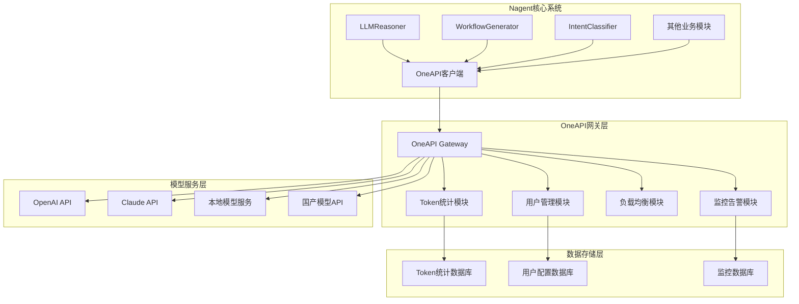

# 基于OneAPI的统一大模型API网关设计方案

## 1. 概述

### 1.1 方案调整说明
经过技术调研，我们决定采用开源的OneAPI项目作为统一大模型API网关的核心组件，而不是从零开发。OneAPI是一个成熟的开源LLM API网关，完全满足我们的Token统计和监控需求。

### 1.2 现状分析
目前Nagent架构中存在以下问题：
- 大模型API调用分散在各个模块中（如`LLMReasoner`、`WorkflowGenerator`等）
- **缺乏详细的Token用量统计和分析**
- **没有基于Token消耗的上下文优化机制**
- 缺乏统一的配置管理和负载均衡
- 没有统一的监控、限流和缓存机制
- 不同模块重复实现类似的API调用逻辑
- 难以支持多厂商模型的统一管理

### 1.3 设计目标
- **统一访问**：通过OneAPI提供统一的大模型API访问入口
- **Token精细化管理**：利用OneAPI的详细Token统计和分析功能
- **智能上下文优化**：基于Token消耗数据自动调整上下文长度
- **多厂商支持**：支持OpenAI、Claude、本地模型等30+种厂商
- **企业级功能**：用户管理、配额控制、成本追踪、告警监控
- **开箱即用**：快速部署，1-2周完成集成

### 1.4 架构原则
- **拥抱开源**：基于成熟的OneAPI项目，避免重复造轮子
- **轻量集成**：Nagent专注核心业务逻辑，网关功能交给专业组件
- **数据驱动**：基于OneAPI提供的详细统计数据优化系统
- **渐进式替换**：逐步将现有LLM调用迁移到OneAPI

## 2. OneAPI技术选型分析

### 2.1 OneAPI核心优势

#### 2.1.1 完整的Token管理功能
```yaml
Token统计能力:
  实时统计: ✅ 每次API调用的详细Token消耗
  多维度分析: ✅ 按用户、模型、时间维度统计
  成本计算: ✅ 自动计算API调用成本
  历史数据: ✅ 长期Token使用趋势分析
  
上下文优化支持:
  Token消耗监控: ✅ 实时监控Token使用情况
  阈值告警: ✅ Token使用量超限告警
  统计API: ✅ 提供详细的使用统计接口
  成本优化: ✅ 基于成本的模型选择建议
```

#### 2.1.2 企业级功能
```yaml
用户管理:
  多用户支持: ✅ 支持多租户架构
  权限控制: ✅ 细粒度权限管理
  配额管理: ✅ 用户级别的配额控制
  
监控告警:
  实时监控: ✅ API调用实时监控
  预算管理: ✅ 预算超限自动告警
  性能监控: ✅ 延迟、成功率监控
  
负载均衡:
  多实例支持: ✅ 支持多个API实例
  故障转移: ✅ 自动故障切换
  智能路由: ✅ 基于负载的智能路由
```

#### 2.1.3 多厂商支持
```yaml
国外厂商:
  - OpenAI (GPT-4, GPT-3.5, DALL-E)
  - Anthropic (Claude-3 系列)
  - Google (Gemini)
  - Cohere
  - Mistral AI

国内厂商:
  - 百度文心一言
  - 阿里通义千问
  - 腾讯混元
  - 智谱ChatGLM
  - 月之暗面Kimi
  - 字节豆包

本地模型:
  - Ollama
  - LocalAI
  - FastChat
  - vLLM
```

### 2.2 成本效益分析

| 方案对比 | 自建网关 | 集成OneAPI |
|---------|----------|-----------|
| **开发时间** | 6-12个月 | 1-2周 |
| **开发成本** | 高（需要专门团队） | 低（配置集成） |
| **维护成本** | 高（持续开发维护） | 低（社区维护） |
| **功能完整度** | 需要逐步开发 | 开箱即用 |
| **技术风险** | 高（从零开发） | 低（成熟方案） |
| **扩展性** | 需要自己实现 | 社区持续更新 |

## 3. 集成架构设计

### 3.1 整体架构



### 3.2 核心组件设计

#### 3.2.1 OneAPI集成客户端

```python
# src/communication/llm/oneapi_client.py
"""
OneAPI集成客户端
提供统一的LLM调用接口，自动处理Token统计
"""

import aiohttp
import asyncio
from typing import Dict, List, Optional, Any, AsyncIterator
from dataclasses import dataclass
import structlog

logger = structlog.get_logger(__name__)


@dataclass
class TokenUsage:
    """Token使用情况"""
    prompt_tokens: int
    completion_tokens: int
    total_tokens: int
    cost_usd: float
    model: str
    timestamp: str


@dataclass
class OneAPIConfig:
    """OneAPI配置"""
    base_url: str = "http://localhost:3000"
    api_key: str = ""
    timeout: int = 60
    max_retries: int = 3
    
    # Token监控配置
    token_limit_per_user: int = 100000  # 每用户每月Token限制
    cost_limit_per_user: float = 100.0  # 每用户每月成本限制
    alert_threshold: float = 0.8  # 告警阈值（80%）


class OneAPIClient:
    """OneAPI统一客户端"""
    
    def __init__(self, config: OneAPIConfig):
        self.config = config
        self.session = aiohttp.ClientSession(
            timeout=aiohttp.ClientTimeout(total=config.timeout)
        )
        self.stats = {
            "total_calls": 0,
            "successful_calls": 0,
            "failed_calls": 0,
            "total_tokens_used": 0,
            "total_cost": 0.0
        }
        
        logger.info(
            "OneAPI client initialized",
            base_url=config.base_url,
            timeout=config.timeout
        )
    
    async def chat_completion(
        self,
        messages: List[Dict[str, str]],
        model: str = "gpt-3.5-turbo",
        user_id: Optional[str] = None,
        temperature: float = 0.7,
        max_tokens: Optional[int] = None,
        stream: bool = False,
        **kwargs
    ) -> Dict[str, Any]:
        """
        聊天完成接口（非流式）
        OneAPI会自动统计Token使用量
        """
        self.stats["total_calls"] += 1
        
        try:
            payload = {
                "model": model,
                "messages": messages,
                "temperature": temperature,
                "stream": False,
                **kwargs
            }
            
            if max_tokens:
                payload["max_tokens"] = max_tokens
            
            if user_id:
                payload["user"] = user_id
            
            # 调用OneAPI
            response = await self._post("/v1/chat/completions", payload)
            
            # 提取Token使用情况（OneAPI自动提供）
            usage = response.get("usage", {})
            token_usage = TokenUsage(
                prompt_tokens=usage.get("prompt_tokens", 0),
                completion_tokens=usage.get("completion_tokens", 0),
                total_tokens=usage.get("total_tokens", 0),
                cost_usd=usage.get("cost", 0.0),  # OneAPI提供成本信息
                model=model,
                timestamp=response.get("created", "")
            )
            
            # 更新统计
            self.stats["successful_calls"] += 1
            self.stats["total_tokens_used"] += token_usage.total_tokens
            self.stats["total_cost"] += token_usage.cost_usd
            
            # 检查是否需要上下文优化
            await self._check_context_optimization(user_id, token_usage)
            
            logger.debug(
                "Chat completion successful",
                model=model,
                user_id=user_id,
                tokens_used=token_usage.total_tokens,
                cost=token_usage.cost_usd
            )
            
            return response
            
        except Exception as e:
            self.stats["failed_calls"] += 1
            logger.error(
                "Chat completion failed",
                model=model,
                user_id=user_id,
                error=str(e)
            )
            
            # 返回友好的错误响应
            return {
                "error": {
                    "message": f"API调用失败: {str(e)}",
                    "type": "api_error"
                }
            }
    
    async def stream_chat_completion(
        self,
        messages: List[Dict[str, str]],
        model: str = "gpt-3.5-turbo",
        user_id: Optional[str] = None,
        **kwargs
    ) -> AsyncIterator[Dict[str, Any]]:
        """
        流式聊天完成接口
        OneAPI支持流式调用的Token统计
        """
        
        payload = {
            "model": model,
            "messages": messages,
            "stream": True,
            **kwargs
        }
        
        if user_id:
            payload["user"] = user_id
        
        try:
            async with self.session.post(
                f"{self.config.base_url}/v1/chat/completions",
                json=payload,
                headers=self._get_headers()
            ) as response:
                
                total_tokens = 0
                async for line in response.content:
                    if line.startswith(b"data: "):
                        chunk_data = line[6:].decode('utf-8').strip()
                        
                        if chunk_data == "[DONE]":
                            # OneAPI在流式结束时提供总Token统计
                            final_usage = await self._get_stream_usage(user_id, model)
                            if final_usage:
                                await self._check_context_optimization(user_id, final_usage)
                            break
                        
                        try:
                            chunk = json.loads(chunk_data)
                            yield chunk
                            
                            # 累计Token使用量（如果chunk中包含）
                            if "usage" in chunk:
                                usage = chunk["usage"]
                                total_tokens += usage.get("total_tokens", 0)
                                
                        except json.JSONDecodeError:
                            continue
                            
        except Exception as e:
            logger.error(
                "Stream chat completion failed",
                model=model,
                user_id=user_id,
                error=str(e)
            )
            yield {
                "error": {
                    "message": f"流式API调用失败: {str(e)}",
                    "type": "stream_error"
                }
            }
    
    async def get_token_usage(
        self,
        user_id: Optional[str] = None,
        start_date: Optional[str] = None,
        end_date: Optional[str] = None,
        model: Optional[str] = None
    ) -> Dict[str, Any]:
        """
        获取Token使用统计
        利用OneAPI的统计接口
        """
        
        params = {}
        if user_id:
            params["user_id"] = user_id
        if start_date:
            params["start_date"] = start_date
        if end_date:
            params["end_date"] = end_date
        if model:
            params["model"] = model
        
        try:
            # OneAPI提供的使用统计接口
            usage_data = await self._get("/v1/dashboard/usage", params=params)
            
            return {
                "success": True,
                "data": usage_data,
                "summary": {
                    "total_tokens": usage_data.get("total_tokens", 0),
                    "total_cost": usage_data.get("total_cost", 0.0),
                    "total_requests": usage_data.get("total_requests", 0),
                    "period": f"{start_date} to {end_date}" if start_date and end_date else "all_time"
                }
            }
            
        except Exception as e:
            logger.error(
                "Failed to get token usage",
                user_id=user_id,
                error=str(e)
            )
            return {
                "success": False,
                "error": str(e)
            }
    
    async def get_user_quota_status(self, user_id: str) -> Dict[str, Any]:
        """
        获取用户配额使用状态
        """
        
        try:
            # 获取当月使用情况
            import datetime
            current_month = datetime.datetime.now().strftime("%Y-%m")
            start_date = f"{current_month}-01"
            end_date = datetime.datetime.now().strftime("%Y-%m-%d")
            
            usage = await self.get_token_usage(
                user_id=user_id,
                start_date=start_date,
                end_date=end_date
            )
            
            if not usage["success"]:
                return usage
            
            data = usage["data"]
            total_tokens = data.get("total_tokens", 0)
            total_cost = data.get("total_cost", 0.0)
            
            # 计算配额使用率
            token_usage_rate = total_tokens / self.config.token_limit_per_user
            cost_usage_rate = total_cost / self.config.cost_limit_per_user
            
            # 检查是否需要告警
            needs_alert = (
                token_usage_rate >= self.config.alert_threshold or
                cost_usage_rate >= self.config.alert_threshold
            )
            
            return {
                "success": True,
                "user_id": user_id,
                "quota_status": {
                    "token_limit": self.config.token_limit_per_user,
                    "tokens_used": total_tokens,
                    "token_usage_rate": token_usage_rate,
                    "cost_limit": self.config.cost_limit_per_user,
                    "cost_used": total_cost,
                    "cost_usage_rate": cost_usage_rate,
                    "needs_alert": needs_alert,
                    "period": f"{start_date} to {end_date}"
                }
            }
            
        except Exception as e:
            logger.error(
                "Failed to get user quota status",
                user_id=user_id,
                error=str(e)
            )
            return {
                "success": False,
                "error": str(e)
            }
    
    async def _check_context_optimization(
        self,
        user_id: Optional[str],
        token_usage: TokenUsage
    ) -> None:
        """
        检查是否需要进行上下文优化
        当Token使用量过高时，建议优化上下文
        """
        
        # 单次调用Token过多（超过总限制的10%）
        high_usage_threshold = self.config.token_limit_per_user * 0.1
        
        if token_usage.total_tokens > high_usage_threshold:
            logger.warning(
                "High token usage detected, consider context optimization",
                user_id=user_id,
                tokens_used=token_usage.total_tokens,
                threshold=high_usage_threshold,
                model=token_usage.model,
                cost=token_usage.cost_usd
            )
            
            # 这里可以触发上下文优化逻辑
            # 例如：通知推理引擎减少上下文长度
            await self._notify_context_optimization(user_id, token_usage)
    
    async def _notify_context_optimization(
        self,
        user_id: Optional[str],
        token_usage: TokenUsage
    ) -> None:
        """
        通知系统进行上下文优化
        """
        
        optimization_suggestion = {
            "type": "context_optimization",
            "user_id": user_id,
            "trigger": {
                "tokens_used": token_usage.total_tokens,
                "cost": token_usage.cost_usd,
                "model": token_usage.model
            },
            "suggestions": [
                "减少历史对话上下文长度",
                "优化prompt模板",
                "考虑使用成本更低的模型",
                "实现智能上下文裁剪"
            ],
            "timestamp": token_usage.timestamp
        }
        
        # 发送优化建议到事件系统
        # 这里可以集成到Nagent的事件系统中
        logger.info(
            "Context optimization suggestion generated",
            suggestion=optimization_suggestion
        )
    
    async def _post(self, endpoint: str, data: Dict) -> Dict[str, Any]:
        """发送POST请求到OneAPI"""
        
        url = f"{self.config.base_url}{endpoint}"
        headers = self._get_headers()
        
        for attempt in range(self.config.max_retries):
            try:
                async with self.session.post(url, json=data, headers=headers) as response:
                    if response.status == 200:
                        return await response.json()
                    else:
                        error_text = await response.text()
                        raise Exception(f"HTTP {response.status}: {error_text}")
                        
            except Exception as e:
                if attempt == self.config.max_retries - 1:
                    raise
                await asyncio.sleep(2 ** attempt)  # 指数退避
    
    async def _get(self, endpoint: str, params: Dict = None) -> Dict[str, Any]:
        """发送GET请求到OneAPI"""
        
        url = f"{self.config.base_url}{endpoint}"
        headers = self._get_headers()
        
        async with self.session.get(url, params=params, headers=headers) as response:
            if response.status == 200:
                return await response.json()
            else:
                error_text = await response.text()
                raise Exception(f"HTTP {response.status}: {error_text}")
    
    def _get_headers(self) -> Dict[str, str]:
        """获取请求头"""
        return {
            "Authorization": f"Bearer {self.config.api_key}",
            "Content-Type": "application/json"
        }
    
    async def _get_stream_usage(
        self,
        user_id: Optional[str],
        model: str
    ) -> Optional[TokenUsage]:
        """
        获取流式调用的Token使用情况
        OneAPI在流式调用结束后提供统计信息
        """
        
        try:
            # 查询最近的使用记录
            recent_usage = await self._get(
                "/v1/dashboard/usage/recent",
                params={
                    "user_id": user_id,
                    "model": model,
                    "limit": 1
                }
            )
            
            if recent_usage and recent_usage.get("data"):
                latest = recent_usage["data"][0]
                return TokenUsage(
                    prompt_tokens=latest.get("prompt_tokens", 0),
                    completion_tokens=latest.get("completion_tokens", 0),
                    total_tokens=latest.get("total_tokens", 0),
                    cost_usd=latest.get("cost", 0.0),
                    model=model,
                    timestamp=latest.get("timestamp", "")
                )
                
        except Exception as e:
            logger.warning(
                "Failed to get stream usage",
                user_id=user_id,
                model=model,
                error=str(e)
            )
        
        return None
    
    async def close(self):
        """关闭客户端"""
        await self.session.close()
        
        logger.info(
            "OneAPI client closed",
            total_calls=self.stats["total_calls"],
            successful_calls=self.stats["successful_calls"],
            failed_calls=self.stats["failed_calls"],
            total_tokens_used=self.stats["total_tokens_used"],
            total_cost=self.stats["total_cost"]
        )


# 全局客户端实例
_oneapi_client: Optional[OneAPIClient] = None


async def get_oneapi_client() -> OneAPIClient:
    """获取OneAPI客户端单例"""
    global _oneapi_client
    
    if _oneapi_client is None:
        from config.config_manager import ConfigManager
        config_manager = ConfigManager()
        config = config_manager.get_config()
        
        oneapi_config = OneAPIConfig(
            base_url=config.get("oneapi", {}).get("base_url", "http://localhost:3000"),
            api_key=config.get("oneapi", {}).get("api_key", ""),
            timeout=config.get("oneapi", {}).get("timeout", 60),
            max_retries=config.get("oneapi", {}).get("max_retries", 3),
            token_limit_per_user=config.get("oneapi", {}).get("token_limit_per_user", 100000),
            cost_limit_per_user=config.get("oneapi", {}).get("cost_limit_per_user", 100.0),
            alert_threshold=config.get("oneapi", {}).get("alert_threshold", 0.8)
        )
        
        _oneapi_client = OneAPIClient(oneapi_config)
    
    return _oneapi_client
```

#### 3.2.2 Token监控管理器

```python
# src/communication/llm/token_monitor.py
"""
Token监控管理器
基于OneAPI的统计数据提供上下文优化建议
"""

import asyncio
from typing import Dict, List, Optional, Any
from dataclasses import dataclass
from datetime import datetime, timedelta
import structlog

from .oneapi_client import get_oneapi_client, TokenUsage

logger = structlog.get_logger(__name__)


@dataclass
class ContextOptimizationRule:
    """上下文优化规则"""
    name: str
    condition: str  # 触发条件
    action: str     # 优化动作
    threshold: float  # 阈值
    description: str


class TokenMonitor:
    """Token监控管理器"""
    
    def __init__(self):
        self.optimization_rules = [
            ContextOptimizationRule(
                name="high_token_usage",
                condition="single_call_tokens > monthly_limit * 0.1",
                action="reduce_context_length",
                threshold=0.1,
                description="单次调用Token过多，建议减少上下文长度"
            ),
            ContextOptimizationRule(
                name="high_cost_model",
                condition="cost_per_token > avg_cost_per_token * 2",
                action="suggest_cheaper_model",
                threshold=2.0,
                description="使用的模型成本较高，建议切换到更经济的模型"
            ),
            ContextOptimizationRule(
                name="frequent_long_context",
                condition="avg_context_length > context_limit * 0.8",
                action="implement_context_compression",
                threshold=0.8,
                description="上下文长度经常接近限制，建议实现上下文压缩"
            ),
            ContextOptimizationRule(
                name="quota_approaching",
                condition="monthly_usage > monthly_quota * 0.9",
                action="optimize_all_contexts",
                threshold=0.9,
                description="月度配额即将用完，建议全面优化上下文使用"
            )
        ]
    
    async def analyze_token_usage(
        self,
        user_id: str,
        time_period: str = "7d"
    ) -> Dict[str, Any]:
        """
        分析Token使用情况并提供优化建议
        """
        
        client = await get_oneapi_client()
        
        # 计算时间范围
        end_date = datetime.now()
        if time_period == "7d":
            start_date = end_date - timedelta(days=7)
        elif time_period == "30d":
            start_date = end_date - timedelta(days=30)
        elif time_period == "24h":
            start_date = end_date - timedelta(hours=24)
        else:
            start_date = end_date - timedelta(days=7)
        
        try:
            # 获取使用统计
            usage_data = await client.get_token_usage(
                user_id=user_id,
                start_date=start_date.strftime("%Y-%m-%d"),
                end_date=end_date.strftime("%Y-%m-%d")
            )
            
            if not usage_data["success"]:
                return {
                    "success": False,
                    "error": usage_data["error"]
                }
            
            # 获取配额状态
            quota_status = await client.get_user_quota_status(user_id)
            
            if not quota_status["success"]:
                return {
                    "success": False,
                    "error": quota_status["error"]
                }
            
            # 分析数据并生成建议
            analysis_result = await self._analyze_usage_patterns(
                usage_data["data"],
                quota_status["quota_status"]
            )
            
            return {
                "success": True,
                "user_id": user_id,
                "time_period": time_period,
                "usage_summary": usage_data["summary"],
                "quota_status": quota_status["quota_status"],
                "analysis": analysis_result,
                "timestamp": datetime.now().isoformat()
            }
            
        except Exception as e:
            logger.error(
                "Token usage analysis failed",
                user_id=user_id,
                time_period=time_period,
                error=str(e)
            )
            return {
                "success": False,
                "error": str(e)
            }
    
    async def _analyze_usage_patterns(
        self,
        usage_data: Dict[str, Any],
        quota_status: Dict[str, Any]
    ) -> Dict[str, Any]:
        """
        分析使用模式并生成优化建议
        """
        
        total_tokens = usage_data.get("total_tokens", 0)
        total_cost = usage_data.get("total_cost", 0.0)
        total_requests = usage_data.get("total_requests", 1)
        
        # 计算平均值
        avg_tokens_per_request = total_tokens / total_requests
        avg_cost_per_request = total_cost / total_requests
        avg_cost_per_token = total_cost / total_tokens if total_tokens > 0 else 0
        
        # 检查各种优化规则
        optimization_suggestions = []
        priority_level = "low"
        
        # 规则1: 单次调用Token过多
        monthly_limit = quota_status.get("token_limit", 100000)
        if avg_tokens_per_request > monthly_limit * 0.1:
            optimization_suggestions.append({
                "rule": "high_token_usage",
                "priority": "high",
                "description": "平均每次调用使用Token过多",
                "current_value": avg_tokens_per_request,
                "threshold": monthly_limit * 0.1,
                "suggestion": "建议减少上下文长度，使用更精简的prompt"
            })
            priority_level = "high"
        
        # 规则2: 成本过高
        # 这里需要获取平均成本基准，简化处理
        avg_cost_benchmark = 0.002  # 假设基准成本per token
        if avg_cost_per_token > avg_cost_benchmark * 2:
            optimization_suggestions.append({
                "rule": "high_cost_model",
                "priority": "medium",
                "description": "使用的模型成本较高",
                "current_value": avg_cost_per_token,
                "threshold": avg_cost_benchmark * 2,
                "suggestion": "考虑使用成本更低的模型，如gpt-3.5-turbo替代gpt-4"
            })
            if priority_level == "low":
                priority_level = "medium"
        
        # 规则3: 配额使用率过高
        token_usage_rate = quota_status.get("token_usage_rate", 0)
        cost_usage_rate = quota_status.get("cost_usage_rate", 0)
        
        if token_usage_rate > 0.9 or cost_usage_rate > 0.9:
            optimization_suggestions.append({
                "rule": "quota_approaching",
                "priority": "critical",
                "description": "月度配额即将用完",
                "current_value": max(token_usage_rate, cost_usage_rate),
                "threshold": 0.9,
                "suggestion": "立即优化所有上下文，考虑使用更经济的模型或减少API调用频率"
            })
            priority_level = "critical"
        
        # 生成具体的优化建议
        actionable_recommendations = self._generate_actionable_recommendations(
            optimization_suggestions,
            usage_data,
            quota_status
        )
        
        return {
            "usage_patterns": {
                "avg_tokens_per_request": avg_tokens_per_request,
                "avg_cost_per_request": avg_cost_per_request,
                "avg_cost_per_token": avg_cost_per_token,
                "total_requests": total_requests
            },
            "optimization_suggestions": optimization_suggestions,
            "priority_level": priority_level,
            "actionable_recommendations": actionable_recommendations,
            "estimated_savings": self._calculate_potential_savings(
                optimization_suggestions,
                usage_data
            )
        }
    
    def _generate_actionable_recommendations(
        self,
        suggestions: List[Dict[str, Any]],
        usage_data: Dict[str, Any],
        quota_status: Dict[str, Any]
    ) -> List[Dict[str, Any]]:
        """
        生成可执行的优化建议
        """
        
        recommendations = []
        
        for suggestion in suggestions:
            rule = suggestion["rule"]
            
            if rule == "high_token_usage":
                recommendations.extend([
                    {
                        "action": "reduce_context_window",
                        "description": "将上下文窗口从当前长度减少25%",
                        "implementation": "在LLMReasoner中设置max_context_length参数",
                        "expected_savings": "25%的Token使用量减少",
                        "code_example": "llm_reasoner.set_context_limit(int(current_limit * 0.75))"
                    },
                    {
                        "action": "optimize_prompt_templates",
                        "description": "优化prompt模板，去除冗余信息",
                        "implementation": "重新设计prompt模板，使用更简洁的表达",
                        "expected_savings": "10-20%的Token使用量减少",
                        "code_example": "使用bullet points替代长句描述"
                    }
                ])
            
            elif rule == "high_cost_model":
                recommendations.append({
                    "action": "model_downgrade",
                    "description": "对于简单任务使用更经济的模型",
                    "implementation": "在智能路由中添加成本考虑",
                    "expected_savings": f"可节省{suggestion['current_value'] - suggestion['threshold']:.4f}$/token",
                    "code_example": "if task_complexity < 0.5: use_model('gpt-3.5-turbo')"
                })
            
            elif rule == "quota_approaching":
                recommendations.extend([
                    {
                        "action": "emergency_optimization",
                        "description": "立即启用所有优化策略",
                        "implementation": "激活紧急优化模式",
                        "expected_savings": "30-50%的使用量减少",
                        "code_example": "config.enable_emergency_optimization = True"
                    },
                    {
                        "action": "request_throttling",
                        "description": "临时限制API调用频率",
                        "implementation": "设置更严格的rate limiting",
                        "expected_savings": "防止超出配额",
                        "code_example": "rate_limiter.set_limit(requests_per_minute=10)"
                    }
                ])
        
        return recommendations
    
    def _calculate_potential_savings(
        self,
        suggestions: List[Dict[str, Any]],
        usage_data: Dict[str, Any]
    ) -> Dict[str, Any]:
        """
        计算潜在节省
        """
        
        total_cost = usage_data.get("total_cost", 0.0)
        total_tokens = usage_data.get("total_tokens", 0)
        
        estimated_cost_savings = 0.0
        estimated_token_savings = 0
        
        for suggestion in suggestions:
            rule = suggestion["rule"]
            
            if rule == "high_token_usage":
                # 假设可以节省25%的Token
                estimated_token_savings += total_tokens * 0.25
                estimated_cost_savings += total_cost * 0.25
            
            elif rule == "high_cost_model":
                # 假设可以节省40%的成本（通过使用更便宜的模型）
                estimated_cost_savings += total_cost * 0.40
            
            elif rule == "quota_approaching":
                # 紧急优化可以节省30%
                estimated_token_savings += total_tokens * 0.30
                estimated_cost_savings += total_cost * 0.30
        
        return {
            "estimated_token_savings": min(estimated_token_savings, total_tokens),
            "estimated_cost_savings": min(estimated_cost_savings, total_cost),
            "potential_savings_percentage": min(
                (estimated_cost_savings / total_cost * 100) if total_cost > 0 else 0,
                50  # 最多50%节省
            ),
            "monthly_projection": {
                "current_monthly_cost": total_cost * 4,  # 假设当前是周数据
                "optimized_monthly_cost": (total_cost - estimated_cost_savings) * 4,
                "monthly_savings": estimated_cost_savings * 4
            }
        }
    
    async def generate_optimization_report(
        self,
        user_id: str
    ) -> Dict[str, Any]:
        """
        生成完整的优化报告
        """
        
        # 分析不同时间段的使用情况
        analysis_24h = await self.analyze_token_usage(user_id, "24h")
        analysis_7d = await self.analyze_token_usage(user_id, "7d")
        analysis_30d = await self.analyze_token_usage(user_id, "30d")
        
        if not all([analysis_24h["success"], analysis_7d["success"], analysis_30d["success"]]):
            return {
                "success": False,
                "error": "Failed to analyze usage data"
            }
        
        # 综合分析趋势
        trend_analysis = self._analyze_usage_trends(
            analysis_24h["analysis"],
            analysis_7d["analysis"],
            analysis_30d["analysis"]
        )
        
        # 生成执行计划
        execution_plan = self._create_optimization_execution_plan(
            analysis_30d["analysis"]["actionable_recommendations"]
        )
        
        return {
            "success": True,
            "user_id": user_id,
            "report_generated_at": datetime.now().isoformat(),
            "usage_analysis": {
                "last_24h": analysis_24h,
                "last_7d": analysis_7d,
                "last_30d": analysis_30d
            },
            "trend_analysis": trend_analysis,
            "optimization_execution_plan": execution_plan,
            "summary": {
                "overall_priority": analysis_30d["analysis"]["priority_level"],
                "total_potential_savings": analysis_30d["analysis"]["estimated_savings"],
                "recommended_actions": len(analysis_30d["analysis"]["actionable_recommendations"])
            }
        }
    
    def _analyze_usage_trends(
        self,
        analysis_24h: Dict[str, Any],
        analysis_7d: Dict[str, Any],
        analysis_30d: Dict[str, Any]
    ) -> Dict[str, Any]:
        """
        分析使用趋势
        """
        
        # 获取平均Token使用量
        avg_24h = analysis_24h["usage_patterns"]["avg_tokens_per_request"]
        avg_7d = analysis_7d["usage_patterns"]["avg_tokens_per_request"]
        avg_30d = analysis_30d["usage_patterns"]["avg_tokens_per_request"]
        
        # 计算趋势
        short_term_trend = ((avg_24h - avg_7d) / avg_7d * 100) if avg_7d > 0 else 0
        long_term_trend = ((avg_7d - avg_30d) / avg_30d * 100) if avg_30d > 0 else 0
        
        trend_direction = "stable"
        if short_term_trend > 10:
            trend_direction = "increasing"
        elif short_term_trend < -10:
            trend_direction = "decreasing"
        
        return {
            "short_term_trend_percentage": short_term_trend,
            "long_term_trend_percentage": long_term_trend,
            "trend_direction": trend_direction,
            "usage_stability": "stable" if abs(short_term_trend) < 10 else "volatile",
            "recommendations": self._get_trend_recommendations(
                trend_direction,
                short_term_trend,
                long_term_trend
            )
        }
    
    def _get_trend_recommendations(
        self,
        trend_direction: str,
        short_term_trend: float,
        long_term_trend: float
    ) -> List[str]:
        """
        基于趋势生成建议
        """
        
        recommendations = []
        
        if trend_direction == "increasing":
            recommendations.extend([
                "使用量呈上升趋势，建议立即实施优化措施",
                "考虑设置更严格的Token使用限制",
                "审查最近的代码变更，查看是否有导致Token使用增加的修改"
            ])
        
        elif trend_direction == "decreasing":
            recommendations.extend([
                "使用量呈下降趋势，当前优化措施有效",
                "可以考虑适当放宽限制以提升用户体验",
                "将当前的优化策略应用到其他用户"
            ])
        
        else:
            recommendations.extend([
                "使用量相对稳定，保持当前配置",
                "定期监控确保使用量不会突然增加",
                "可以尝试小幅优化以获得额外节省"
            ])
        
        return recommendations
    
    def _create_optimization_execution_plan(
        self,
        recommendations: List[Dict[str, Any]]
    ) -> Dict[str, Any]:
        """
        创建优化执行计划
        """
        
        # 按优先级排序
        high_priority = []
        medium_priority = []
        low_priority = []
        
        for rec in recommendations:
            action = rec["action"]
            if "emergency" in action or "critical" in rec.get("priority", ""):
                high_priority.append(rec)
            elif "cost" in action or "model" in action:
                medium_priority.append(rec)
            else:
                low_priority.append(rec)
        
        return {
            "immediate_actions": high_priority,
            "short_term_actions": medium_priority,
            "long_term_actions": low_priority,
            "execution_timeline": {
                "phase1_immediate": "0-1 days",
                "phase2_short_term": "1-7 days", 
                "phase3_long_term": "1-4 weeks"
            },
            "success_metrics": [
                "Token使用量减少 > 20%",
                "API调用成本减少 > 15%",
                "配额使用率 < 80%",
                "平均响应时间保持不变"
            ]
        }


# 全局监控器实例
_token_monitor: Optional[TokenMonitor] = None


def get_token_monitor() -> TokenMonitor:
    """获取Token监控器单例"""
    global _token_monitor
    
    if _token_monitor is None:
        _token_monitor = TokenMonitor()
    
    return _token_monitor
```

### 3.3 配置管理

```python
# 更新 config/system.yaml
llm_gateway:
  # OneAPI配置
  oneapi:
    enabled: true
    base_url: "http://oneapi:3000"  # OneAPI服务地址
    api_key: "${ONEAPI_API_KEY}"    # OneAPI管理API密钥
    timeout: 60
    max_retries: 3
    
    # Token监控配置
    token_monitoring:
      enabled: true
      token_limit_per_user: 100000      # 每用户每月Token限制
      cost_limit_per_user: 100.0        # 每用户每月成本限制($)
      alert_threshold: 0.8               # 告警阈值(80%)
      
      # 上下文优化配置
      context_optimization:
        enabled: true
        high_usage_threshold: 0.1        # 单次高用量阈值(月限制的10%)
        auto_optimization: true          # 是否自动优化
        optimization_strategies:
          - "reduce_context_length"
          - "optimize_prompt_templates"
          - "suggest_cheaper_models"
    
    # 支持的模型配置
    models:
      # 高级模型
      premium:
        - "qwen-max"
        - "qwen-plus"
        - "qwen-coder-plus"
        - "qwen-coder-plus-latest"
        - "qwq-32b-preview"
        - "deepseek-r1"
        - "deepseek-v3"
      # 标准模型  
      standard:
        - "qwen-turbo"
        - "qwen-long"
        - "qwen-mt-plus"
        - "qwen-mt-turbo"
        - "qwen-coder-turbo"
        - "qwen-coder-turbo-latest"
      # 经济模型
      economy: []

  # 智能路由配置
  routing:
    enabled: true
    strategy: "cost_performance_balanced"  # 成本性能平衡
    fallback_model: "gpt-3.5-turbo"      # 降级模型
    
    # 路由规则
    rules:
      # 简单任务使用经济模型
      simple_tasks:
        conditions:
          - "token_count < 1000"
          - "task_complexity < 0.3"
        target_models: ["gpt-3.5-turbo", "claude-3-haiku"]
      
      # 复杂任务使用高级模型
      complex_tasks:
        conditions:
          - "token_count > 5000"
          - "task_complexity > 0.8"
        target_models: ["gpt-4", "claude-3-opus"]

# 原有配置保持兼容
fallback:
  enabled: true  # 当OneAPI不可用时的降级方案
  direct_api:
    openai:
      api_key: "${OPENAI_API_KEY}"
      base_url: "https://api.openai.com/v1"
    anthropic:
      api_key: "${ANTHROPIC_API_KEY}"
      base_url: "https://api.anthropic.com"