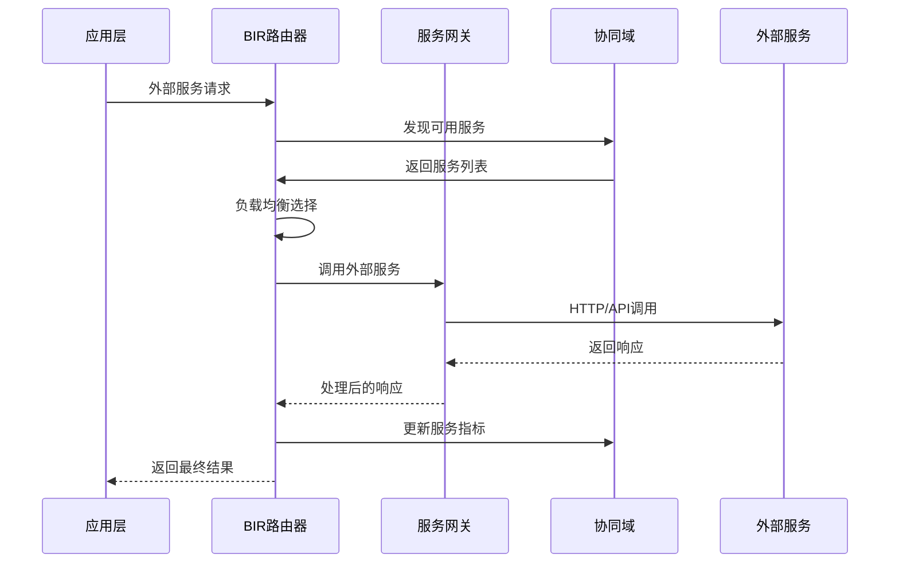

# 通信域与协同域外部服务统一调度方案

## 方案概述

本方案设计了通信域(Communication)和协同域(Coordination)协作管理外部服务的统一调度架构，实现大模型API、文档解析服务、知识库服务等外部资源的智能调度、负载均衡和故障处理。

## 整体架构设计

### 双域协作架构图

```
┌─────────────────────────────────────────────────────────────────────────────────┐
│                              Application Layer 应用层                           │
│  ┌─────────────────┐  ┌─────────────────┐  ┌─────────────────┐  ┌─────────────────┐ │
│  │ Knowledge       │  │ Query Engine    │  │ Workflow        │  │ Chat Interface  │ │
│  │ Manager         │  │                 │  │ Engine          │  │                 │ │
│  └─────────────────┘  └─────────────────┘  └─────────────────┘  └─────────────────┘ │
└─────────────────────────────────────────────────────────────────────────────────┘
                                        │
                                        ▼
┌─────────────────────────────────────────────────────────────────────────────────┐
│                        Communication Domain 通信域                               │
│  ┌─────────────────┐  ┌─────────────────┐  ┌─────────────────┐  ┌─────────────────┐ │
│  │ External        │  │ BIR Router      │  │ Protocol        │  │ Message         │ │
│  │ Service Gateway │  │ (Enhanced)      │  │ Adapters        │  │ Dispatcher      │ │
│  └─────────────────┘  └─────────────────┘  └─────────────────┘  └─────────────────┘ │
│  ┌─────────────────┐  ┌─────────────────┐  ┌─────────────────┐  ┌─────────────────┐ │
│  │ Service         │  │ Load Balancer   │  │ Circuit         │  │ Cache           │ │
│  │ Discovery       │  │                 │  │ Breaker         │  │ Manager         │ │
│  └─────────────────┘  └─────────────────┘  └─────────────────┘  └─────────────────┘ │
└─────────────────────────────────────────────────────────────────────────────────┘
                                        │
                                        ▼
┌─────────────────────────────────────────────────────────────────────────────────┐
│                       Coordination Domain 协同域                                 │
│  ┌─────────────────┐  ┌─────────────────┐  ┌─────────────────┐  ┌─────────────────┐ │
│  │ Service         │  │ Resource        │  │ Task            │  │ Health          │ │
│  │ Registry        │  │ Allocator       │  │ Scheduler       │  │ Monitor         │ │
│  └─────────────────┘  └─────────────────┘  └─────────────────┘  └─────────────────┘ │
│  ┌─────────────────┐  ┌─────────────────┐  ┌─────────────────┐  ┌─────────────────┐ │
│  │ Container       │  │ Policy          │  │ Metrics         │  │ Governance      │ │
│  │ Manager         │  │ Engine          │  │ Collector       │  │ Controller      │ │
│  └─────────────────┘  └─────────────────┘  └─────────────────┘  └─────────────────┘ │
└─────────────────────────────────────────────────────────────────────────────────┘
                                        │
                                        ▼
┌─────────────────────────────────────────────────────────────────────────────────┐
│                          External Services 外部服务层                            │
│  ┌─────────────────┐  ┌─────────────────┐  ┌─────────────────┐  ┌─────────────────┐ │
│  │ LLM Services    │  │ Document        │  │ Knowledge       │  │ Vector          │ │
│  │ OpenAI/Claude   │  │ Processing      │  │ Graph           │  │ Database        │ │
│  │ /Local Models   │  │ Unstructured    │  │ GraphRAG        │  │ Chroma/Pinecone │ │
│  └─────────────────┘  └─────────────────┘  └─────────────────┘  └─────────────────┘ │
└─────────────────────────────────────────────────────────────────────────────────┘
```

## 核心设计理念

### 1. 双域职责分工

#### 通信域职责
- **外部服务网关**：统一的外部服务访问入口
- **智能路由**：基于BIR路由器的外部服务路由
- **协议适配**：不同外部服务的协议转换和适配
- **消息调度**：外部服务请求的消息队列管理
- **缓存管理**：外部服务响应的智能缓存

#### 协同域职责
- **服务注册**：外部服务的注册、发现和状态管理
- **资源调度**：外部服务资源的分配和优化
- **任务编排**：复杂外部服务调用的任务编排
- **健康监控**：外部服务的健康检查和故障处理
- **治理控制**：外部服务的权限、配额和策略管理

### 2. 统一调度策略

```python
# 外部服务调度策略枚举
class ExternalServiceSchedulingStrategy(Enum):
    """外部服务调度策略"""
    ROUND_ROBIN = "round_robin"           # 轮询调度
    LEAST_LOADED = "least_loaded"         # 最少负载
    WEIGHTED_ROUND_ROBIN = "weighted"     # 加权轮询
    PRIORITY_BASED = "priority"           # 优先级调度
    COST_OPTIMIZED = "cost_optimized"     # 成本优化
    LATENCY_OPTIMIZED = "latency"         # 延迟优化
    INTELLIGENT = "intelligent"           # 智能调度
```

## 核心组件实现

### 1. 增强的BIR路由器 (通信域)

```python
# src/communication/dispatcher/enhanced_bir_router.py
from typing import Dict, List, Optional, Any
from enum import Enum
import asyncio
import logging
from dataclasses import dataclass

class ServiceCategory(Enum):
    """服务类别"""
    LLM_SERVICE = "llm"
    DOCUMENT_PROCESSING = "document"
    KNOWLEDGE_GRAPH = "knowledge_graph"
    VECTOR_DATABASE = "vector_db"
    EMBEDDING_SERVICE = "embedding"

@dataclass
class ExternalServiceRequest:
    """外部服务请求"""
    request_id: str
    service_category: ServiceCategory
    service_name: str
    method: str
    data: Dict[str, Any]
    priority: int = 5
    timeout: int = 30
    retry_count: int = 0
    max_retries: int = 3
    user_id: Optional[str] = None
    session_id: Optional[str] = None

class EnhancedBIRRouter:
    """增强的BIR路由器 - 支持外部服务路由"""
    
    def __init__(self):
        self.service_gateway = None  # 外部服务网关
        self.coordination_client = None  # 协同域客户端
        self.load_balancer = LoadBalancer()
        self.circuit_breaker = CircuitBreakerManager()
        self.cache_manager = CacheManager()
        self.metrics_collector = MetricsCollector()
        self.logger = logging.getLogger(__name__)
    
    async def initialize(self, service_gateway, coordination_client):
        """初始化路由器"""
        self.service_gateway = service_gateway
        self.coordination_client = coordination_client
        await self.load_balancer.initialize()
        self.logger.info("Enhanced BIR Router initialized")
    
    async def route_external_service_request(
        self,
        request: ExternalServiceRequest
    ) -> Dict[str, Any]:
        """路由外部服务请求"""
        
        try:
            # 1. 检查缓存
            cache_key = self._generate_cache_key(request)
            cached_response = await self.cache_manager.get(cache_key)
            if cached_response:
                self.metrics_collector.record_cache_hit(request.service_category.value)
                return cached_response
            
            # 2. 从协同域获取可用服务实例
            available_services = await self.coordination_client.discover_services(
                service_category=request.service_category,
                service_name=request.service_name
            )
            
            if not available_services:
                raise Exception(f"No available services for {request.service_name}")
            
            # 3. 负载均衡选择服务实例
            selected_service = await self.load_balancer.select_service(
                available_services,
                strategy=self._get_scheduling_strategy(request)
            )
            
            # 4. 检查熔断器状态
            if self.circuit_breaker.is_open(selected_service.service_id):
                # 尝试故障转移
                selected_service = await self._handle_failover(
                    available_services, 
                    selected_service
                )
            
            # 5. 执行外部服务调用
            response = await self.service_gateway.call_service(
                service_id=selected_service.service_id,
                method=request.method,
                data=request.data,
                timeout=request.timeout
            )
            
            # 6. 处理响应
            if response.success:
                # 缓存成功响应
                await self.cache_manager.set(cache_key, response.data)
                self.circuit_breaker.record_success(selected_service.service_id)
                
                # 更新负载信息
                await self.load_balancer.update_service_load(
                    selected_service.service_id,
                    response.response_time
                )
            else:
                self.circuit_breaker.record_failure(selected_service.service_id)
                
                # 重试逻辑
                if request.retry_count < request.max_retries:
                    request.retry_count += 1
                    return await self.route_external_service_request(request)
            
            # 7. 记录指标
            self.metrics_collector.record_request(
                request.service_category.value,
                response
            )
            
            return response.data
            
        except Exception as e:
            self.logger.error(f"External service routing failed: {str(e)}")
            
            # 尝试降级服务
            fallback_response = await self._handle_fallback(request, str(e))
            if fallback_response:
                return fallback_response
            
            raise
    
    def _get_scheduling_strategy(self, request: ExternalServiceRequest) -> str:
        """根据请求类型获取调度策略"""
        
        # LLM服务优先考虑成本和延迟
        if request.service_category == ServiceCategory.LLM_SERVICE:
            if request.priority > 7:  # 高优先级
                return "latency_optimized"
            else:
                return "cost_optimized"
        
        # 文档处理服务考虑负载均衡
        elif request.service_category == ServiceCategory.DOCUMENT_PROCESSING:
            return "least_loaded"
        
        # 知识图谱服务考虑资源密集型
        elif request.service_category == ServiceCategory.KNOWLEDGE_GRAPH:
            return "weighted_round_robin"
        
        # 默认智能调度
        return "intelligent"
    
    async def _handle_failover(
        self,
        available_services: List,
        failed_service
    ):
        """处理故障转移"""
        
        # 从可用服务中排除失败的服务
        healthy_services = [
            s for s in available_services 
            if s.service_id != failed_service.service_id
        ]
        
        if not healthy_services:
            raise Exception("No healthy services available for failover")
        
        # 选择最佳替代服务
        return await self.load_balancer.select_service(
            healthy_services,
            strategy="least_loaded"
        )
    
    async def _handle_fallback(
        self,
        request: ExternalServiceRequest,
        error_message: str
    ) -> Optional[Dict[str, Any]]:
        """处理降级服务"""
        
        # LLM服务降级：使用本地模型或缓存响应
        if request.service_category == ServiceCategory.LLM_SERVICE:
            return await self._llm_fallback(request)
        
        # 文档处理降级：使用简化处理
        elif request.service_category == ServiceCategory.DOCUMENT_PROCESSING:
            return await self._document_processing_fallback(request)
        
        # 其他服务暂时返回错误
        return {
            "error": f"Service temporarily unavailable: {error_message}",
            "fallback": True
        }
    
    async def _llm_fallback(self, request: ExternalServiceRequest) -> Dict[str, Any]:
        """LLM服务降级处理"""
        
        # 尝试使用本地模型
        try:
            local_llm_response = await self.coordination_client.call_local_llm(
                request.data
            )
            return {
                "response": local_llm_response,
                "fallback": True,
                "source": "local_model"
            }
        except:
            # 返回预设响应
            return {
                "response": "Service temporarily unavailable. Please try again later.",
                "fallback": True,
                "source": "preset_response"
            }
    
    async def _document_processing_fallback(
        self,
        request: ExternalServiceRequest
    ) -> Dict[str, Any]:
        """文档处理服务降级"""
        
        # 使用简化的文档处理
        return {
            "processed": False,
            "message": "Document processing service unavailable, queued for later processing",
            "fallback": True,
            "queue_id": f"queue_{request.request_id}"
        }
    
    def _generate_cache_key(self, request: ExternalServiceRequest) -> str:
        """生成缓存键"""
        import hashlib
        key_data = f"{request.service_category.value}:{request.service_name}:{request.method}:{str(request.data)}"
        return hashlib.md5(key_data.encode()).hexdigest()
```

### 2. 外部服务协调器 (协同域)

```python
# src/coordination/external/external_service_coordinator.py
from typing import Dict, List, Optional, Any
import asyncio
import logging
from datetime import datetime, timedelta

class ExternalServiceCoordinator:
    """外部服务协调器 - 协同域外部服务管理"""
    
    def __init__(self):
        self.service_registry = None  # 服务注册中心
        self.task_scheduler = None    # 任务调度器
        self.resource_allocator = None # 资源分配器
        self.health_monitor = None    # 健康监控器
        self.policy_engine = PolicyEngine()
        self.metrics_collector = MetricsCollector()
        self.logger = logging.getLogger(__name__)
    
    async def initialize(self, registry, scheduler, allocator, monitor):
        """初始化协调器"""
        self.service_registry = registry
        self.task_scheduler = scheduler
        self.resource_allocator = allocator
        self.health_monitor = monitor
        await self.policy_engine.initialize()
        self.logger.info("External Service Coordinator initialized")
    
    async def discover_services(
        self,
        service_category: ServiceCategory,
        service_name: str,
        requirements: Optional[Dict] = None
    ) -> List[Dict[str, Any]]:
        """发现可用的外部服务"""
        
        # 1. 从服务注册中心获取服务列表
        registered_services = await self.service_registry.find_services(
            service_name=service_name,
            service_type=service_category.value
        )
        
        # 2. 过滤健康的服务
        healthy_services = []
        for service in registered_services:
            health_status = await self.health_monitor.get_service_health(
                service.service_id
            )
            if health_status.is_healthy:
                healthy_services.append(service)
        
        # 3. 应用策略过滤
        filtered_services = await self.policy_engine.apply_service_policies(
            healthy_services,
            requirements or {}
        )
        
        # 4. 添加负载和性能信息
        enriched_services = []
        for service in filtered_services:
            metrics = self.metrics_collector.get_service_metrics(service.service_id)
            service_info = {
                "service_id": service.service_id,
                "service_name": service.service_name,
                "endpoint": service.endpoint,
                "load": metrics.get("current_load", 0.0),
                "avg_response_time": metrics.get("avg_response_time", 0.0),
                "success_rate": metrics.get("success_rate", 1.0),
                "cost_per_request": metrics.get("cost_per_request", 0.0),
                "capabilities": service.metadata.get("capabilities", [])
            }
            enriched_services.append(service_info)
        
        return enriched_services
    
    async def schedule_external_service_task(
        self,
        task_definition: Dict[str, Any]
    ) -> str:
        """调度外部服务任务"""
        
        # 1. 创建任务
        task_id = await self.task_scheduler.submit_task(
            task_name=f"external_service_{task_definition['service_name']}",
            task_type="external_service",
            priority=task_definition.get("priority", 5),
            timeout=task_definition.get("timeout", 300),
            data=task_definition
        )
        
        # 2. 分配资源
        resource_requirements = self._calculate_resource_requirements(
            task_definition
        )
        
        success = await self.resource_allocator.allocate_resources(
            request_id=task_id,
            resources=resource_requirements,
            priority=task_definition.get("priority", 5)
        )
        
        if not success:
            await self.task_scheduler.fail_task(
                task_id, 
                "Resource allocation failed"
            )
            raise Exception("Failed to allocate resources for external service task")
        
        return task_id
    
    async def monitor_external_services(self):
        """监控外部服务状态"""
        
        while True:
            try:
                # 获取所有注册的外部服务
                all_services = await self.service_registry.get_all_services()
                
                for service in all_services:
                    # 健康检查
                    health_status = await self.health_monitor.check_service_health(
                        service.service_id
                    )
                    
                    # 更新服务状态
                    await self.service_registry.update_service_status(
                        service.service_id,
                        health_status
                    )
                    
                    # 收集指标
                    metrics = await self._collect_service_metrics(service)
                    self.metrics_collector.update_service_metrics(
                        service.service_id,
                        metrics
                    )
                
                # 执行自动优化
                await self._optimize_service_allocation()
                
            except Exception as e:
                self.logger.error(f"External service monitoring error: {str(e)}")
            
            # 等待下一次检查
            await asyncio.sleep(30)  # 30秒检查一次
    
    async def _collect_service_metrics(self, service) -> Dict[str, Any]:
        """收集服务指标"""
        
        # 这里可以调用具体的指标收集逻辑
        # 例如：响应时间、成功率、吞吐量等
        
        return {
            "timestamp": datetime.utcnow().isoformat(),
            "current_load": 0.5,  # 示例值
            "avg_response_time": 150.0,  # 毫秒
            "success_rate": 0.99,
            "requests_per_minute": 100,
            "cost_per_request": 0.001  # 美元
        }
    
    async def _optimize_service_allocation(self):
        """优化服务分配"""
        
        # 1. 分析当前负载分布
        load_distribution = await self._analyze_load_distribution()
        
        # 2. 识别过载服务
        overloaded_services = [
            service_id for service_id, load in load_distribution.items()
            if load > 0.8  # 80%以上认为过载
        ]
        
        # 3. 执行负载重新分配
        for service_id in overloaded_services:
            await self._redistribute_load(service_id)
    
    async def _analyze_load_distribution(self) -> Dict[str, float]:
        """分析负载分布"""
        
        all_services = await self.service_registry.get_all_services()
        load_distribution = {}
        
        for service in all_services:
            metrics = self.metrics_collector.get_service_metrics(service.service_id)
            load_distribution[service.service_id] = metrics.get("current_load", 0.0)
        
        return load_distribution
    
    async def _redistribute_load(self, overloaded_service_id: str):
        """重新分配负载"""
        
        # 1. 找到同类型的其他服务
        overloaded_service = await self.service_registry.get_service(
            overloaded_service_id
        )
        
        alternative_services = await self.service_registry.find_services(
            service_type=overloaded_service.service_type,
            exclude_ids=[overloaded_service_id]
        )
        
        # 2. 选择负载较低的服务
        low_load_services = []
        for service in alternative_services:
            metrics = self.metrics_collector.get_service_metrics(service.service_id)
            if metrics.get("current_load", 0.0) < 0.6:  # 60%以下
                low_load_services.append(service)
        
        # 3. 更新路由权重
        if low_load_services:
            await self._update_routing_weights(
                overloaded_service_id,
                low_load_services
            )
    
    def _calculate_resource_requirements(
        self,
        task_definition: Dict[str, Any]
    ) -> Dict[str, Any]:
        """计算资源需求"""
        
        service_category = task_definition.get("service_category")
        
        # 根据服务类型设置默认资源需求
        if service_category == "llm":
            return {
                "cpu": 2.0,
                "memory": 4 * 1024 * 1024 * 1024,  # 4GB
                "gpu": 0.5,  # 半个GPU
                "network_bandwidth": 100  # Mbps
            }
        elif service_category == "document":
            return {
                "cpu": 4.0,
                "memory": 8 * 1024 * 1024 * 1024,  # 8GB
                "disk_io": 1000,  # IOPS
                "network_bandwidth": 200
            }
        else:
            return {
                "cpu": 1.0,
                "memory": 2 * 1024 * 1024 * 1024,  # 2GB
                "network_bandwidth": 50
            }
```

### 3. 智能负载均衡器

```python
# src/communication/external/intelligent_load_balancer.py
from typing import Dict, List, Optional, Any
from enum import Enum
import random
import math

class LoadBalancingStrategy(Enum):
    """负载均衡策略"""
    ROUND_ROBIN = "round_robin"
    WEIGHTED_ROUND_ROBIN = "weighted_round_robin"
    LEAST_CONNECTIONS = "least_connections"
    LEAST_RESPONSE_TIME = "least_response_time"
    COST_OPTIMIZED = "cost_optimized"
    INTELLIGENT = "intelligent"

class IntelligentLoadBalancer:
    """智能负载均衡器"""
    
    def __init__(self):
        self.service_counters = {}  # 轮询计数器
        self.service_weights = {}   # 服务权重
        self.service_metrics = {}   # 服务指标
        self.logger = logging.getLogger(__name__)
    
    async def select_service(
        self,
        available_services: List[Dict[str, Any]],
        strategy: str = "intelligent",
        context: Optional[Dict] = None
    ) -> Dict[str, Any]:
        """选择服务实例"""
        
        if not available_services:
            raise Exception("No available services")
        
        if len(available_services) == 1:
            return available_services[0]
        
        # 根据策略选择服务
        if strategy == LoadBalancingStrategy.ROUND_ROBIN.value:
            return self._round_robin_select(available_services)
        elif strategy == LoadBalancingStrategy.WEIGHTED_ROUND_ROBIN.value:
            return self._weighted_round_robin_select(available_services)
        elif strategy == LoadBalancingStrategy.LEAST_CONNECTIONS.value:
            return self._least_connections_select(available_services)
        elif strategy == LoadBalancingStrategy.LEAST_RESPONSE_TIME.value:
            return self._least_response_time_select(available_services)
        elif strategy == LoadBalancingStrategy.COST_OPTIMIZED.value:
            return self._cost_optimized_select(available_services)
        elif strategy == LoadBalancingStrategy.INTELLIGENT.value:
            return self._intelligent_select(available_services, context)
        else:
            return self._round_robin_select(available_services)
    
    def _round_robin_select(self, services: List[Dict]) -> Dict:
        """轮询选择"""
        
        service_group = str(hash(tuple(s["service_id"] for s in services)))
        
        if service_group not in self.service_counters:
            self.service_counters[service_group] = 0
        
        selected_index = self.service_counters[service_group] % len(services)
        self.service_counters[service_group] += 1
        
        return services[selected_index]
    
    def _weighted_round_robin_select(self, services: List[Dict]) -> Dict:
        """加权轮询选择"""
        
        # 计算权重（基于成功率和响应时间）
        weighted_services = []
        for service in services:
            weight = self._calculate_service_weight(service)
            weighted_services.extend([service] * max(1, int(weight * 10)))
        
        return self._round_robin_select(weighted_services)
    
    def _least_connections_select(self, services: List[Dict]) -> Dict:
        """最少连接选择"""
        
        # 选择当前负载最低的服务
        return min(services, key=lambda s: s.get("load", 0.0))
    
    def _least_response_time_select(self, services: List[Dict]) -> Dict:
        """最短响应时间选择"""
        
        # 选择平均响应时间最短的服务
        return min(services, key=lambda s: s.get("avg_response_time", float('inf')))
    
    def _cost_optimized_select(self, services: List[Dict]) -> Dict:
        """成本优化选择"""
        
        # 在满足性能要求的前提下选择成本最低的服务
        # 过滤掉响应时间过长或成功率过低的服务
        qualified_services = [
            s for s in services
            if s.get("avg_response_time", 0) < 5000  # 5秒以内
            and s.get("success_rate", 0) > 0.95      # 95%以上成功率
        ]
        
        if not qualified_services:
            qualified_services = services
        
        # 选择成本最低的服务
        return min(qualified_services, key=lambda s: s.get("cost_per_request", 0.0))
    
    def _intelligent_select(
        self,
        services: List[Dict],
        context: Optional[Dict] = None
    ) -> Dict:
        """智能选择 - 综合多个因素"""
        
        context = context or {}
        
        # 计算每个服务的综合评分
        scored_services = []
        for service in services:
            score = self._calculate_service_score(service, context)
            scored_services.append((service, score))
        
        # 选择评分最高的服务
        best_service = max(scored_services, key=lambda x: x[1])
        return best_service[0]
    
    def _calculate_service_score(
        self,
        service: Dict[str, Any],
        context: Dict[str, Any]
    ) -> float:
        """计算服务综合评分"""
        
        # 基础指标
        load = service.get("load", 0.0)
        response_time = service.get("avg_response_time", 1000.0)
        success_rate = service.get("success_rate", 1.0)
        cost = service.get("cost_per_request", 0.001)
        
        # 归一化指标 (0-1)
        load_score = max(0, 1 - load)  # 负载越低越好
        response_score = max(0, 1 - min(response_time / 10000, 1))  # 响应时间越短越好
        success_score = success_rate  # 成功率越高越好
        cost_score = max(0, 1 - min(cost / 0.01, 1))  # 成本越低越好
        
        # 根据上下文调整权重
        priority = context.get("priority", 5)
        user_type = context.get("user_type", "standard")
        
        if priority > 7:  # 高优先级任务
            # 更重视响应时间和成功率
            weights = {
                "load": 0.2,
                "response": 0.4,
                "success": 0.3,
                "cost": 0.1
            }
        elif user_type == "premium":  # 付费用户
            # 平衡性能和成本
            weights = {
                "load": 0.25,
                "response": 0.3,
                "success": 0.3,
                "cost": 0.15
            }
        else:  # 标准用户
            # 更重视成本
            weights = {
                "load": 0.2,
                "response": 0.2,
                "success": 0.3,
                "cost": 0.3
            }
        
        # 计算加权总分
        total_score = (
            load_score * weights["load"] +
            response_score * weights["response"] +
            success_score * weights["success"] +
            cost_score * weights["cost"]
        )
        
        return total_score
    
    def _calculate_service_weight(self, service: Dict[str, Any]) -> float:
        """计算服务权重"""
        
        success_rate = service.get("success_rate", 1.0)
        response_time = service.get("avg_response_time", 1000.0)
        load = service.get("load", 0.0)
        
        # 权重计算：成功率高、响应时间短、负载低的服务权重高
        weight = success_rate * (1 / max(response_time / 1000, 0.1)) * (1 - load)
        
        return max(0.1, min(weight, 10.0))  # 权重范围 0.1-10.0
    
    async def update_service_metrics(
        self,
        service_id: str,
        metrics: Dict[str, Any]
    ):
        """更新服务指标"""
        
        self.service_metrics[service_id] = {
            **self.service_metrics.get(service_id, {}),
            **metrics,
            "updated_at": datetime.utcnow().isoformat()
        }
    
    def get_load_balancer_stats(self) -> Dict[str, Any]:
        """获取负载均衡器统计信息"""
        
        return {
            "total_services": len(self.service_metrics),
            "active_counters": len(self.service_counters),
            "avg_service_load": sum(
                metrics.get("load", 0.0) 
                for metrics in self.service_metrics.values()
            ) / max(len(self.service_metrics), 1),
            "service_metrics": self.service_metrics
        }
```

## 统一调度流程

### 1. 请求处理流程



### 2. 服务注册流程

```python
# 外部服务注册示例
async def register_external_services():
    """注册外部服务"""
    
    # 协同域服务注册
    coordinator = ExternalServiceCoordinator()
    
    # 注册OpenAI服务
    await coordinator.service_registry.register_service(
        service_name="openai-gpt4",
        service_type="llm",
        endpoint="https://api.openai.com/v1",
        metadata={
            "model": "gpt-4",
            "max_tokens": 4096,
            "cost_per_1k_tokens": 0.03,
            "capabilities": ["text_completion", "chat", "code_generation"]
        }
    )
    
    # 注册Unstructured服务
    await coordinator.service_registry.register_service(
        service_name="unstructured-parser",
        service_type="document",
        endpoint="http://unstructured-api:8000",
        metadata={
            "supported_formats": ["pdf", "docx", "xlsx", "pptx"],
            "max_file_size": "50MB",
            "processing_time_avg": "30s"
        }
    )
    
    # 通信域服务网关注册
    gateway = ServiceGateway()
    
    # 注册对应的适配器
    await gateway.register_service(
        ServiceConfig(
            service_id="openai-gpt4",
            service_type=ServiceType.LLM_SERVICE,
            base_url="https://api.openai.com/v1",
            api_key=os.getenv("OPENAI_API_KEY")
        ),
        OpenAIAdapter()
    )
```

## 配置管理

### 1. 统一配置文件

```yaml
# config/external_services_unified.yaml
external_services:
  coordination:
    # 协同域配置
    service_discovery:
      cache_ttl: 300  # 5分钟
      health_check_interval: 30
      failover_threshold: 3
      
    resource_allocation:
      default_cpu: 2.0
      default_memory: "4Gi"
      max_concurrent_tasks: 100
      
    scheduling_policies:
      llm_services:
        strategy: "cost_optimized"
        max_cost_per_request: 0.05
        min_success_rate: 0.95
        
      document_processing:
        strategy: "least_loaded"
        max_queue_size: 50
        timeout: 300
        
  communication:
    # 通信域配置
    load_balancing:
      default_strategy: "intelligent"
      health_check_timeout: 5
      circuit_breaker_threshold: 5
      
    caching:
      enabled: true
      ttl:
        llm_responses: 3600      # 1小时
        document_parsing: 86400  # 24小时
        embeddings: 604800       # 7天
        
    retry_policy:
      max_retries: 3
      backoff_strategy: "exponential"
      base_delay: 1.0
      max_delay: 30.0

  services:
    # LLM服务配置
    llm_services:
      openai:
        models:
          - name: "gpt-4"
            cost_per_1k_tokens: 0.03
            max_tokens: 4096
            priority: 10
          - name: "gpt-3.5-turbo"
            cost_per_1k_tokens: 0.002
            max_tokens: 4096
            priority: 5
            
      anthropic:
        models:
          - name: "claude-3-sonnet"
            cost_per_1k_tokens: 0.015
            max_tokens: 4096
            priority: 8
            
      local_models:
        - name: "llama2-7b"
          endpoint: "http://local-llm:8080"
          cost_per_1k_tokens: 0.0
          max_tokens: 2048
          priority: 3
          
    # 文档处理服务
    document_services:
      unstructured:
        endpoint: "http://unstructured:8000"
        max_file_size: "50MB"
        supported_formats: ["pdf", "docx", "xlsx", "pptx", "html"]
        timeout: 300
        
    # 知识图谱服务
    knowledge_graph:
      graphrag:
        endpoint: "http://graphrag:8001"
        max_documents: 1000
        timeout: 600
        
    # 向量数据库
    vector_databases:
      chroma:
        endpoint: "http://chroma:8000"
        collections: ["documents", "chunks", "embeddings"]
        
      pinecone:
        api_key: "${PINECONE_API_KEY}"
        environment: "us-west1-gcp"
        index_name: "knowledge-base"
```

## 监控和告警

### 1. 关键指标监控

```python
# 外部服务监控指标
EXTERNAL_SERVICE_METRICS = {
    "request_count": "外部服务请求总数",
    "success_rate": "成功率",
    "avg_response_time": "平均响应时间",
    "error_rate": "错误率",
    "cost_per_hour": "每小时成本",
    "cache_hit_rate": "缓存命中率",
    "circuit_breaker_trips": "熔断器触发次数",
    "failover_count": "故障转移次数",
    "queue_length": "请求队列长度",
    "resource_utilization": "资源利用率"
}

# 告警规则
ALERT_RULES = {
    "high_error_rate": {
        "condition": "error_rate > 0.05",  # 错误率超过5%
        "severity": "warning",
        "action": "enable_circuit_breaker"
    },
    "high_response_time": {
        "condition": "avg_response_time > 10000",  # 响应时间超过10秒
        "severity": "warning", 
        "action": "switch_to_faster_service"
    },
    "high_cost": {
        "condition": "cost_per_hour > 100",  # 每小时成本超过100美元
        "severity": "critical",
        "action": "switch_to_cheaper_service"
    },
    "service_unavailable": {
        "condition": "success_rate < 0.9",  # 成功率低于90%
        "severity": "critical",
        "action": "enable_failover"
    }
}
```

## 总结

这个统一调度方案实现了：

### 🎯 **核心优势**

1. **双域协作**：通信域负责路由和调用，协同域负责调度和管理
2. **智能调度**：基于负载、成本、延迟等多因素的智能选择
3. **高可用性**：熔断器、故障转移、降级服务等多重保障
4. **成本优化**：智能成本控制和资源优化分配
5. **统一管理**：所有外部服务的统一注册、监控和治理

### 🔧 **技术特色**

1. **增强BIR路由**：支持外部服务的智能路由和负载均衡
2. **协同域调度**：资源分配、任务编排、策略管理
3. **多策略负载均衡**：轮询、加权、成本优化、智能选择
4. **完善监控体系**：实时指标、健康检查、告警机制
5. **灵活配置管理**：统一配置、动态调整、策略驱动

这个方案让我们的系统能够智能地管理和调度所有外部服务，实现最佳的性能、成本和可用性平衡！🚀 