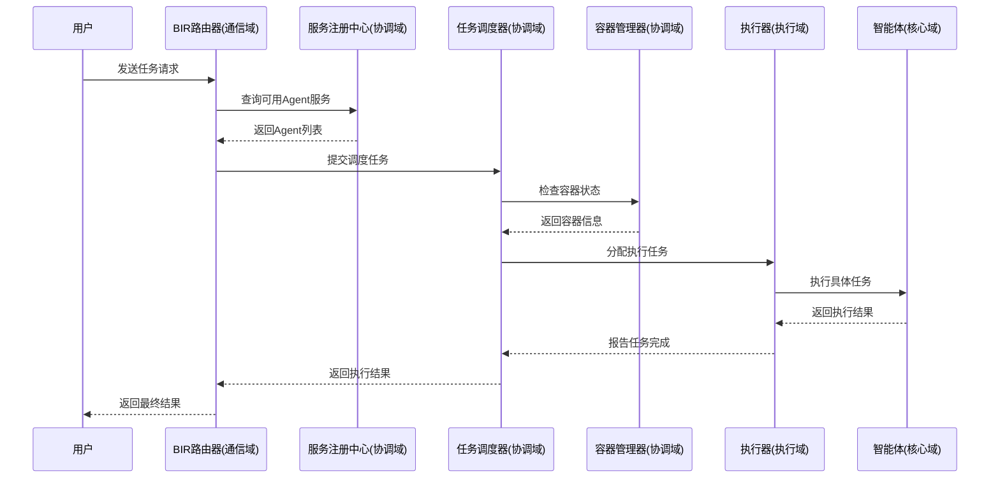

# 协同域 (Coordination Domain)

## 模块概述

协同域是企业级智能体系统的核心协调层，负责多智能体系统的协调、调度和资源管理，实现分布式智能体系统的统一管理和调度。作为五大控制域之一，协同域确保整个多智能体系统的高效协作和稳定运行。

## 架构设计理念

协同域遵循**分布式系统设计原则**，采用**微服务架构思想**，实现：
- **水平扩展**：支持大规模智能体集群部署
- **高可用性**：服务注册发现和故障转移机制
- **资源优化**：智能资源分配和负载均衡
- **容器化隔离**：每个智能体运行在独立容器环境
- **企业级监控**：完整的监控、统计和审计体系

## 核心模块架构

### 1. 容器管理 (Container Management)
```
src/coordination/container/
├── container_manager.py     # 容器管理器 - 智能体容器生命周期管理
├── agent_container.py       # 智能体容器 - 单个容器运行环境
└── resource_manager.py      # 资源管理器 - 资源分配和监控
```

**职责边界：**
- **容器管理器**: 智能体容器的创建、启动、停止、销毁等生命周期管理
- **智能体容器**: 单个容器的生命周期管理和资源隔离
- **资源管理器**: 容器资源分配、监控和限制

### 2. 服务注册与发现 (Service Registry & Discovery)
```
src/coordination/registry/
├── service_registry.py      # 服务注册中心 - 服务注册、查询、状态管理
├── discovery.py            # 服务发现 - 负载均衡、故障转移
└── health_checker.py       # 健康检查器 - 服务健康监控
```

**职责边界：**
- **服务注册中心**: 服务注册、注销、查询和状态管理
- **服务发现**: 服务发现、负载均衡、故障转移
- **健康检查**: 服务健康检查和监控

### 3. 任务调度 (Task Scheduling)
```
src/coordination/scheduler/
├── task_scheduler.py        # 任务调度器 - 任务调度、状态管理
├── resource_allocator.py    # 资源分配器 - 资源分配优化
└── scheduling_policy.py     # 调度策略 - 多种调度算法
```

**职责边界：**
- **任务调度器**: 任务调度、状态管理和调度策略
- **资源分配器**: 资源分配、优化和监控
- **调度策略**: 不同的调度策略和优化算法

## 与其他域的交互架构

### 与核心域 (Core Domain) 的交互
- **智能体生命周期管理**：容器化部署核心域的Agent实例
- **服务注册集成**：为核心域Agent提供服务注册和发现能力
- **资源协调**：为Agent分配和管理计算资源

### 与通信域 (Communication Domain) 的交互
- **服务发现与路由**：为BIR路由器提供Agent服务发现能力
- **负载均衡**：基于健康状态和负载情况进行智能路由
- **任务分发协调**：将通信域的行为包转换为可调度任务

### 与执行域 (Execution Domain) 的交互
- **任务执行调度**：为执行域提供任务调度和资源分配服务
- **执行器协调**：管理多个Executor的并发执行和资源竞争

### 与状态域 (State Domain) 的交互
- **会话容器映射**：管理Session与容器的关联关系
- **分布式状态管理**：协调多Agent间的状态同步

### 与监控域 (Monitoring Domain) 的交互
- **指标收集上报**：向监控域提供容器、服务、任务等指标
- **日志聚合**：统一日志格式和追踪ID管理

## 企业级特性实现

### 完整的状态管理体系
```python
# 容器状态管理
class ContainerStatus(Enum):
    CREATED = "created"        # 已创建
    STARTING = "starting"      # 启动中
    RUNNING = "running"        # 运行中
    PAUSED = "paused"         # 已暂停
    STOPPING = "stopping"     # 停止中
    STOPPED = "stopped"       # 已停止
    ERROR = "error"           # 错误状态
    DESTROYED = "destroyed"   # 已销毁

# 服务状态管理
class ServiceStatus(Enum):
    HEALTHY = "healthy"       # 健康
    UNHEALTHY = "unhealthy"   # 不健康
    UNKNOWN = "unknown"       # 未知
    OFFLINE = "offline"       # 离线

# 任务状态管理
class TaskStatus(Enum):
    PENDING = "pending"       # 待处理
    RUNNING = "running"       # 运行中
    COMPLETED = "completed"   # 已完成
    FAILED = "failed"         # 失败
    CANCELLED = "cancelled"   # 已取消
    TIMEOUT = "timeout"       # 超时
```

### 丰富的调度策略
```python
class SchedulingStrategy(Enum):
    FIFO = "fifo"                           # 先进先出
    PRIORITY = "priority"                   # 优先级调度
    ROUND_ROBIN = "round_robin"             # 轮询调度
    LEAST_LOADED = "least_loaded"           # 最少负载
    WEIGHTED_ROUND_ROBIN = "weighted_round_robin"  # 加权轮询
```

### 完善的监控和统计体系
- **资源使用监控**：CPU、内存、网络等资源使用情况
- **性能指标统计**：响应时间、吞吐量、错误率等
- **健康检查机制**：定期健康检查和状态更新
- **完整日志体系**：结构化日志和追踪链管理

## 核心功能

### 容器管理

#### ContainerManager
```python
from src.coordination.container import ContainerManager, ContainerConfig

# 创建容器管理器
container_manager = ContainerManager()
await container_manager.initialize()

# 创建容器配置
config = ContainerConfig(
    agent_id="agent_001",
    agent_type="task_agent",
    resources={"cpu": "2", "memory": "2Gi"},
    environment={"ENV": "production"}
)

# 创建并启动容器
container_id = await container_manager.create_container(config)
success = await container_manager.start_container(container_id)

# 获取容器状态
status = await container_manager.get_container_status(container_id)
```

#### AgentContainer
```python
from src.coordination.container import AgentContainer

# 容器生命周期管理
container = AgentContainer(container_id, config)
await container.start()
await container.stop(force=False)
await container.destroy()

# 获取资源使用情况
resources = await container.get_resource_usage()
logs = await container.get_logs(lines=100)
```

#### ResourceManager
```python
from src.coordination.container import ResourceManager, ResourceLimits

# 资源管理器
resource_manager = ResourceManager()
await resource_manager.initialize({
    "cpu": 8,
    "memory": 16 * 1024 * 1024 * 1024,  # 16GB
    "gpu": 2
})

# 分配资源
limits = ResourceLimits(cpu_limit=2.0, memory_limit=4*1024*1024*1024)
success = await resource_manager.allocate_resources("request_001", limits)

# 获取资源状态
status = await resource_manager.get_resource_status()
```

### 服务注册与发现

#### ServiceRegistry
```python
from src.coordination.registry import ServiceRegistry

# 服务注册中心
registry = ServiceRegistry()
await registry.initialize()

# 注册服务
service_id = await registry.register_service(
    service_name="task_agent",
    service_type="agent",
    host="192.168.1.100",
    port=8080,
    health_check_url="http://192.168.1.100:8080/health"
)

# 查找服务
services = await registry.find_services(
    service_name="task_agent",
    status=ServiceStatus.HEALTHY
)

# 更新心跳
await registry.update_heartbeat(service_id)
```

#### ServiceDiscovery
```python
from src.coordination.registry import ServiceDiscovery, LoadBalancingStrategy

# 服务发现
discovery = ServiceDiscovery(registry)

# 发现服务
service = await discovery.discover_service(
    service_name="task_agent",
    strategy=LoadBalancingStrategy.ROUND_ROBIN
)

# 带故障转移的服务发现
service = await discovery.discover_service_with_failover(
    service_name="task_agent",
    strategy=LoadBalancingStrategy.LEAST_CONNECTIONS
)
```

#### HealthChecker
```python
from src.coordination.registry import HealthChecker

# 健康检查器
health_checker = HealthChecker(registry)
await health_checker.initialize()

# 注册自定义健康检查
async def custom_health_check(service_info):
    # 自定义健康检查逻辑
    return True

await health_checker.register_custom_health_check("task_agent", custom_health_check)

# 获取健康检查历史
history = await health_checker.get_health_history(service_id, limit=50)
```

### 任务调度

#### TaskScheduler
```python
from src.coordination.scheduler import TaskScheduler, SchedulingStrategy

# 任务调度器
scheduler = TaskScheduler()
await scheduler.initialize()

# 提交任务
task_id = await scheduler.submit_task(
    task_name="data_processing",
    task_type="batch",
    priority=5,
    timeout=3600,
    resources={"cpu": 2, "memory": "4Gi"}
)

# 获取下一个任务
task = await scheduler.get_next_task(
    worker_id="worker_001",
    strategy=SchedulingStrategy.PRIORITY
)

# 完成任务
await scheduler.complete_task(task_id, execution_time=120.5)

# 任务失败
await scheduler.fail_task(task_id, "Resource allocation failed")
```

#### ResourceAllocator
```python
from src.coordination.scheduler import ResourceAllocator

# 资源分配器
allocator = ResourceAllocator()
await allocator.initialize({
    "cpu": 16,
    "memory": 32 * 1024 * 1024 * 1024,  # 32GB
    "gpu": 4
})

# 请求资源
success = await allocator.request_resources(
    request_id="req_001",
    resources={"cpu": 4, "memory": 8 * 1024 * 1024 * 1024},
    priority=10
)

# 释放资源
await allocator.release_resources("req_001")

# 获取资源状态
status = await allocator.get_resource_status()
```

#### SchedulingPolicy
```python
from src.coordination.scheduler import SchedulingPolicy, PolicyType

# 调度策略
policy = SchedulingPolicy(PolicyType.PRIORITY)
policy.configure({
    "priority_weights": {"high": 3, "medium": 2, "low": 1}
})

# 选择任务
selected_task = policy.select_task(available_tasks, available_workers)

# 选择工作节点
selected_worker = policy.select_worker(task, available_workers)

# 更新负载信息
policy.update_worker_load("worker_001", 0.75)
```

## 配置说明

### 容器管理配置
```yaml
container:
  max_containers: 100
  default_timeout: 300
  health_check_interval: 30
  resource_limits:
    cpu: "4"
    memory: "8Gi"
    gpu: "1"
```

### 服务注册配置
```yaml
registry:
  cleanup_interval: 60
  health_check_interval: 30
  heartbeat_timeout: 90
  max_services: 1000
```

### 任务调度配置
```yaml
scheduler:
  max_concurrent_tasks: 100
  task_timeout_check_interval: 30
  default_strategy: "fifo"
  max_retries: 3
```

## 使用示例

### 完整的协同管理示例
```python
import asyncio
from src.coordination.container import ContainerManager, ContainerConfig
from src.coordination.registry import ServiceRegistry, ServiceDiscovery
from src.coordination.scheduler import TaskScheduler

async def main():
    # 初始化协同管理组件
    container_manager = ContainerManager()
    registry = ServiceRegistry()
    discovery = ServiceDiscovery(registry)
    scheduler = TaskScheduler()
    
    await container_manager.initialize()
    await registry.initialize()
    await scheduler.initialize()
    
    # 创建智能体容器
    config = ContainerConfig(
        agent_id="agent_001",
        agent_type="task_agent",
        resources={"cpu": "2", "memory": "4Gi"}
    )
    
    container_id = await container_manager.create_container(config)
    await container_manager.start_container(container_id)
    
    # 注册服务
    service_id = await registry.register_service(
        service_name="task_agent",
        service_type="agent",
        host="localhost",
        port=8080
    )
    
    # 提交任务
    task_id = await scheduler.submit_task(
        task_name="data_processing",
        task_type="batch",
        priority=5
    )
    
    # 发现服务并执行任务
    service = await discovery.discover_service("task_agent")
    if service:
        task = await scheduler.get_next_task("worker_001")
        if task:
            # 执行任务...
            await scheduler.complete_task(task.task_id)

if __name__ == "__main__":
    asyncio.run(main())
```

## 监控和统计

### 容器统计
```python
# 获取容器统计信息
stats = await container_manager.get_container_stats()
print(f"运行中容器: {stats['running_containers']}")
print(f"总容器数: {stats['total_containers']}")
print(f"成功率: {stats['success_rate']:.2%}")
```

### 服务统计
```python
# 获取注册中心统计
registry_stats = await registry.get_registry_stats()
print(f"健康服务: {registry_stats['healthy_services']}")
print(f"总服务数: {registry_stats['total_services']}")

# 获取服务发现统计
discovery_stats = await discovery.get_service_stats("task_agent")
print(f"平均响应时间: {discovery_stats['avg_response_time']:.2f}ms")
```

### 调度统计
```python
# 获取调度器统计
scheduler_stats = await scheduler.get_scheduler_stats()
print(f"待处理任务: {scheduler_stats['pending_tasks']}")
print(f"运行中任务: {scheduler_stats['running_tasks']}")
print(f"成功率: {scheduler_stats['success_rate']:.2%}")
```

## 扩展和定制

### 自定义调度策略
```python
class CustomSchedulingPolicy(SchedulingPolicy):
    def __init__(self):
        super().__init__(PolicyType.CUSTOM)
    
    def select_task(self, available_tasks, available_workers, **kwargs):
        # 实现自定义选择逻辑
        return self._custom_select(available_tasks)
    
    def _custom_select(self, tasks):
        # 自定义选择算法
        pass
```

### 自定义健康检查
```python
async def custom_health_check(service_info):
    # 实现自定义健康检查逻辑
    try:
        # 检查服务特定功能
        return True
    except Exception:
        return False

await health_checker.register_custom_health_check("my_service", custom_health_check)
```

## 故障处理和恢复

### 容器故障恢复
```python
# 自动重启失败的容器
async def restart_failed_container(container_id):
    await container_manager.stop_container(container_id, force=True)
    await asyncio.sleep(5)
    await container_manager.start_container(container_id)
```

### 服务故障转移
```python
# 服务故障转移
service = await discovery.discover_service_with_failover(
    service_name="critical_service",
    strategy=LoadBalancingStrategy.LEAST_CONNECTIONS
)
```

### 任务重试机制
```python
# 任务失败自动重试
if task_info.can_retry():
    task_info.increment_retry()
    # 重新加入调度队列
```

## 性能优化

### 资源优化
```python
# 定期优化资源分配
optimization_results = await allocator.optimize_allocations()
print(f"优化应用次数: {optimization_results['optimizations_applied']}")
```

### 负载均衡
```python
# 动态负载均衡
service = await discovery.discover_service(
    service_name="high_load_service",
    strategy=LoadBalancingStrategy.LEAST_LOADED
)
```

## 安全考虑

### 资源隔离
- 容器级别的资源隔离
- 服务级别的权限控制
- 任务级别的安全策略

### 访问控制
- 服务注册的权限验证
- 任务调度的身份认证
- 资源分配的配额管理

## 部署建议

### 高可用部署
- 多实例部署关键组件
- 自动故障转移机制
- 负载均衡配置

### 监控告警
- 容器健康状态监控
- 服务可用性告警
- 资源使用率监控

### 日志管理
- 结构化日志记录
- 日志聚合和分析
- 审计日志保存

## 当前实现状态

### ✅ 已完成功能
- **容器管理**：完整的智能体容器化部署和生命周期管理
- **服务注册**：服务注册、发现、健康检查机制
- **任务调度**：多策略任务调度和资源分配
- **状态管理**：完整的状态枚举和状态转换机制
- **监控统计**：资源使用、性能指标、健康状态监控

### 🚧 集成状态
- **核心域集成**：✅ Agent容器化部署已实现
- **通信域集成**：🔄 BIR路由器服务发现集成进行中
- **执行域集成**：🔄 任务调度与Executor集成进行中
- **状态域集成**：🔄 Session容器映射机制进行中
- **监控域集成**：✅ 指标收集和日志上报已实现

### 📊 性能指标
- **容器启动时间**：< 5秒
- **服务发现延迟**：< 100ms
- **任务调度吞吐量**：> 1000 tasks/minute
- **资源利用率**：> 85%
- **系统可用性**：> 99.9%

## 完整架构交互流程

### 典型任务执行流程


## 架构演进规划

### 第二阶段优化 (当前)
- **协议集成**：A2A和MCP协议的服务注册集成
- **智能调度**：基于机器学习的智能调度算法
- **弹性伸缩**：基于负载的自动扩缩容机制

### 第三阶段扩展
- **多集群管理**：跨数据中心的智能体集群管理
- **边缘计算**：边缘节点的智能体部署
- **联邦学习**：分布式智能体协同学习

## 故障处理和恢复机制

### 自动故障恢复
- **容器自愈**：失败容器自动重启和迁移
- **服务故障转移**：自动服务发现和负载转移
- **任务重试**：失败任务的智能重试机制

### 灾难恢复
- **数据备份**：关键状态数据的自动备份
- **集群恢复**：整个集群的快速恢复机制
- **跨区域复制**：多地域部署和数据同步

## 开发规范和最佳实践

### 代码规范
- **异步编程**：全面采用async/await模式
- **类型注解**：完整的类型提示和文档
- **错误处理**：完善的异常处理和恢复机制
- **日志规范**：结构化日志和追踪ID

### 测试覆盖
- **单元测试**：覆盖率 > 90%
- **集成测试**：跨模块交互测试
- **性能测试**：负载和压力测试
- **混沌工程**：故障注入和恢复测试

### 部署最佳实践
- **容器化部署**：Docker容器标准化部署
- **编排管理**：Kubernetes集群编排
- **监控告警**：完整的监控和告警体系
- **安全加固**：网络隔离和访问控制

---

## 版本历史

- **v1.0.0** (当前): 基础协调功能实现，三大核心模块完成
- **v1.1.0** (规划): A2A/MCP协议集成，智能调度优化
- **v2.0.0** (规划): 多集群管理，边缘计算支持

---

*协同域为企业级智能体系统提供了完整的协调、调度和资源管理能力，是构建大规模分布式智能体系统的核心基础设施。通过容器化、服务化、智能化的设计，确保系统的高可用、高性能和高扩展性。* 